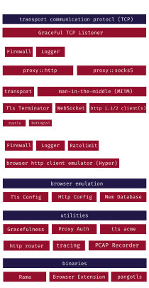

[![Crates.io][crates-badge]][crates-url]
[![Docs.rs][docs-badge]][docs-url]
[![MIT License][license-mit-badge]][license-mit-url]
[![Apache 2.0 License][license-apache-badge]][license-apache-url]
[![Build Status][actions-badge]][actions-url]

[![Discord][discord-badge]][discord-url]
[![Buy Me A Coffee][bmac-badge]][bmac-url]
[![GitHub Sponsors][ghs-badge]][ghs-url]

[crates-badge]: https://img.shields.io/crates/v/rama.svg
[crates-url]: https://crates.io/crates/rama
[docs-badge]: https://img.shields.io/docsrs/rama/latest
[docs-url]: https://docs.rs/rama/latest/rama/index.html
[license-mit-badge]: https://img.shields.io/badge/license-MIT-blue.svg
[license-mit-url]: https://github.com/plabayo/rama/blob/main/LICENSE-MIT
[license-apache-badge]: https://img.shields.io/badge/license-APACHE-blue.svg
[license-apache-url]: https://github.com/plabayo/rama/blob/main/LICENSE-APACHE
[actions-badge]: https://github.com/plabayo/rama/workflows/CI/badge.svg
[actions-url]: https://github.com/plabayo/rama/actions?query=workflow%3ACI+branch%main

[discord-badge]: https://img.shields.io/badge/Discord-%235865F2.svg?style=for-the-badge&logo=discord&logoColor=white
[discord-url]: https://discord.gg/29EetaSYCD
[bmac-badge]: https://img.shields.io/badge/Buy%20Me%20a%20Coffee-ffdd00?style=for-the-badge&logo=buy-me-a-coffee&logoColor=black
[bmac-url]: https://www.buymeacoffee.com/plabayo
[ghs-badge]: https://img.shields.io/badge/sponsor-30363D?style=for-the-badge&logo=GitHub-Sponsors&logoColor=#EA4AAA
[ghs-url]: https://github.com/sponsors/plabayo

> rama is early work in progress, use at your own risk.
>
> Not everything that exists is documented and not everything that is documented is implemented.

Come join us at [Discord][discord-url] on the `#rama` public channel.

## Roadmap

> NOTE: at this early experimental stage things might still derive from the roadmap and not be immediately
> reflected in the summary below. Contact @glendc in doubt.

```
New Design Guidelines (for 0.2)

- heavy things like tokio, hyper, ... will be behind feature gates
- hyper, tokio etc will be by default enabled (for now)
- have it not be a generic network lib, but do focus on proxying
- stuff like an HttpConnector will be opiniated rather then generic
- do built by default on `tower-async-core`, but hide the
  heavy stuff (e.g. things within `tower-async`) behind feature gates
- http connector follows no specific interface, for the tcp server
  it is just something that handles tcp streams,
- for state stuff we'll follow the axum approach, seems fine
```

Here we'll also add some draft snippets of how we might Rama want to be,
these are rough sketches and are not tested or develoepd code. All of it is still
in flux as well.

```
> rama-macros
> rama
```

An eventual goal will be to make it also work on async runtimes like `smol`.
Initially we will however just make sure tokio works, but will at least already
put the guards in place to make sure that if you do not compile with features
like `tokio` and `hyper` that we also not rely on it.

Just not somethingt worry about ourselves immediately.

```rust
use rama_old::{
    // better name then Stream?!
    server::Stream,
    server::http::Request,
};

#[tokio::main]
async fn main() {
    // client profiles...
    let client_profile_db = rama_old::client::ProfileDB::new(..);

    let shutdown = tokio_graceful::Shutdown::default();

    shutdown.spawn_task_fn(|guard| async move {
        let client_profile_db = client_profile_db.clone();
        if let Err(err) = https_proxy(guard, client_profile_db) {
            trace::error!(..);
        }
    });

    shutdown.spawn_task_fn(|guard| async move {
        let client_profile_db = client_profile_db.clone();
        if let Err(err) = http_server(guard, client_profile_db).await {
            trace::error!(..);
        }
    });

    shutdown.spawn_task_fn(|guard| async move {
        let client_profile_db = client_profile_db.clone();
        if let Err(err) = https_proxy(guard, client_profile_db).await {
            trace::error!(..);
        }
    });
    
    shutdown
        .shutdown_with_limit(Duration::from_secs(60))
        .await
        .unwrap();
}

async fn http_server(guard: Guard, client_profile_database: ProfileDatabase) {
    rama_old::server::HttpServer::build()
        .get("/k8s/health", |_| async {
            "Ok"
        })
        .get("/api/v1/profile", |_| async {
            client_profile_database.get_random_desktop_browser_profile()
        })
        .layer(tower_async_http::TraceLayer::new_for_http())
        .layer(tower_async_http::compression::CompressionLayer::new())
        .layer(tower_async_http::normalize_path::NormalizePathLayer::trim_trailing_slash())
        .serve("127.0.0.1:8080").await
}

async fn https_proxy(guard: Guard, client_profile_database: ProfileDatabase) {
    // requires `rustls` or `boringssl` feature to be enabled
    let tls_server_config = rama_old::server::TlsServerConfig::builder()
        .with_safe_defaults()
        .with_no_client_auth()
        .with_single_cert(certs, key)
        .unwrap();
    let tls_acceptor = rama_old::server::TlsAcceptor::from(
        std::sync::Arc::new(tls_server_config),
    );

    // proxy acceptor, always available
    let http_proxy_config = rama_old::server::HttpProxyConfig::builder()
        .with_basic_auth("username", "password")
        .unwrap();
    let proxy_acceptor = rama_old::server::HttpProxy::from(
        std::sync::Arc::new(http_proxy_config),
    );

    // profile db layer
    let client_profile_database_layer = client_profile_database.layer();

    // proxy db
    let upstream_proxy_db = rama_old::proxy::ProxyDB::new(..);
    let upstream_proxy_db_layer = upstream_proxy_db.layer();

    // available only when enabled `smol` or `tokio`
    rama_old::server::TcpServer::bind(&"0.0.0.0:8080".parse().unwrap())
        .serve(|stream: Stream| async move {
            let client_profile_database_layer = client_profile_database_layer.clone();

            // terminate TLS
            let tls_acceptor = tls_acceptor.clone();
            let stream = tls_acceptor.accept(stream).await?;

            // proxy authenticate
            let proxy_acceptor = proxy_acceptor.clone();
            let (stream, target_info) = proxy_acceptor.accept(stream).await?;

            // serve http,
            // available when `hyper` feature is enabled (== default)
            rama_old::server::HttpConnection::builder()
                .http1_only(true)
                .http1_keep_alive(true)
                .serve(
                    stream,
                    rama_old::client::HttpClient::new()
                        .handle_upgrade(
                            "websocket",
                            |request: Request| {
                                // ... do stuff with request if desired...
                                // ... todo
                                // for default response you can use the shipped one
                                rama_old::client::ws::accept_response(request)
                            },
                            |client: HttpClient, stream: Stream| {
                                // TODO... how to get desired client conn...
                            },
                        )
                        .layer(rama_old::middleware::http::RemoveHeaders::default())
                        .layer(client_profile_db_layer.clone())
                        .layer(upstream_proxy_db_layer.clone())
                        .layer(rama_old::middleware::http::Firewall::new(
                            Some(vec!["127.0.0.1"]),
                            None,
                        ))
                ).await?;
        }).await.unwrap();
}
```

The above code shows that there are roughly 3 sections on an https proxy code:

1. The initial https server setup.
   Result is an https proxy server running that can start handling incoming connections.
2. for each incoming tcp connection (similar logic for udp would apply):
   - terminate the tls (if its an https instead of http proxy)
   - do the proxy accept (http/socks5, with or without auth)
   - create a http client: optional, but would allow to reuse connections that use the same config,
     which in most cases are all requests going over that single connection
3. for each incoming http request on that now ready http connection:
   - read and modify the http headers where desired
   - do the http request (that request or a new one)
   - read and modify the response
   - return the response

The setup (1) is not much to say about. But once you look into designs for (2) and (3) there's
a very hard balance between making Rama too generic and thus also very complicated in how to design.
Or you make it too specific (opininated), making the design a lot simpler though.

The above design looks fine enough as a start. Still it's a bit messy,
and this is where Axum+Tower do make a difference for Http web services.
Point is to make it also work for proxy services.



## Nightly

`rama` is currently only available on nightly rust,
this is because it uses the `async_trait` feature,
which is currently only available on nightly rust.

We expect to be able to switch back to stable rust once `async_trait` is available on stable rust,
which should be by the end of 2023.

See <https://blog.rust-lang.org/inside-rust/2023/05/03/stabilizing-async-fn-in-trait.html> for more information.

> NOTE: the above information was about design #3 of Rama,
> in the new design we might switch to `impl Future` which would stabalize this year...

## Contributing

:balloon: Thanks for your help improving the project! We are so happy to have
you! We have a [contributing guide][contributing] to help you get involved in the
`rama` project.

Should you want to contribure this project but you do not yet know how to program in Rust, you could start learning Rust with as goal to contribute as soon as possible to `rama` by using "[the Rust 101 Learning Guide](https://rust-lang.guide/)" as your study companion. Glen can also be hired as a mentor or teacher to give you paid 1-on-1 lessons and other similar consultancy services. You can find his contact details at <https://www.glendc.com/>.

## License

This project is dual-licensed under both the [MIT license][mit-license] and [Apache 2.0 License][apache-license].

### Contribution

Unless you explicitly state otherwise, any contribution intentionally submitted
for inclusion in `rama` by you, shall be licensed as both [MIT][mit-license] and [Apache 2.0][apache-license],
without any additional terms or conditions.

[contributing]: https://github.com/plabayo/rama/blob/main/CONTRIBUTING.md
[mit-license]: https://github.com/plabayo/rama/blob/main/LICENSE-MIT
[apache-license]: https://github.com/plabayo/rama/blob/main/LICENSE-APACHE

## Sponsors

Rama is **completely free, open-source software** which needs lots of effort and time to develop and maintain.

Support this project by becoming a [sponsor][ghs-url]. One time payments are accepted [at GitHub][ghs-url] as well as at ["Buy me a Coffee"][bmac-url]

Sponsors help us continue to maintain and improve `rama`, as well as other
Free and Open Source (FOSS) technology. It also helps us to create
educational content such as <https://github.com/plabayo/learn-rust-101>,
and other open source libraries such as <https://github.com/plabayo/tower-async>.

Sponsors receive perks and depending on your regular contribution it also
allows you to rely on us for support and consulting.

If you plan to use Rama for your commercial resell or package activities you
need to be a sponsor for a high enough tier to allow you to use it
for these purposes despite it having a Business License (BSL).

### Contribute to Open Source

Part of the money we receive from sponsors is used to contribute to other projects
that we depend upon. Plabayo sponsors the following organisations and individuals
building and maintaining open source software that `rama` depends upon:

| | name | projects |
| - | - | - |
| 💌 | [Tokio (*)](https://github.com/tokio-rs) | (Tokio Project and Ecosystem)
| 💌 | [Sean McArthur](https://github.com/seanmonstar) | (Hyper and Tokio)
| 💌 | [Ulixee](https://github.com/ulixee) | (Browser Profile Data)

> (*) we no longer depend upon `tower` directly, and instead
> have made a permanent fork of it, available at: <https://github.com/plabayo/tower-async>

## FAQ

### Why the name rama?

The name _rama_ is Japanese for llama and written as "ラマ".
This animal is used as a our mascot and spiritual inspiration of this proxy framework.
It was chosen to honor our connection with Peru, the homeland of this magnificent animal,
and translated into Japanese because we gratefully have built _rama_
upon the broad shoulders of [Tokio and its community](https://tokio.rs/).

Note that the Tokio runtime and its ecosystems sparked initial experimental versions of Rama,
but that we since then, after plenty of non-published iterations, have broken free from that ecosystem,
and are now supporting other ecosystems as well. In fact, by default we link not into any async runtime,
and rely only on the `std` library for for any future/async primitives.

### What Async Runtime is used?

We try to write the Rama codebase in an async runtime agnostic manner. Everything that is
runtime specific (e.g. low level primitives) is hidden behind feature gates.

You can bring your own runtinme, but for most purposes we recommend that activate
the `[tokio]` or `[smol]` runtime. Both can be activated at the same time, but that is usually not done.

### Do you support Tokio?

Yes. It is not enabled by default, but can be activated using the `tokio` feature.

### Do you support [Smol](https://github.com/smol-rs/smol)?

Yes. It is not enabled by default, but can be activated using the `smol` feature.

### Help! My Async Trait's Future is not `Send`

Due to a bug in Rust, most likely its trait resolver,
you can currently run into this not very meanigful error.

Cfr: <https://github.com/rust-lang/rust/issues/114142>

By using the 'turbo fish' syntax you can resolve it.
See that issue for more details on this solution.
