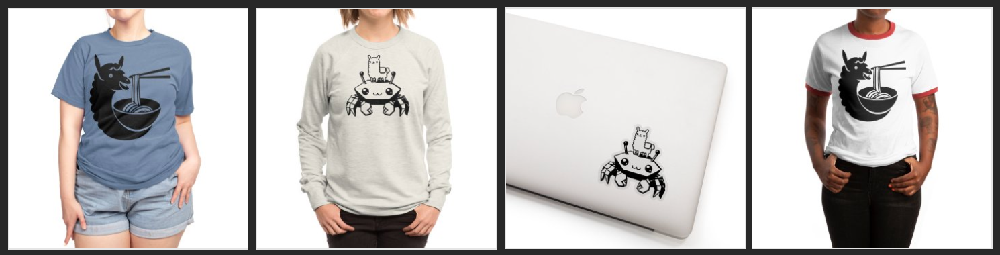

[](https://ramaproxy.org/)

[![Crates.io][crates-badge]][crates-url]
[![Docs.rs][docs-badge]][docs-url]
[![MIT License][license-mit-badge]][license-mit-url]
[![Apache 2.0 License][license-apache-badge]][license-apache-url]
[![rust version][rust-version-badge]][rust-version-url]
[![Build Status][actions-badge]][actions-url]

[crates-badge]: https://img.shields.io/crates/v/rama.svg
[crates-url]: https://crates.io/crates/rama
[docs-badge]: https://img.shields.io/docsrs/rama/latest
[docs-url]: https://docs.rs/rama/latest/rama/index.html
[license-mit-badge]: https://img.shields.io/badge/license-MIT-blue.svg
[license-mit-url]: https://github.com/plabayo/rama/blob/main/LICENSE-MIT
[license-apache-badge]: https://img.shields.io/badge/license-APACHE-blue.svg
[license-apache-url]: https://github.com/plabayo/rama/blob/main/LICENSE-APACHE
[rust-version-badge]: https://img.shields.io/badge/rustc-1.75+-blue?style=flat-square&logo=rust
[rust-version-url]: https://www.rust-lang.org
[actions-badge]: https://github.com/plabayo/rama/workflows/CI/badge.svg
[actions-url]: https://github.com/plabayo/rama/actions

[discord-badge]: https://img.shields.io/badge/Discord-%235865F2.svg?style=for-the-badge&logo=discord&logoColor=white
[discord-url]: https://discord.gg/29EetaSYCD
[bmac-badge]: https://img.shields.io/badge/Buy%20Me%20a%20Coffee-ffdd00?style=for-the-badge&logo=buy-me-a-coffee&logoColor=black
[bmac-url]: https://www.buymeacoffee.com/plabayo
[ghs-badge]: https://img.shields.io/badge/sponsor-30363D?style=for-the-badge&logo=GitHub-Sponsors&logoColor=#EA4AAA
[ghs-url]: https://github.com/sponsors/plabayo
[paypal-badge]: https://img.shields.io/badge/paypal-contribution?style=for-the-badge&color=blue
[paypal-url]: https://www.paypal.com/donate/?hosted_button_id=P3KCGT2ACBVFE
[polar-badge]: https://img.shields.io/badge/polar.sh-subscribe?style=for-the-badge&color=blue
[polar-url]: https://polar.sh/plabayo

🦙 Rama (ラマ) is a modular service framework for the 🦀 Rust language to move and transform your network packets.
The reasons behind the creation of rama can be read in [the "Why Rama" chapter](https://ramaproxy.org/book/why_rama).

Rama is async-first using [Tokio](https://tokio.rs/) as its _only_ Async Runtime.
Please refer to [the examples found in the `/examples` dir](https://github.com/plabayo/rama/tree/main/examples)
to get inspired on how you can use it for your purposes.

[![Polar Subscribe][polar-badge]][polar-url]
[![GitHub Sponsors][ghs-badge]][ghs-url]
[![Buy Me A Coffee][bmac-badge]][bmac-url]
[![Paypal Donation][paypal-badge]][paypal-url]
[![Discord][discord-badge]][discord-url]

This framework comes with 🔋 batteries included, giving you the full freedome to build the middleware and services you want, without _having_ to repeat the "common":

| category | support list |
|-|-|
| 🏗️ [transports](https://ramaproxy.org/docs/rama/net/stream/index.html) | ✅ [tcp](https://ramaproxy.org/docs/rama/tcp/index.html) ⸱ 🏗️ udp <sup>(2)</sup> ⸱ ✅ [middleware](https://ramaproxy.org/docs/rama/net/stream/layer/index.html) |
| 🏗️ [http](https://ramaproxy.org/docs/rama/http/index.html) | ✅ [auto](https://ramaproxy.org/docs/rama/http/server/service/struct.HttpServer.html#method.auto) ⸱ ✅ [http/1.1](https://ramaproxy.org/docs/rama/http/server/service/struct.HttpServer.html#method.http1) ⸱ ✅ [h2](https://ramaproxy.org/docs/rama/http/server/service/struct.HttpServer.html#method.h2) ⸱ 🏗️ h3 <sup>(2)</sup> ⸱ ✅ [middleware](https://ramaproxy.org/docs/rama/http/layer/index.html) |
| ✅ web server | ✅ [fs](https://ramaproxy.org/docs/rama/http/service/fs/index.html) ⸱ ✅ [redirect](https://ramaproxy.org/docs/rama/http/service/redirect/struct.Redirect.html) ⸱ ✅ [dyn router](https://ramaproxy.org/docs/rama/http/service/web/struct.WebService.html) ⸱ ✅ [static router](https://ramaproxy.org/docs/rama/http/service/web/macro.match_service.html) ⸱ ✅ [handler extractors](https://ramaproxy.org/docs/rama/http/service/web/extract/index.html) ⸱ ✅ [k8s healthcheck](https://ramaproxy.org/docs/rama/http/service/web/k8s/index.html) |
| ✅ http [client](https://ramaproxy.org/docs/rama/http/client/index.html) | ✅ [client](https://ramaproxy.org/docs/rama/http/client/struct.HttpClient.html) ⸱ ✅ [high level API](https://ramaproxy.org/docs/rama/http/client/trait.HttpClientExt.html) ⸱ ✅ [Proxy Connect](https://ramaproxy.org/docs/rama/proxy/http/client/layer/struct.HttpProxyConnectorService.html) ⸱ ❌ [Chromium Http](https://github.com/plabayo/rama/issues/189) <sup>(3)</sup> |
| 🏗️ [tls](https://ramaproxy.org/docs/rama/tls/index.html) | ✅ [Rustls](https://ramaproxy.org/docs/rama/tls/rustls/index.html) ⸱ 🏗️ BoringSSL <sup>(1)</sup> ⸱ ❌ NSS <sup>(3)</sup> |
| ✅ [dns](https://ramaproxy.org/docs/rama/dns/index.html) | ✅ [DNS Resolver](https://ramaproxy.org/docs/rama/dns/struct.Dns.html) |
| ✅ [proxy protocols](https://ramaproxy.org/docs/rama/proxy/index.html) | ✅ [PROXY protocol](https://ramaproxy.org/docs/rama/proxy/pp/index.html) ⸱ ✅ [http proxy](https://github.com/plabayo/rama/blob/main/examples/http_connect_proxy.rs) ⸱ ✅ [https proxy](https://github.com/plabayo/rama/blob/main/examples/https_connect_proxy.rs) ⸱ 🏗️ SOCKS5 <sup>(2)</sup> ⸱ 🏗️ SOCKS5H <sup>(2)</sup> |
| 🏗️ web protocols | 🏗️ Web Sockets (WS) <sup>(2)</sup> ⸱ 🏗️ WSS <sup>(2)</sup> ⸱ ❌ Web Transport <sup>(3)</sup> ⸱ ❌ gRPC <sup>(3)</sup> |
| ✅ [async-method trait](https://blog.rust-lang.org/inside-rust/2023/05/03/stabilizing-async-fn-in-trait.html) services | ✅ [Service](https://ramaproxy.org/docs/rama/service/trait.Service.html) ⸱ ✅ [Layer](https://ramaproxy.org/docs/rama/service/layer/trait.Layer.html) ⸱ ✅ [context](https://ramaproxy.org/docs/rama/service/context/index.html) ⸱ ✅ [dyn dispatch](https://ramaproxy.org/docs/rama/service/struct.BoxService.html) ⸱ ✅ [middleware](https://ramaproxy.org/docs/rama/service/layer/index.html) |
| ✅ [telemetry](https://ramaproxy.org/docs/rama/telemetry/index.html) | ✅ [tracing](https://tracing.rs/tracing/) ⸱ ✅ [opentelemetry](https://ramaproxy.org/docs/rama/telemetry/opentelemetry/index.html) ⸱ ✅ [http metrics](https://ramaproxy.org/docs/rama/http/layer/opentelemetry/index.html) ⸱ ✅ [transport metrics](https://ramaproxy.org/docs/rama/net/stream/layer/opentelemetry/index.html) ⸱ ✅ [prometheus exportor](https://ramaproxy.org/docs/rama/http/service/web/struct.PrometheusMetricsHandler.html) |
| ✅ upstream [proxies](https://ramaproxy.org/docs/rama/proxy/index.html) | ✅ [MemoryProxyDB](https://ramaproxy.org/docs/rama/proxy/struct.MemoryProxyDB.html) ⸱ ✅ [L4 Username Config](https://ramaproxy.org/docs/rama/utils/username/index.html) ⸱ ✅ [Proxy Filters](https://ramaproxy.org/docs/rama/proxy/struct.ProxyFilter.html) |
| 🏗️ [User Agent (UA)](https://ramaproxy.org/book/intro/user_agent) | 🏗️ Http Emulation <sup>(1)</sup> ⸱ 🏗️ Tls Emulation <sup>(1)</sup> ⸱ ✅ [UA Parsing](https://ramaproxy.org/docs/rama/ua/struct.UserAgent.html) |
| 🏗️ utilities | ✅ [error handling](https://ramaproxy.org/docs/rama/error/index.html) ⸱ ✅ [graceful shutdown](https://ramaproxy.org/docs/rama/utils/graceful/index.html) ⸱ 🏗️ Connection Pool <sup>(1)</sup> ⸱ 🏗️ IP2Loc <sup>(2)</sup> |
| 🏗️ [TUI](https://ratatui.rs/) | 🏗️ traffic logger <sup>(2)</sup> ⸱ 🏗️ curl export <sup>(2)</sup> ⸱ ❌ traffic intercept <sup>(3)</sup> ⸱ ❌ traffic replay <sup>(3)</sup> |
| ✅ binary | ✅ [prebuilt binaries](https://ramaproxy.org/book/binary/rama) ⸱ 🏗️ proxy config <sup>(2)</sup> ⸱ ✅ http client ⸱ ❌ WASM Plugins <sup>(3)</sup> |
| 🏗️ data scraping | 🏗️ Html Processor <sup>(2)</sup> ⸱ ❌ Json Processor <sup>(3)</sup> |
| ❌ browser | ❌ JS Engine <sup>(3)</sup> ⸱ ❌ [Web API](https://developer.mozilla.org/en-US/docs/Web/API) Emulation <sup>(3)</sup> |

> 🗒️ _Footnotes_
>
> * <sup>(1)</sup> Part of [`v0.2.0` milestone (ETA: 2024/05)](https://github.com/plabayo/rama/milestone/1)
> * <sup>(2)</sup> Part of [`v0.3.0` milestone (ETA: 2024/07)](https://github.com/plabayo/rama/milestone/2)
> * <sup>(3)</sup> No immediate plans, but on our radar. Please [open an issue](https://github.com/plabayo/rama/issues) to request this feature if you have an immediate need for it. Please add sufficient motivation/reasoning and consider [becoming a sponsor](#--sponsors) to help accelerate its priority.

The primary focus of Rama is to aid you in your development of [proxies](https://ramaproxy.org/book/proxies/intro.html):

- 🚦 [Reverse proxies](https://ramaproxy.org/book/proxies/reverse);
- 🔓 [TLS Termination proxies](https://ramaproxy.org/book/proxies/tls);
- 🌐 [HTTP(S) proxies](https://ramaproxy.org/book/proxies/http);
- 🧦 [SOCKS5 proxies](https://ramaproxy.org/book/proxies/socks5) (will be implemented in `v0.3`);
- 🔎 [MITM proxies](https://ramaproxy.org/book/proxies/mitm);
- 🕵️‍♀️ [Distortion proxies](https://ramaproxy.org/book/proxies/distort).

> 💡 Check out [the "Intro to Proxies" chapters in the Rama book](https://ramaproxy.org/book/proxies/intro.html)
> to learn more about the different kind of proxies. It might help in case you are new to developing proxies.

The [Distortion proxies](https://ramaproxy.org/book/proxies/distort) support
comes with [User Agent (UA)](https://ramaproxy.org/book/intro/user_agent) emulation capabilities. The emulations are made possible by patterns
and data extracted using [`rama-fp`](https://github.com/plabayo/rama/tree/main/rama-fp/). The service is publicly exposed at
<https://fp.ramaproxy.org>, made possible by our sponsor host <https://fly.io/>.

> 🔁 <https://echo.ramaproxy.org/> is another service publicly exposed.
> In contrast to the Fingerprinting Service it is aimed at developers
> and allows you to send any http request you wish in order to get an insight
> on the Tls Info and Http Request Info the server receives
> from you when making that request.
>
> ```bash
> curl -XPOST 'https://echo.ramaproxy.org/foo?bar=baz' \
>   -H 'x-magic: 42' --data 'whatever forever'
> ```
>
> Feel free to make use of while crafting distorted http requests,
> but please do so with moderation. In case you have ideas on how to improve
> the service, please let us know [by opening an issue](https://github.com/plabayo/rama/issues).

[BrowserStack](https://browserstack.com) sponsors Rama by providing automated cross-platform browser testing
on real devices, which [uses the public fingerprinting service](./rama-fp/browserstack/main.py) to aid in automated fingerprint collection
on both the Http and Tls layers. By design we do not consider Tcp and Udp fingerprinting.

Next to proxies, Rama can also be used to develop [Web Services](#--web-services) and [Http Clients](#--http-clients).

- Learn more by reading the Rama book at <https://ramaproxy.org/book>;
- or checkout the framework Rust docs at <https://docs.rs/rama>;
    - edge docs (for main branch) can be found at <https://ramaproxy.org/docs/rama>.

📖 Rama's full documentation, references and background material can be found in the form of the "rama book" at <https://ramaproxy.org/book>.

💬 Come join us at [Discord][discord-url] on the `#rama` public channel. To ask questions, discuss ideas and ask how rama may be useful for you.

## ⌨️ | `rama` binary

The `rama` binary allows you to use a lot of what `rama` has to offer without
having to code yourself. It comes with a working http client for CLI, which emulates
User-Agents and has other utilities. And it also comes with IP/Echo services.

It also allows you to run a `rama` proxy, configured to your needs.

Learn more about the `rama` binary and how to install it at <https://ramaproxy.org/book/binary/rama>.

## 🧪 | Experimental

🦙 Rama (ラマ) is to be considered experimental software for the foreseeable future. In the meanwhile it is already used
in production by ourselves and others alike. This is great as it gives us new perspectives and data to further improve
and grow the framework. It does mean however that there are still several non-backward compatible releases that will follow `0.2`.

In the meanwhile the async ecosystem of Rust is also maturing, and edition 2024 is also to be expected as a 2024 end of year gift.
It goes also without saying that we do not nilly-willy change designs or break on purpose. The core design is by now also well defined. But truth has to be said,
there is still plenty to be improve and work out. Production use and feedback from you and other users helps a lot with that. As such,
if you use Rama do let us know feedback over [Discord][discord-url], [email](mailto:glen@plabayo.tech) or a [GitHub issue](https://github.com/plabayo/rama/issues).

👉 If you are a company or enterprise that makes use of Rama, or even an individual user that makes use of Rama for commcercial purposes. Please consider becoming [a business/enterprise subscriber](https://polar.sh/plabayo/subscriptions). It helps make the development cycle to remain sustainable, and is beneficial to you as well. As part of your benefits we are also available to assist you with migrations between breaking releases. For enterprise users we can even make time to develop those PR's in your integration codebases ourselves on your behalf. A win for everybody. 💪

## 🏢 | Proxy Examples

- [/examples/tls_termination.rs](https://github.com/plabayo/rama/tree/main/examples/tls_termination.rs):
  Spawns a mini handmade http server, as well as a TLS termination proxy, forwarding the
  plain text stream to the first.
- [/examples/tls_termination.rs](https://github.com/plabayo/rama/tree/main/examples/tls_termination.rs):
  Spawns a mini handmade http server, as well as a TLS termination proxy, forwarding the
  plain text stream to the first.
- [/examples/mtls_tunnel_and_service.rs](https://github.com/plabayo/rama/blob/main/examples/mtls_tunnel_and_service.rs):
  Example of how to do mTls (manual Tls, where the client also needs a certificate) using rama,
  as well as how one might use this concept to provide a tunnel service build with these concepts;
- [/examples/http_connect_proxy.rs](https://github.com/plabayo/rama/tree/main/examples/http_connect_proxy.rs):
  Spawns a minimal http proxy which accepts http/1.1 and h2 connections alike,
  and proxies them to the target host.

## 🌐 | Web Services

Developing proxies are the primary focus of Rama (ラマ). It can however also be used to develop web services to serve web pages, Http API's and static content. This comes with many of the same benefits that you get when developing proxies using Rama:

* Use Async Method Traits;
* Reuse modular [Tower](https://github.com/tower-rs/tower)-like middleware using extensions as well as strongly typed state;
* Have the ability to be in full control of your web stack from Transport Layer (Tcp, Udp), through Tls and Http;
* If all you care about is the Http layer then that is fine to.
* Be able to trust that your incoming Application Http data has not been modified (e.g. Http header casing and order is preserved);
* Easily develop your service at a Request layer and High level functions alike, choices are yours and can be combined.

Examples of the kind of web services you might build with rama in function of your proxy service:

- a k8s health service ([/examples/http_k8s_health.rs](https://github.com/plabayo/rama/tree/main/examples/http_k8s_health.rs));
- a metric exposure service;
- a minimal api service (e.g. to expose device profiles or certificates);
- a graphical interface / control panel;

> 📖 Learn more about developing web services in the Rama book: <https://ramaproxy.org/book/web_servers.html>.

## 🌐 | Web Service Examples

Here are some low level web service examples without fancy features:

- [/examples/http_listener_hello.rs](https://github.com/plabayo/rama/blob/main/examples/http_listener_hello.rs): is the most basic example on how to provide
  a root service with no needs for endpoints or anything else (e.g. good enough for some use cases related
  to health services or metrics exposures);
  - [/examples/http_health_check.rs](https://github.com/plabayo/rama/blob/main/examples/http_health_check.rs) is an even more minimal example
    of a health check service returning a _200 OK_ for any incoming request.
- [/examples/http_service_hello.rs](https://github.com/plabayo/rama/blob/main/examples/http_service_hello.rs): is an example similar to the previous
  example but shows how you can also operate on the underlying transport (TCP) layer, prior to passing it to your
  http service;

There's also a premade webservice that can be used as the health service for your proxy k8s workloads:

- [/examples/http_k8s_health.rs](https://github.com/plabayo/rama/tree/main/examples/http_k8s_health.rs):
  built-in web service that can be used as a k8s health service for proxies deploying as a k8s deployment;

The following are examples that use the high level concepts of Request/State extractors and IntoResponse converters,
that you'll recognise from `axum`, just as available for `rama` services:

- [/examples/http_key_value_store.rs](https://github.com/plabayo/rama/tree/main/examples/http_key_value_store.rs):
  a web service example showcasing how one might do a key value store web service using `Rama`;
- [/examples/http_web_service_dir_and_api.rs](https://github.com/plabayo/rama/tree/main/examples/http_web_service_dir_and_api.rs):
  a web service example showcasing how one can make a web service to serve a website which includes an XHR API;

For a production-like example of a web service you can also read the [`rama-fp` source code](https://github.com/plabayo/rama/tree/main/rama-fp/src).
This is the webservice behind the Rama fingerprinting service, which is used by the maintainers of 🦙 Rama (ラマ) to generate
the UA emulation data for the Http and TLS layers. It is not meant to fingerprint humans or users. Instead it is meant to help
automated processes look like a human.

> 💡 This example showcases how you can make use of the [`match_service`](https://ramaproxy.org/docs/rama/http/service/web/macro.match_service.html)
> macro to create a `Box`-free service router. Another example of this approach can be seen in the
> [http_service_match.rs](https://github.com/plabayo/rama/tree/main/examples/http_service_match.rs) example.

## 🧑‍💻 | Http Clients

In [The rama book](https://ramaproxy.org/book) you can read and learn that a big pillar of Rama's architecture is build on top of [the Service concept](https://ramaproxy.org/book/intro/services_all_the_way_down.html). A [`Service`][rama-service] takes as input a user-defined `State` (e.g. containing your database Pool) and a `Request`, and uses it to serve either a `Response` or `Error`. Such a [`Service`][rama-service] can produce the response "directly" (also called ☘️ Leaf services) or instead pass the request and state to an inner [`Service`][rama-service] which it wraps around (so called 🍔 Middlewares).

[rama-service]: https://ramaproxy.org/docs/rama/service/trait.Service.html

It's a powerful concept, originally introduced to Rust by [the Tower ecosystem](https://github.com/tower-rs/tower) and allows you build complex stacks specialised to your needs in a modular and easy manner. Even cooler is that this works for both clients and servers alike.

Rama provides an [`HttpClient`](https://ramaproxy.org/docs/rama/http/client/struct.HttpClient.html) which sends your _Http_ `Request` over the network and returns the `Response` if it receives and read one or an `Error` otherwise. Combined with [the many Layers (middleware)](https://ramaproxy.org/docs/rama/http/layer/index.html) that `Rama` provides and perhaps also some developed by you it is possible to create a powerful _Http_ client suited to your needs.

As a 🍒 cherry on the cake you can import the [`HttpClientExt`](https://ramaproxy.org/docs/rama/http/client/trait.HttpClientExt.html) trait in your Rust module to be able to use your _Http_ Client [`Service`][rama-service] stack using a high level API to build and send requests with ease.

### 🧑‍💻 | Http Client Example

> 💡 The full "high levelexample can be found at [/examples/http_high_level_client.rs](https://github.com/plabayo/rama/tree/main/examples/http_high_level_client.rs).

```rust
use rama::http::client::HttpClientExt;

let client = ServiceBuilder::new()
    .layer(TraceLayer::new_for_http())
    .layer(DecompressionLayer::new())
    .layer(
        AddAuthorizationLayer::basic("john", "123")
            .as_sensitive(true)
            .if_not_present(),
    )
    .layer(RetryLayer::new(
        ManagedPolicy::default().with_backoff(ExponentialBackoff::default()),
    ))
    .service(HttpClient::default());

#[derive(Debug, Deserialize)]
struct Info {
    name: String,
    example: String,
    magic: u64,
}

let info: Info = client
    .get("http://example.com/info")
    .header("x-magic", "42")
    .typed_header(Accept::json())
    .send(Context::default())
    .await
    .unwrap()
    .try_into_json()
    .await
    .unwrap();
```

## ⛨ | Safety

This crate uses `#![forbid(unsafe_code)]` to ensure everything is implemented in 100% safe Rust.

We also make use of [`cargo vet`](https://github.com/mozilla/cargo-vet) to [audit our supply chain](./supply-chain/).

## 🦀 | Compatibility

Rama (ラマ) is developed mostly on MacOS M-Series machines and run in production
on a variety of Linux systems. Windows support is not officially guaranteed,
but is [tested using Github Actions](https://github.com/plabayo/rama/blob/main/.github/workflows/CI.yml) with success.

| platform | tested | test platform |
|----------|--------|---------------|
| MacOS    | ✅     | M2 (developer laptop) and macos-12 Intel ([GitHub Action](https://docs.github.com/en/actions/using-github-hosted-runners/about-github-hosted-runners/about-github-hosted-runners)) |
| Windows <sup>⚠️</sup> | ✅     | Windows 2022 ([GitHub Action](https://docs.github.com/en/actions/using-github-hosted-runners/about-github-hosted-runners/about-github-hosted-runners)) |
| Linux    | ✅     | Ubuntu 22.04 ([GitHub Action](https://docs.github.com/en/actions/using-github-hosted-runners/about-github-hosted-runners/about-github-hosted-runners)) |

Please [open a ticket](https://github.com/plabayo/rama/issues) in case you have compatibility issues for your setup/platform.
Our goal is not to support all possible platformns in the world, but we do want to
support as many as we reasonably can.

> <sup>⚠️</sup> example runner tests are not enabled on Windows as these failed in unpredictable ways.
> It is unclear if this is due to code mistakes or because of the way we run these tests (e.g. hardcoded ports).
> We also are not aware of any production usage of Rama on Windows. We welcome contributions
> from Rama users on Windows with great enthusiasm. And while you are at it,
> feel free to contribute to [Tokio](https://tokio.rs/) as well, given they also lack professional Windows users.

### Minimum supported Rust version

Rama's MSRV is `1.75`.

[Using GitHub Actions we also test](https://github.com/plabayo/rama/blob/main/.github/workflows/CI.yml) if `rama` on that version still works on
the stable and beta versions of _rust_ as well.

## 🧭 | Roadmap

Please refer to <https://github.com/plabayo/rama/milestones> to know what's on the roadmap. Is there something not on the roadmap for the next version that you would really like? Please [create a feature request](https://github.com/plabayo/rama/issues) to request it and [become a sponsor](#--sponsors) if you can.

## 📰 | Media Appearances

Rama (`0.2`)  was featured in a 📻 Rustacean episode on the 19th of May 2024, and available to listen at <https://rustacean-station.org/episode/glen-de-cauwsemaecker/>. In this episode [Glen](https://www.glendc.com/) explains the history of Rama, why it exists, how it can be used and more.

## 💼 | License

This project is dual-licensed under both the [MIT license][mit-license] and [Apache 2.0 License][apache-license].

## 👋 | Contributing

🎈 Thanks for your help improving the project! We are so happy to have
you! We have a [contributing guide][contributing] to help you get involved in the
`rama` project.

Contributions often come from people who already know what they want, be it a fix for a bug they encountered,
or a feature that they are missing. Please do always make a ticket if one doesn't exist already.

It's possible however that you do not yet know what specifically to contribute, and yet want to help out.
For that we thank you. You can take a look at the open issues, and in particular:

- [`good first issue`](https://github.com/plabayo/rama/issues?q=is%3Aissue+is%3Aopen+label%3A%22good+first+issue%22): issues that are good for those new to the `rama` codebase;
- [`easy`](https://github.com/plabayo/rama/issues?q=is%3Aissue+is%3Aopen+label%3Aeasy): issues that are seen as easy;
- [`mentor available`](https://github.com/plabayo/rama/issues?q=is%3Aissue+is%3Aopen+label%3A%22mentor+available%22): issues for which we offer mentorship;
- [`low prio`](https://github.com/plabayo/rama/issues?q=is%3Aissue+is%3Aopen+label%3A%22low+prio%22): low prio issues that have no immediate pressure to be finished quick, great in case you want to help out but can only do with limited time to spare;

In general, any issue not assigned already is free to be picked up by anyone else. Please do communicate in the ticket
if you are planning to pick it up, as to avoid multiple people trying to solve the same one.

> 💡 Some issues have a [`needs input`](https://github.com/plabayo/rama/issues?q=is%3Aissue+is%3Aopen+label%3A%22needs+input%22+) label.
> These mean that the issue is not yet ready for development. First of all prior to starting working on an issue you should always look for
> alignment with the rama maintainers. However these
> [`needs input`](https://github.com/plabayo/rama/issues?q=is%3Aissue+is%3Aopen+label%3A%22needs+input%22+) issues require also prior R&D work:
>
> - add and discuss missing knowledge or other things not clear;
> - figure out pros and cons of the solutions (as well as what if we choose to not not resolve the issue);
> - discuss and brainstorm on possible implementations, desire features, consequences, benefits, ...
>
> Only once this R&D is complete and alignment is confirmed, shall the feature be started to be implemented.

Should you want to contribure this project but you do not yet know how to program in Rust, you could start learning Rust with as goal to contribute as soon as possible to `rama` by using "[the Rust 101 Learning Guide](https://rust-lang.guide/)" as your study companion. Glen can also be hired as a mentor or teacher to give you paid 1-on-1 lessons and other similar consultancy services. You can find his contact details at <https://www.glendc.com/>.

### Contribution

Unless you explicitly state otherwise, any contribution intentionally submitted
for inclusion in `rama` by you, shall be licensed as both [MIT][mit-license] and [Apache 2.0][apache-license],
without any additional terms or conditions.

[contributing]: https://github.com/plabayo/rama/blob/main/CONTRIBUTING.md
[mit-license]: https://github.com/plabayo/rama/blob/main/LICENSE-MIT
[apache-license]: https://github.com/plabayo/rama/blob/main/LICENSE-APACHE

### Acknowledgements

Special thanks goes to all involved in developing, maintaining and supporting [the Rust programming language](https://www.rust-lang.org/), the [Tokio ecosystem](https://tokio.rs/) and [all other crates](./Cargo.toml) that we depend upon. This also includes [Hyper and its ecosystem](https://github.com/hyperium) as without those projects Rama would not be. The core http module of rama is a specialised fork of `hyper` and use the underlying `h2` and `h3` crates as dependencies.

Extra credits also go to [Axum](https://github.com/tokio-rs/axum), from which ideas and code were copied as its a project very much in line with the kind of software we want Rama to be, but for a different purpose. Our hats also go off to [Tower][Tower], its inventors and all the people and creatures that help make it be every day. The service concept is derived from [Tower][Tower] and many of our layers are a [Tower][Tower] fork, adapted where required or desired.

An extra big shoutout goes also to the online communities surrounding and part of these ecosystems. They are a great place to hangout and always friendly and helpful. Thanks.

[Tower]: https://github.com/tower-rs/tower

## 💖 | Sponsors

Rama is **completely free, open-source software** which needs lots of effort and time to develop and maintain.

You can become a regular financial contributor to Rama by paying for a monthly subscription at [polar.sh/plabayo](https://polar.sh/plabayo/subscriptions). In case you want a specific github issue to be resolved or like you can also fund issues via that platform. One time contributions are possible as well and greatly appreciated.

Alternatively you can also become a (monthly subscriber) sponsor or pay a one-time donation via [Github Sponsors][ghs-url]. For one-time donations you are also free to use ["Buy me a Coffee"][bmac-url] or ["Paypal Donations"][paypal-url] in case you are more at ease with any of these.

Sponsors help us continue to maintain and improve `rama`, as well as other
Free and Open Source (FOSS) technology. It also helps us to create
educational content such as <https://github.com/plabayo/learn-rust-101>,
and other open source libraries such as <https://github.com/plabayo/tokio-graceful> and <https://venndb.rs>.

Next to the many unpaid developer hours we put in a project such as `rama`,
we also have plenty of costs, such as services ranging from hosting to Docker,
but also tooling for developers and automated processing. All these costs money.

Sponsors receive perks and depending on your regular contribution it also
allows you to rely on us for support and consulting.

Finally, you can also support us by shopping Plabayo <3 `ラマ` merchandise 🛍️ at <https://plabayo.threadless.com/>.

[](https://plabayo.threadless.com/)

### Rama Sponsors

We would like to extend our thanks to the following sponsors for funding Rama (ラマ) development. If you are interested in becoming a sponsor, you can do so by becoming a [sponsor][ghs-url]. One time payments are accepted [at GitHub][ghs-url] as well as at ["Buy me a Coffee"][bmac-url]. One-time and monthly financial contributions are also possible via Paypal, should you feel more at ease with that at ["Paypal Donations"][paypal-url].


If you wish to financially support us through other means you can best
start a conversation with us by sending an email to [glen@plabayo.tech](mailto:glen@plabayo.tech).

#### Premium Partners

* [fly.io](https://fly.io)
* [BrowserStack](https://browserstack.com)

Rama (ラマ) is bundled with Http/Tls emulation data, gathered for all major platforms and browsers using real devices by [BrowserStack](https://browserstack.com). It does this automatically every day by using [our public Fingerprinting service](https://fp.ramaproxy.org) which is hosted together with a database on [fly.io](https://fly.io).

We are grateful to both sponsors for sponsering us these cloud resources.

### Professional Services

🤝 Enterprise support, software customisations, integrations, professional support, consultancy and training are available upon request by sending an email to [glen@plabayo.tech](mailto:glen@plabayo.tech). Or get an entireprise subscription at [polar.sh/plabayo](https://polar.sh/plabayo).

These type of contracts are another way for you to be able to support the project and
at the same time get serviced for your own needs and purposes.

Rama is licensed as both [MIT][mit-license] and [Apache 2.0][apache-license], as such you are free to use
and modify the source code for any purposes, including commercial goals. That said, we would appreciate it
if you would consider becoming a sponsor of the project if you do end up using it for commcercial reasons.

### Contribute to Open Source

Part of the money we receive from sponsors is used to contribute to other projects
that we depend upon. Plabayo sponsors the following organisations and individuals
building and maintaining open source software that `rama` depends upon:

| | name | projects |
| - | - | - |
| 💌 | [Tokio](https://github.com/tokio-rs) | (Tokio Project and Ecosystem)
| 💌 | [Ratatui](https://github.com/ratatui-org/ratatui) | (TUI framework)

#### Past Contributions

| | name | projects |
| - | - | - |
| 💌 | [Ulixee](https://github.com/ulixee) | (Browser Profile Data)
| 💌 | [Sean McArthur](https://github.com/seanmonstar) | (Hyper and Tokio)

## 🌱 | Alternatives

While there are a handful of proxies written in Rust, there are only two other Rust frameworks
specifically made for proxy purposes. All other proxy codebases are single purpose code bases,
some even just for learning purposes. Or are actually generic http/web libraries/frameworks
that facilitate proxy features as an extra.

[Cloudflare] has been working on a proxy service framework, named [`pingora`], since a couple of years already,
and on the 28th of February of 2024 they also open sourced it.

Rama is not for everyone, but we sure hope it is right for you.
If not, consider giving [`pingora`] a try, it might very well be the next best thing for you.

Secondly, [ByteDance] has an open source proxy framework written in Rust to developer forward
and reverse proxies alike, named [`g3proxy`].

[Cloudflare]: https://www.cloudflare.com/
[`pingora`]: https://github.com/cloudflare/pingora
[ByteDance]: https://www.bytedance.com/en/
[`g3proxy`]: https://github.com/bytedance/g3

## ❓| FAQ

Available at <https://ramaproxy.org/book/faq.html>.

## ⭐ | Stargazers

[](https://star-history.com/#plabayo/rama&Date)

[](https://ramaproxy.org/)
