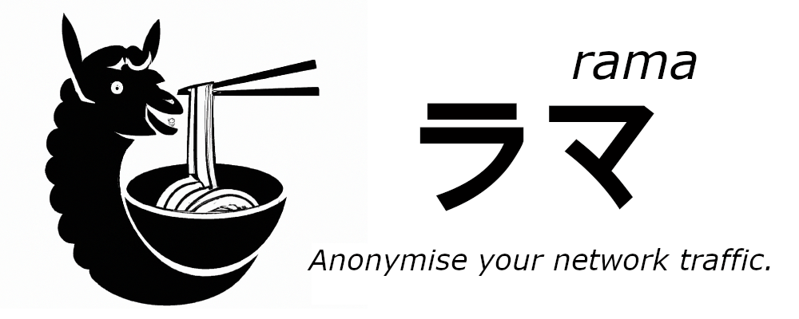

[![Crates.io][crates-badge]][crates-url]
[![Docs.rs][docs-badge]][docs-url]
[![MIT licensed][mit-badge]][mit-url]
[![Build Status][actions-badge]][actions-url]

[crates-badge]: https://img.shields.io/crates/v/rama.svg
[crates-url]: https://crates.io/crates/rama
[docs-badge]: https://img.shields.io/docsrs/rama/latest
[docs-url]: https://docs.rs/rama/latest/rama/index.html
[mit-badge]: https://img.shields.io/badge/license-MIT-blue.svg
[mit-url]: https://github.com/plabayo/llama/blob/master/LICENSE
[actions-badge]: https://github.com/plabayo/llama/workflows/CI/badge.svg
[actions-url]: https://github.com/plabayo/llama/actions?query=workflow%3ACI+branch%main

> rama is early work in progress, use at your own risk.
>
> Not everything that exists is documented and not everything that is documented is implemented.

rama is a proxy framework using Tokio written purely in Rust,
with as primary goal to anonymise your network traffic.

> The name "ラマ (rama)" is Japanese for llama, the mascot and spiritual inspiration of this proxy framework.

rama can be used in two different ways:

- `rama::core::*` contains all the building blocks to build your own (web) proxy,
  which can be used to build any (web) proxy you can think of (`[TODO: create]`);
- `rama::managed::*` combines the above to give you an easy to use Proxy builder and other web related services such as a TLS terminator and HTTP(S) mirror web service (`[TODO: create]`).

In the `/bin` folder there are a variety of ready-to-use binaries that use the `rama` crate internally:

- `/bin/rama` has a ready to use `rama::managed::proxy`, usable as a pure transport layer proxy or a full blown MITM proxy (`[TODO: create]`);
- `/bin/pango` has a ready to use `rama::managed::tls`, a TLS terminator (`[TODO: create]`);
- `/bin/mirror` has a ready to use `rama::managed::mirror`, a HTTP(S) mirror web service that can be used to see incoming traffic and mock services for it (`[TODO: create]`);

The `rama::core` can be summarized in one chart as follows:

```
┌────────────────────────────────────────┐      ┌──────────────────────────────────────┐
│inbound                                 │      │outbound                              │
├──────────┬─────────────────────────────┤      ├──────────────────────────────────────┤      ┌──────┐
│transports│services                     │      │handlers                              │      │Target│
├──────────┼─────────────────────────────┤ ◄──► ├──────────────────────────────────────┤ ◄──► ├──────┤
│          │AsyncRW -> Result<AsyncRW>   │      │HTTP(S) Proxy, Socks5 Proxy, ...      │      │Proxy │
├──────────┼─────────────────────────────┤      │                                      │      └──────┘
│TCP       │TLS, Firewall, RateLimit, ...│      │        TODO: define this side better │
└──────────┴─────────────────────────────┘      └──────────────────────────────────────┘

`rama::managed::*` combines the above to give you an easy to use Proxy framework,
which should allow you to focus only on the config of the proxy and any custom services
you might wish to use.
```

## Goals

With rama you can should be able to write any typical tls/http proxy,
without having to write all the boilerplate code first,
but by keeping all the power that comes with having a source-code driven proxy.

The following technologies are used under the hood of rama,
and are for the most part exposed to the user:

- [tokio][tokio]: async runtime of choice, and also drives the TCP layer, the foundation for most common proxies;
- [tower][tower]: layer your proxy together using tower, all services provided by rama are tower-compatible;
- [rustls][rustls]: tls server layer (reverse proxy) as well as tls client layer, provided by _rustls_, safe and fun;
- [hyper][hyper]: http1/2/3 client of choice, also used in case you wish to implement an http (MITM) proxy;
- [fast-socks5][socks5]: socks5 client/server, useful in case you want a socks5 proxy;
- [hyper-tungstenite-rs][ws]: serve incoming web socket requests;

[tokio]: https://tokio.rs
[tower]: https://github.com/tower-rs/tower
[rustls]: https://github.com/rustls/rustls
[hyper]: https://hyper.rs
[socks5]: https://github.com/dizda/fast-socks5
[ws]: https://github.com/de-vri-es/hyper-tungstenite-rs

All these technologies are built-in to rama and drive many of its provided services.
Llama is also bundled with some custom middleware layers as well that can be used in combination with
these services. Important to know is that:

- All layers are optional and composable how you want;
- You should be able to use any other Tokio-compatible Tower-driven library out there, for all your middleware and service needs;

As such you should easily be able to implement your own Service for any layer you wish,
while at the same time retaining the ability to seamlessly piggy-back on rama for most of your proxy logic.

## Services

With [Tower][tower] everything is a service. A service takes in a request and outputs either an error or a response.
What the actual types for these request-response pairs are, is up to you and depend mostly on the layer it is used.
In tower it is typical that a service wraps another service, as such all your services and middleware will stack on top of each other,
like a... _tower_.

### Socks5 Proxy Example

A socks5 proxy could be implemented as follows:

```
tcp::Server
     ⤷ socks5::Server ⭢ /target/
```

A typical rama proxy will start with `tcp::Server`.
This gives you [an accepted TcpStream](https://docs.rs/tokio/latest/tokio/net/struct.TcpStream.html).

> Given "Accept" is a _kernel_ function this is the lowest level you can go painlessly.
> Should you want to be able to act upon incoming tcp clients prior to accepting,
> you'll need to implement it yourself on kernel level, and make your own Rust service
> to make use of that kernel module.
>
> _eBPF_ could help you achieve this, which can be done
> using https://github.com/foniod/redbpf. Note though that this comes
> with a lot of effort on your side while at the same time not giving a lot in return.
