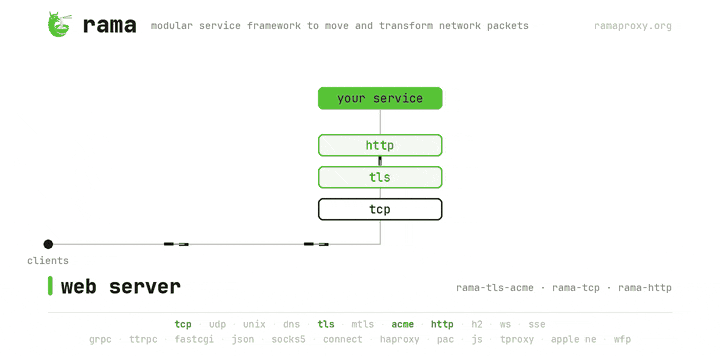

[](https://ramaproxy.org/)

[![Crates.io][crates-badge]][crates-url]
[![Docs.rs][docs-badge]][docs-url]
[![MIT License][license-mit-badge]][license-mit-url]
[![Apache 2.0 License][license-apache-badge]][license-apache-url]
[![rust version][rust-version-badge]][rust-version-url]
[![Build Status][actions-badge]][actions-url]
[![Lines of Code][loc-badge]][loc-url]

[crates-badge]: https://img.shields.io/crates/v/rama.svg
[crates-url]: https://crates.io/crates/rama
[docs-badge]: https://img.shields.io/docsrs/rama/latest
[docs-url]: https://docs.rs/rama/latest/rama/index.html
[license-mit-badge]: https://img.shields.io/badge/license-MIT-blue.svg
[license-mit-url]: https://github.com/plabayo/rama/blob/main/LICENSE-MIT
[license-apache-badge]: https://img.shields.io/badge/license-APACHE-blue.svg
[license-apache-url]: https://github.com/plabayo/rama/blob/main/LICENSE-APACHE
[rust-version-badge]: https://img.shields.io/badge/rustc-1.96+-blue?style=flat-square&logo=rust
[rust-version-url]: https://www.rust-lang.org
[actions-badge]: https://github.com/plabayo/rama/actions/workflows/CI.yml/badge.svg?branch=main
[actions-url]: https://github.com/plabayo/rama/actions/workflows/CI.yml
[loc-badge]: https://img.shields.io/endpoint?url=https://ghloc.vercel.app/api/plabayo/rama/badge?filter=.rs,.swift,.c,.h$&style=flat&logoColor=white&label=LoC
[loc-url]: https://github.com/plabayo/rama

[discord-badge]: https://img.shields.io/badge/Discord-%235865F2.svg?style=for-the-badge&logo=discord&logoColor=white
[discord-url]: https://discord.gg/29EetaSYCD
[bmac-badge]: https://img.shields.io/badge/Buy%20Me%20a%20Coffee-ffdd00?style=for-the-badge&logo=buy-me-a-coffee&logoColor=black
[bmac-url]: https://www.buymeacoffee.com/plabayo
[ghs-badge]: https://img.shields.io/badge/sponsor-30363D?style=for-the-badge&logo=GitHub-Sponsors&logoColor=#EA4AAA
[ghs-url]: https://github.com/sponsors/plabayo
[paypal-badge]: https://img.shields.io/badge/paypal-contribution?style=for-the-badge&color=blue
[paypal-url]: https://www.paypal.com/donate/?hosted_button_id=P3KCGT2ACBVFE

🦙 rama® (ラマ) is a modular service framework for the 🦀 Rust language
that provides a cohesive foundation for building network clients,
servers, proxies, and combinations thereof.

The framework is intentionally explicit. Your network stack is built from services,
layers, transports, protocols, and state that you compose yourself. That makes
the shape of the system visible in the code, instead of hidden behind framework
magic or configuration.

This makes Rama a good fit not only for proxies, but for network services where
the stack itself matters: how traffic enters, how it is decoded, where state
lives, what gets inspected, what gets transformed, and where it goes next.

Whether you're inspecting traffic for security analysis, writing a web service,
emulating clients with custom user agents, controlling connection behavior for
advanced testing, or building high-performance proxies, Rama provides a clean
and composable [Tokio](https://tokio.rs/)-native foundation for network services
in Rust.

Rama is used in production for network security, data extraction, API gateways,
routing, and other networked systems. Commercial support and partner offerings
are available at [ramaproxy.com](https://ramaproxy.com).

> This framework is developed and maintained by [Plabayo](https://plabayo.tech),
> a European software studio based in Gent, Belgium, focused on building resilient,
> interoperable, and secure digital infrastructure.

<p align="center">
  <picture>
    <source
      media="(prefers-color-scheme: dark)"
      srcset="docs/img/rama-dark.gif">
    
  </picture>
</p>

## Start here

The book explains the ideas, the examples show working stacks, and the Rust docs
are the API reference.

| If you want to... | Go here |
|---|---|
| Understand why Rama exists | [Why Rama](https://ramaproxy.org/book/why_rama.html) |
| Learn the core model | [Intro to Rama](https://ramaproxy.org/book/intro.html) |
| Run working code | [Examples](https://github.com/plabayo/rama/tree/main/examples) |
| Build a proxy | [Intro to proxies](https://ramaproxy.org/book/proxies/intro.html) and [proxy examples](https://github.com/plabayo/rama/tree/main/examples#proxies) |
| Operate advanced proxy stacks | [Operate Proxies](https://ramaproxy.org/book/proxies/operate/intro.html) |
| Build an HTTP service | [Web servers](https://ramaproxy.org/book/web_servers.html) and [HTTP service examples](https://github.com/plabayo/rama/tree/main/examples#http-servers-and-services) |
| Build an HTTP client | [HTTP clients](https://ramaproxy.org/book/http/http_clients.html) and [`http_high_level_client.rs`](https://github.com/plabayo/rama/blob/main/examples/src/http_high_level_client.rs) |
| Use Rama from the terminal | [`rama` CLI](https://ramaproxy.org/book/deploy/rama-cli.html) |
| Look up APIs | [docs.rs](https://docs.rs/rama) or [edge docs](https://ramaproxy.org/docs/rama) |
| Get commercial support | [ramaproxy.com](https://ramaproxy.com) |

## What can you build?

Rama is built for programmable network services: software that accepts, opens,
inspects, transforms, routes, proxies, or generates network traffic.

| Area | Capabilities and building blocks |
|---|---|
| Proxies | [reverse proxies](https://ramaproxy.org/book/proxies/reverse.html), [TLS termination proxies](https://ramaproxy.org/book/proxies/tls.html), [HTTP(S) proxies](https://ramaproxy.org/book/proxies/http.html), [SOCKS5 proxies](https://ramaproxy.org/book/proxies/socks5.html), [SNI proxies](https://ramaproxy.org/book/proxies/sni.html), [MITM proxies](https://ramaproxy.org/book/proxies/mitm.html), [transparent proxies](https://ramaproxy.org/book/proxies/transparent.html), [distortion proxies](https://ramaproxy.org/book/proxies/distort.html), [network proxies](https://ramaproxy.org/book/proxies/network.html), [HAProxy PROXY protocol](https://ramaproxy.org/book/proxies/haproxy.html) |
| [Web applications and APIs](https://ramaproxy.org/book/web_servers.html) | [path and matcher routing](https://ramaproxy.org/docs/rama/http/service/web/index.html), [async handlers](https://ramaproxy.org/docs/rama/http/service/web/trait.EndpointServiceFn.html) with [typed request extractors and shared state](https://ramaproxy.org/docs/rama/http/service/web/extract/index.html), [typed HTML, JSON, and streaming responses](https://ramaproxy.org/docs/rama/http/service/web/response/index.html), [forms and streaming file uploads](https://ramaproxy.org/book/http/multipart.html), [static and embedded assets](https://ramaproxy.org/docs/rama/http/service/fs/index.html), and [authentication, CSRF, CORS, compression, timeouts, tracing, and other middleware](https://ramaproxy.org/docs/rama/http/layer/index.html) |
| Clients and connector stacks | [high-level and blocking HTTP(S) clients](https://ramaproxy.org/book/http/http_clients.html), [WebSocket clients](https://ramaproxy.org/book/http/ws.html), [gRPC clients](https://ramaproxy.org/book/http/grpc.html), [ttRPC clients](https://ramaproxy.org/book/http/grpc.html#ttrpc-a-sibling-protocol), [ICAP clients](https://ramaproxy.org/docs/rama/icap/client/index.html), [FastCGI clients](https://ramaproxy.org/book/gateway/fastcgi.html), [DNS clients](https://ramaproxy.org/book/dns.html), [custom connector stacks](https://ramaproxy.org/docs/rama/http/client/struct.EasyHttpConnectorBuilder.html) across transport, DNS, proxy, TLS, and HTTP stages, [custom connection pools and reuse policies](https://ramaproxy.org/docs/rama/net/client/pool/index.html), [request and response middleware](https://ramaproxy.org/docs/rama/http/layer/index.html), [client and proxy HTTP/TLS User-Agent emulation with real-browser profiles](https://ramaproxy.org/book/intro/user_agent.html), [custom services and layers](https://ramaproxy.org/book/diy.html) |
| Servers and ingress controls | [HTTP/1.1 and HTTP/2 servers with automatic protocol detection](https://ramaproxy.org/docs/rama/http/server/service/struct.HttpServer.html#method.auto), [WebSocket servers](https://ramaproxy.org/book/http/ws.html), [SSE and Datastar streams](https://ramaproxy.org/book/http/sse.html), [gRPC servers](https://ramaproxy.org/book/http/grpc.html), [ttRPC servers](https://ramaproxy.org/book/http/grpc.html#ttrpc-a-sibling-protocol), [ICAP servers](https://ramaproxy.org/docs/rama/icap/server/index.html), [TCP, UDP, and Unix transport stacks](https://ramaproxy.org/book/transport.html), [TLS termination, dynamic certificates, mTLS, and ACME](https://ramaproxy.org/book/proxies/tls.html), [protocol inspection and routing](https://ramaproxy.org/book/proxies/protocol_inspection.html), [User-Agent parsing and classification](https://ramaproxy.org/docs/rama/ua/layer/classifier/index.html), [JA3, JA4, and PeetPrint TLS fingerprinting](https://ramaproxy.org/docs/rama/tls/fingerprint/index.html), [JA4H and Akamai HTTP/2 fingerprinting](https://ramaproxy.org/docs/rama/http/fingerprint/index.html), [authentication, CSRF, CORS, rate and body limits, timeouts, and tracing middleware](https://ramaproxy.org/docs/rama/http/layer/index.html) |
| Application protocols and gateways | [WebSockets](https://ramaproxy.org/book/http/ws.html), [SSE](https://ramaproxy.org/book/http/sse.html), [Datastar](https://ramaproxy.org/docs/rama/http/sse/datastar/index.html), [gRPC](https://ramaproxy.org/book/http/grpc.html), [ttRPC](https://ramaproxy.org/book/http/grpc.html#ttrpc-a-sibling-protocol), [FastCGI](https://ramaproxy.org/book/gateway/fastcgi.html), [RSS and Atom feeds](https://ramaproxy.org/book/http/rss.html) |
| Proxy routing and discovery | [explicit routes, route plans, and ordered fallback](https://ramaproxy.org/book/intro/service_zen.html), [HTTP(S) and SOCKS5 upstream proxies](https://ramaproxy.org/book/proxies/operate/proxies_and_vpns.html), [proxy environment variables and `NO_PROXY`](https://ramaproxy.org/book/proxies/operate/app.html), [native system-proxy discovery](https://ramaproxy.org/book/proxies/operate/system.html), [PAC fetching, caching, evaluation, generation, and system integration](https://ramaproxy.org/book/proxies/operate/pac.html), [bypass rules](https://ramaproxy.org/docs/rama/net/client/struct.BypassRules.html), [route failure caching](https://ramaproxy.org/docs/rama/net/client/struct.ProxyRouteFailureCache.html) |
| Content adaptation | [ICAP clients](https://ramaproxy.org/docs/rama/icap/client/index.html), [servers](https://ramaproxy.org/docs/rama/icap/server/index.html), [HTTP adaptation layers](https://ramaproxy.org/docs/rama/icap/http/layer/index.html), and [Preview support](https://ramaproxy.org/docs/rama/icap/proto/struct.Preview.html) |
| Runtime and interoperability | [async services](https://ramaproxy.org/docs/rama/service/trait.Service.html), [blocking service adapters](https://ramaproxy.org/docs/rama/rt/blocking/index.html), [blocking HTTP(S) clients](https://ramaproxy.org/docs/rama/http/client/type.BlockingHttpWebClient.html), [blocking WebSocket clients](https://ramaproxy.org/docs/rama/http/ws/handshake/client/trait.BlockingHttpClientWebSocketExt.html), [Tower interoperability](https://ramaproxy.org/docs/rama/utils/tower/index.html), [graceful shutdown](https://ramaproxy.org/docs/rama/graceful/index.html) |
| TLS and identity | [Rustls](https://ramaproxy.org/docs/rama/tls/rustls/index.html), [BoringSSL](https://ramaproxy.org/docs/rama/tls/boring/index.html), [TLS termination](https://ramaproxy.org/book/proxies/tls.html), [dynamic certificates](https://ramaproxy.org/book/proxies/reverse.html), [mTLS](https://ramaproxy.org/book/proxies/tls.html), [ACME](https://ramaproxy.org/docs/rama/tls/acme/index.html), [certificate pinning](https://github.com/plabayo/rama/blob/main/examples/src/tls_rustls_cert_pinning.rs) |
| Traffic inspection | [protocol inspection](https://ramaproxy.org/book/proxies/protocol_inspection.html), [HAR recording and replay](https://ramaproxy.org/book/http/har.html), [curl export](https://ramaproxy.org/docs/rama/http/convert/curl/index.html), [diagnostics](https://ramaproxy.org/docs/rama/telemetry/index.html) |
| Data processing | [streaming HTML rewriting](https://ramaproxy.org/docs/rama/http/layer/html_rewrite/index.html), [streaming JSON and JSONPath selection and rewriting](https://ramaproxy.org/docs/rama/json/index.html), [JSON-LD responses and extraction](https://ramaproxy.org/docs/rama/http/protocols/json_ld/index.html) |
| Observability | [tracing and OpenTelemetry](https://ramaproxy.org/book/intro/telemetry.html), [HTTP metrics](https://ramaproxy.org/docs/rama/http/layer/opentelemetry/index.html), [transport metrics](https://ramaproxy.org/docs/rama/net/stream/layer/opentelemetry/index.html), [runtime telemetry](https://ramaproxy.org/book/dial9.html) |
| Embedded scripting | [JavaScript runtime](https://ramaproxy.org/docs/rama/js/struct.JsRuntime.html), [PAC evaluation](https://ramaproxy.org/docs/rama/js/pac/struct.PacResolver.html) and [generation](https://ramaproxy.org/docs/rama/js/pac/struct.PacGenerator.html) |
| Lower-level networking | [TCP](https://ramaproxy.org/docs/rama/tcp/index.html), [UDP](https://ramaproxy.org/docs/rama/udp/index.html), [Unix sockets](https://ramaproxy.org/docs/rama/unix/index.html), [DNS](https://ramaproxy.org/book/dns.html), [transport middleware](https://ramaproxy.org/docs/rama/net/stream/layer/index.html), [connection pooling](https://ramaproxy.org/docs/rama/net/client/pool/index.html) |
| Platform integrations | [Apple Network Extension](https://ramaproxy.org/book/proxies/operate/transparent/macos.html), [Apple XPC](https://ramaproxy.org/book/xpc.html), [Linux tproxy](https://ramaproxy.org/book/proxies/operate/transparent.html#1-linux-the-tproxy-powerhouse), [Windows WFP](https://ramaproxy.org/book/proxies/operate/transparent/windows.html) |

For the full capability overview, see the [website feature table](https://ramaproxy.org/#features-table)
and the [API docs](https://docs.rs/rama). All protocols implemented in rama are made with the
entire range of clients, servers and proxies in mind.

For advanced proxy operation, see the [Operate Proxies](https://ramaproxy.org/book/proxies/operate/intro.html)
chapters. For Apple transparent proxying, see the
[Apple transparent proxy example](https://github.com/plabayo/rama/tree/main/ffi/apple/examples/transparent_proxy).

## Core ideas

- **Services all the way down:** Rama uses the same service model across clients,
  servers, middleware, and lower network layers.
- **Explicit stacks:** transports, TLS, protocols, state, and middleware are
  composed in code, so the path traffic takes stays visible.
- **Transport-to-HTTP control:** work at the HTTP layer when that is enough, or
  reach into TCP, UDP, TLS, DNS, and connection state when needed.
- **Modular by design:** use the top-level `rama` crate and compose only the
  protocol and runtime building blocks you need for an application, library,
  or framework, with your own services and layers where desired.
- **Tower interop:** Rama has its own service traits, with compatibility for
  Tower where that helps.
- **Blocking boundaries:** expose async stacks to synchronous code through
  `BlockingService` and `rt::blocking`, without making the stack itself synchronous.

## Examples

The [`examples`](https://github.com/plabayo/rama/tree/main/examples) directory
contains tested examples for common stacks.

| Goal | Example |
|---|---|
| Minimal HTTP service | [`http_service_hello.rs`](https://github.com/plabayo/rama/blob/main/examples/src/http_service_hello.rs) |
| HTTP router | [`http_web_router.rs`](https://github.com/plabayo/rama/blob/main/examples/src/http_web_router.rs) |
| High-level HTTP client | [`http_high_level_client.rs`](https://github.com/plabayo/rama/blob/main/examples/src/http_high_level_client.rs) |
| HTTP CONNECT proxy | [`http_connect_proxy.rs`](https://github.com/plabayo/rama/blob/main/examples/src/http_connect_proxy.rs) |
| SOCKS5 proxy | [`socks5_connect_proxy.rs`](https://github.com/plabayo/rama/blob/main/examples/src/socks5_connect_proxy.rs) |
| MITM proxy | [`http_mitm_proxy_boring.rs`](https://github.com/plabayo/rama/blob/main/examples/src/http_mitm_proxy_boring.rs) |
| HTTP(S) proxy with ICAP | [`http_icap_proxy.rs`](https://github.com/plabayo/rama/blob/main/examples/src/http_icap_proxy.rs) |
| Linux transparent proxy | [`linux_tproxy_tcp.rs`](https://github.com/plabayo/rama/blob/main/examples/src/linux_tproxy_tcp.rs) |
| Apple transparent proxy | [`ffi/apple/examples/transparent_proxy`](https://github.com/plabayo/rama/tree/main/ffi/apple/examples/transparent_proxy) |
| Tower integration | [`http_rama_tower.rs`](https://github.com/plabayo/rama/blob/main/examples/src/http_rama_tower.rs) |

Most examples can be run with `cargo` and the required feature flags:

```bash
cargo run -p rama-examples --bin http_service_hello --features=http-full
cargo run -p rama-examples --bin http_connect_proxy --features=http-full
cargo run -p rama-examples --bin socks5_connect_proxy --features=dns,socks5
```

Check each example's module documentation for exact usage and feature
requirements.

## `rama` binary

The `rama` binary lets you use parts of Rama without writing Rust code. It can
act as an HTTP client, run local IP/echo/fingerprinting services, and run
configured proxy stacks.

Learn how to install and use it in the [`rama` CLI chapter](https://ramaproxy.org/book/deploy/rama-cli.html).

## Status

- **MSRV:** Rama requires Rust `1.96`.
- **Platforms:** Linux, macOS, and Windows are tier 1 platforms. Android and iOS
  targets are checked in CI.
- **Safety:** Rama avoids unsafe code where possible. Low-level protocol code and
  FFI-backed crates use unsafe where needed.
- **Supply chain:** dependencies are audited with [`cargo vet`](https://github.com/mozilla/cargo-vet).
- **Performance:** Rama's default HTTP implementation is based on Hyper internals
  and is designed for production network services.
- **Roadmap:** planned work is tracked in [GitHub milestones](https://github.com/plabayo/rama/milestones).

## All rama and other crates developed by Plabayo

Most users can start with [`rama`](https://crates.io/crates/rama). The smaller
crates exist for users who want finer control over dependencies or extension
points.

See the [ecosystem chapter](https://ramaproxy.org/book/ecosystem.html) for more
context.

Rama crates in this repository:

- [`rama`](https://crates.io/crates/rama): top-level crate
- [`rama-error`](https://crates.io/crates/rama-error): error utilities for rama and its users
- [`rama-macros`](https://crates.io/crates/rama-macros): contains the procedural macros used by `rama`
- [`rama-utils`](https://crates.io/crates/rama-utils): utilities crate for rama
- [`rama-ws`](https://crates.io/crates/rama-ws): WebSocket (WS) support for rama
- [`rama-core`](https://crates.io/crates/rama-core): core crate containing the service and layer traits
  used by all other `rama` code, as well as some other _core_ utilities
- [`rama-crypto`](https://crates.io/crates/rama-crypto): rama crypto primitives and dependencies
- [`rama-net`](https://crates.io/crates/rama-net): rama network types and utilities
- [`rama-net-apple-networkextension`](https://crates.io/crates/rama-net-apple-networkextension): Apple Network Extension support for rama
- [`rama-net-apple-xpc`](https://crates.io/crates/rama-net-apple-xpc): Apple XPC support for rama
- [`rama-dns`](https://crates.io/crates/rama-dns): DNS support for rama
- [`rama-unix`](https://crates.io/crates/rama-unix): Unix (domain) socket support for rama
- [`rama-tcp`](https://crates.io/crates/rama-tcp): TCP support for rama
- [`rama-udp`](https://crates.io/crates/rama-udp): UDP support for rama
- [`rama-tls-acme`](https://crates.io/crates/rama-tls-acme): ACME support for rama
- [`rama-tls-boring`](https://crates.io/crates/rama-tls-boring): [Boring](https://github.com/plabayo/rama-boring) TLS support for rama
- [`rama-tls-rustls`](https://crates.io/crates/rama-tls-rustls): [Rustls](https://github.com/rustls/rustls) support for rama
- [`rama-proxy`](https://crates.io/crates/rama-proxy): proxy types and utilities for rama
- [`rama-socks5`](https://crates.io/crates/rama-socks5): SOCKS5 support for rama
- [`rama-fastcgi`](https://crates.io/crates/rama-fastcgi): FastCGI support for rama
- [`rama-haproxy`](https://crates.io/crates/rama-haproxy): rama HAProxy support
- [`rama-icap`](https://crates.io/crates/rama-icap): ICAP support for rama
- [`rama-ua`](https://crates.io/crates/rama-ua): User-Agent (UA) support for `rama`
- [`rama-http-types`](https://crates.io/crates/rama-http-types): http types and utilities
- [`rama-http-headers`](https://crates.io/crates/rama-http-headers): typed http headers
- [`rama-json`](https://crates.io/crates/rama-json): streaming JSON tokenizer, JSONPath selection, and rewriting utilities
- [`rama-js`](https://crates.io/crates/rama-js): embedded javascript execution
- [`rama-pac`](https://crates.io/crates/rama-pac): proxy auto-configuration (PAC) support
- [`rama-grpc`](https://crates.io/crates/rama-grpc): gRPC support for rama
- [`rama-grpc-build`](https://crates.io/crates/rama-grpc-build): gRPC codegen support for rama
- [`rama-grpc-macros`](https://crates.io/crates/rama-grpc-macros): proc-macros to define gRPC services inline, without a `.proto` file
- [`rama-http`](https://crates.io/crates/rama-http): rama http services, layers and utilities
- [`rama-http-macros`](https://crates.io/crates/rama-http-macros): proc-macros powering the type-safe HTML templating in `rama-http::protocols::html`
- [`rama-http-backend`](https://crates.io/crates/rama-http-backend): default http backend for `rama`
- [`rama-http-core`](https://crates.io/crates/rama-http-core): http protocol implementation driving `rama-http-backend`
- [`rama-http-hyperium`](https://crates.io/crates/rama-http-hyperium): conversions between rama and the hyperium `http` crate
- [`rama-tower`](https://crates.io/crates/rama-tower): [tower](https://github.com/tower-rs/tower) compatibility for `rama`
- [`rama-ttrpc`](https://crates.io/crates/rama-ttrpc): ttRPC (gRPC for low-memory environments) support for rama
- [`rama-ttrpc-build`](https://crates.io/crates/rama-ttrpc-build): ttRPC codegen support for rama

Related Plabayo crates and projects:

- [`rama-boring`](https://crates.io/crates/rama-boring): BoringSSL bindings for rama
- [`rama-boring-sys`](https://crates.io/crates/rama-boring-sys): FFI bindings to BoringSSL for rama
- [`rama-boring-tokio`](https://crates.io/crates/rama-boring-tokio): Tokio SSL streams backed by BoringSSL
- [`rama-boringssl`](https://github.com/plabayo/rama-boringssl): BoringSSL fork used by `rama-boring`
- [`tokio-graceful`](https://crates.io/crates/tokio-graceful): graceful shutdown utilities for Tokio
- [`venndb`](https://crates.io/crates/venndb): set and relation matching utilities used by Rama proxy components
- [`homebrew-rama`](https://github.com/plabayo/homebrew-rama): Homebrew formula for the `rama` CLI

## Community

[![Discord][discord-badge]][discord-url]

Questions, ideas, and project discussion are welcome on [Discord][discord-url].
Bug reports and feature requests can be opened as
[GitHub issues](https://github.com/plabayo/rama/issues).

Rama also has a public channel on the official Discord of the Tokio project:
<https://discord.com/channels/500028886025895936/1349098858831024209>.

## Contributing

Contributions are welcome. Please read [CONTRIBUTING.md](https://github.com/plabayo/rama/blob/main/CONTRIBUTING.md)
before opening a pull request.

Good places to start:

- [`good first issue`](https://github.com/plabayo/rama/issues?q=is%3Aissue+is%3Aopen+label%3A%22good+first+issue%22)
- [`easy`](https://github.com/plabayo/rama/issues?q=is%3Aissue+is%3Aopen+label%3Aeasy)
- [`mentor available`](https://github.com/plabayo/rama/issues?q=is%3Aissue+is%3Aopen+label%3A%22mentor+available%22)
- [`low prio`](https://github.com/plabayo/rama/issues?q=is%3Aissue+is%3Aopen+label%3A%22low+prio%22)

Some issues have a [`needs input`](https://github.com/plabayo/rama/issues?q=is%3Aissue+is%3Aopen+label%3A%22needs+input%22+)
label. These usually need discussion, research, or design work before
implementation starts.

Unless you explicitly state otherwise, any contribution intentionally submitted
for inclusion in `rama` by you shall be licensed as both [MIT](https://github.com/plabayo/rama/blob/main/LICENSE-MIT)
and [Apache-2.0](https://github.com/plabayo/rama/blob/main/LICENSE-APACHE),
without any additional terms or conditions.

## License

Rama is licensed under either of:

- [MIT](https://github.com/plabayo/rama/blob/main/LICENSE-MIT)
- [Apache-2.0](https://github.com/plabayo/rama/blob/main/LICENSE-APACHE)

## Sponsors and support

[![GitHub Sponsors][ghs-badge]][ghs-url]
[![Buy Me A Coffee][bmac-badge]][bmac-url]
[![Paypal Donation][paypal-badge]][paypal-url]

Rama is free and open-source software. Sponsorships help fund development,
infrastructure, testing, and maintenance.

Commercial support, consulting, training, and custom development are available
through [ramaproxy.com](https://ramaproxy.com). More background is available in
the [Sponsor chapter](https://ramaproxy.org/book/sponsor.html).

## Alternatives

If Rama is not the right fit for your proxy work, you may also want to look at
[`pingora`](https://github.com/cloudflare/pingora) by Cloudflare and
[`g3proxy`](https://github.com/bytedance/g3) by ByteDance.

The [Why Rama](https://ramaproxy.org/book/why_rama.html) chapter explains how
Rama fits between off-the-shelf proxies and building a stack from scratch.

## FAQ

Available at <https://ramaproxy.org/book/faq.html>.

[](https://ramaproxy.org/)

> [!TIP]
>
> 📚 If you like Rama, you might also like [Netstack.FM®](https://netstack.fm),
> a podcast about networking, Rust, and everything in between.
