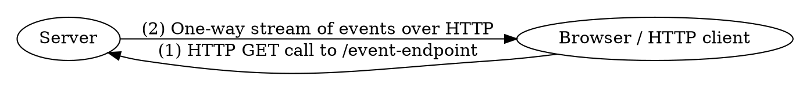

# Server-Sent Events (SSE)

<div class="book-article-intro">
    
    <div>
        Server-Sent Events (SSE) is a simple and efficient mechanism for servers to push real-time updates to clients over HTTP. Unlike WebSockets, which provide full-duplex communication, SSE establishes a one-way channel from server to client using a long-lived HTTP connection.
        <p>— <a href="https://developer.mozilla.org/en-US/docs/Web/API/Server-sent_events">MDN Web Docs</a></p>
    </div>
</div>

## Description

SSE provides a lightweight and efficient alternative to more complex real-time
communication mechanisms like WebSockets, especially when communication is
strictly **server → client**. It relies on standard HTTP and text-based formatting,
making it friendly for browsers and intermediaries like proxies or load balancers.

Rama offers support for `SSE` both as a client and a server.
As such you could even MITM proxy it.

<div class="book-article-image-center">



</div>

First, the client initiates an HTTP `GET` request—either secure (`https`) or not—to the server.
In response, the server replies (step 2) with a `200 OK` status if content is available,
or potentially something else, such as `204 No Content`.

For a successful response, the `Content-Type` must be set to `text/event-stream`.
The server then keeps the HTTP connection open and continuously streams events
using a simple wire format. Each event may include a `data` field, and optionally an `id`, `event` name, or `retry` hint.

When the connection is closed by the server, the client is responsible for retrying
the request (returning to step 1) after waiting the number of milliseconds specified by
the most recent `retry` hint—or falling back to a default such as 3000ms if no hint was provided.

On reconnect, the client can include a `Last-Event-ID` header containing the ID of the last
event it successfully received. This allows the server to resume the stream from where it left off.
Alternatively, the server may respond with a `204 No Content`,
signaling that the stream has no more events to offer and that the client should not continue attempting to reconnect.

Example SSE frame:

```
id: 42
event: update
data: {"status":"ok"}
```

The browser parses these into `MessageEvent`s and exposes them via the [`EventSource`](https://developer.mozilla.org/en-US/docs/Web/API/EventSource) API. But browsers are not the only consumers of SSE...

## Rama Support

> 📚 Rust Docs: <https://ramaproxy.org/docs/rama/http/sse/index.html>

If you enable Rama’s `http` feature, **full SSE support is built-in** — for both server and client side, no additional libraries required.

Unlike the browser’s `EventSource` API which only allows you to *receive* string messages, **Rama gives you full access** to:

- **Sending and receiving** events asynchronously
- Using **arbitrary data formats** (plain strings, JSON, custom types)
- Building your own **retry logic**, reconnect strategies, and event parsing

> There is no opinionated `EventSource` abstraction in Rama. Instead, you interact directly with typed event streams — giving you full control over framing, backpressure, and logic.

### Examples

You can find ready-to-run examples demonstrating how to expose and consume SSE endpoints using Rama:

- [`http_sse.rs`](https://github.com/plabayo/rama/blob/main/examples/http_sse.rs)
  Simple example showing how to expose an SSE endpoint with string data.

- [`http_sse_json.rs`](https://github.com/plabayo/rama/blob/main/examples/http_sse_json.rs)
  Same as above, but emits **structured JSON data** using typed Rust structs.

These examples make use of Rama's typed header support, such as [`LastEventId`](https://github.com/plabayo/rama/blob/main/rama-http-headers/src/common/last_event_id.rs), which allows easy extraction of reconnect state to resume streams reliably.

## The Protocol

The Server-Sent Events protocol is a part of the [WHATWG HTML standard](https://html.spec.whatwg.org/multipage/server-sent-events.html). It defines how servers should format event streams, and how clients should parse them. The key features include:

- `data:` — the payload (can span multiple lines)
- `id:` — the event ID, which gets echoed by reconnecting clients
- `event:` — optional type identifier
- `retry:` — tells the client how long to wait before retrying

Comments are possible as well, these start with a colon `:`.

Unlike WebSockets, everything in SSE is plaintext and stream-friendly. This makes it perfect for cases like:

- Realtime dashboards
- Log viewers
- Chat message broadcasting
- Price tickers
- Background task progress

The `rama` support for datastar (<https://ramaproxy.org/book/web_servers.html#datastar>)
is also built on top of these foundations.

## Custom Logic and Resilience

With Rama you can:

- Use `LastEventId` typed header on the server side to resume lost connections based on the last delivered ID;
- Send data as Strings, structured Json or custom type implementations, all with automatic newline splitting;
- Optionally implement your own **retry strategies** by extracting `retry` hints from events

Since Rama’s stream model is async and composable, you can easily wrap event producers or consumers with middlewares that:
- Filter or enrich events
- Buffer or debounce messages

## Compression

As with other HTTP-based streaming protocols do not apply compression (`Accept-Encoding`)
on your body when using a streaming payload such as `SSE`. It breaks the streaming flow
by introducing hicups while waiting for the next "flush".

If you do need compression you are best to do it on a per-message base (e.g. compress
the data property within an SSE event), which is also an extension that is possible
in WebSockets.
