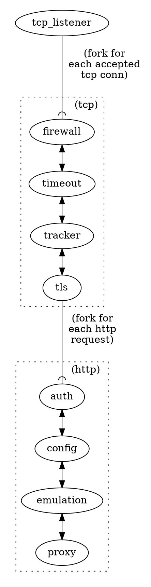

# Network Layers

Where `Rama` is different from most other typical `Tower` user cases that we are aware of,
is that we wish to use service stacks across layers of the network.

You can read through [the 'http service hello' example](https://github.com/plabayo/rama/blob/main/examples/http_service_hello.rs)
to see this in effect in a minimal setup. There you can see how there are services on the tcp layer as well as the http layer,
and that the `Extension`s propagates through them all via the input to the service calls.

Abstract Example:

In rama it is truly `Service`s all the way down.

## Transport Layer Service Examples

All rama [examples can be found in the `/examples` dir](https://github.com/plabayo/rama/tree/main/examples).

Here are some examples that demonstrate working with transport layer services:

- [/examples/tcp_listener_layers.rs](https://github.com/plabayo/rama/tree/main/examples/tcp_listener_layers.rs):
  an example showing how to create a TCP listener with multiple layers of middleware;
- [/examples/tcp_listener_fd_passing.rs](https://github.com/plabayo/rama/tree/main/examples/tcp_listener_fd_passing.rs):
  demonstrates real FD passing via SCM_RIGHTS for zero-downtime restarts (Unix-only);
- [/examples/tcp_listener_hello.rs](https://github.com/plabayo/rama/tree/main/examples/tcp_listener_hello.rs):
  a minimal example demonstrating a TCP listener that responds with a hello message;
- [/examples/tcp_nd_json.rs](https://github.com/plabayo/rama/tree/main/examples/tcp_nd_json.rs):
  example demonstrating how to serve a ndjson (Newline Delimited JSON) stream of data over TCP
- [/examples/udp_codec.rs](https://github.com/plabayo/rama/tree/main/examples/udp_codec.rs):
  an example showing how to work with UDP using codecs for message framing;
