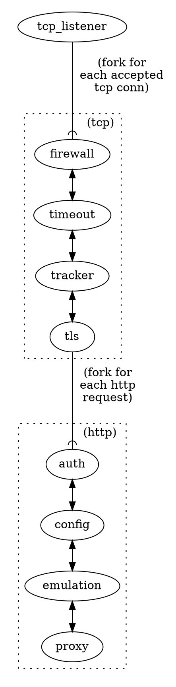

# Network Layers

Where `Rama` is different from most other typical `Tower` user cases that we are aware of,
is that we wish to use service stacks across layers of the network.

You can read through [the 'http service hello' example](https://github.com/plabayo/rama/blob/main/examples/http_service_hello.rs)
to see this in effect in a minimal setup. There you can see how there are services on the tcp layer as well as the http layer,
and that the `Context<State>` propagates through them all.

Abstract Example:

In rama it is truly `Service`s all the way down.
