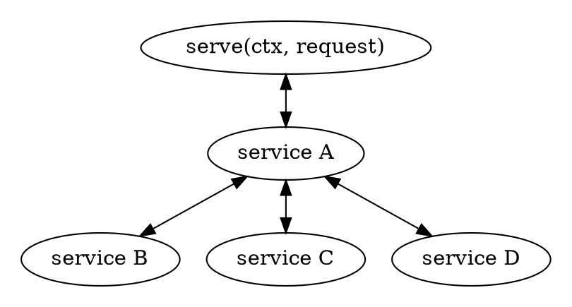
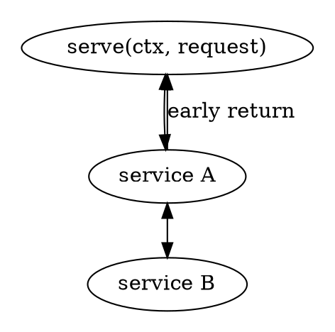
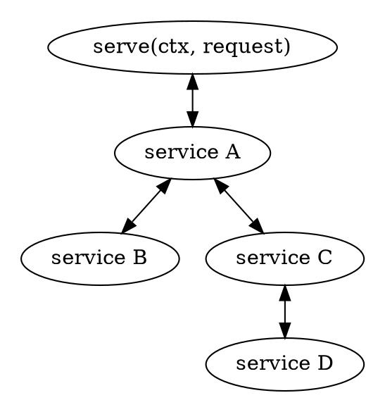

# ⛌ Service Branches

In [the "Service Stack" chapter](./service_stack.md) we hinted at the fact that
services can branch. Let us go a bit deeper into the branching concept now.

The easiest and most common kinds of branches are:

- router-like service: these are services that dispatch the incoming input to one of the services which it wraps around;
- fallible middleware services: these are services that can fail before or after they actually call the inner service(s).

## Service Routers

The easiest way to implement routers in Rama is by making use of
[the `Matcher` trait and the utilities built around it](https://ramaproxy.org/docs/rama/service/matcher/index.html).

In case you need this routing to be done on the web you can make use of:

- [`match_service!` macro](https://ramaproxy.org/docs/rama/http/service/web/macro.match_service.html) in case you want/like a static dispatch approach;
- or you can use the [`WebService` router](https://ramaproxy.org/docs/rama/http/service/web/struct.WebService.html) if dynamic dispatch is what you prefer.

On the transport layer you could make use of the [`SocketMatcher`](https://ramaproxy.org/docs/rama/net/stream/matcher/struct.SocketMatcher.html)
matcher. And of course for any layer there is always the option to roll out your own `Matcher` implementation or even start from scratch entirely.
The tools are there freely to be used directly or as inspiration.

The above is a visualisation of the concept in action where `Service A` would be the "router" service matching on the incoming input (however you wish) in order to forward the request to the relevant inner service. Such inner services are also labeled as "endpoint handlers" in the web world.

Examples of routers:

- static dispatch: [/examples/http_service_match.rs](https://github.com/plabayo/rama/blob/main/examples/http_service_match.rs)
- dynamic disaptch: [/examples/http_web_service_dir_and_api.rs](https://github.com/plabayo/rama/blob/main/examples/http_web_service_dir_and_api.rs)

### Use your imagination

The match concept is pretty powerful, be it by using [the `Matcher` trait](https://ramaproxy.org/docs/rama/service/matcher/trait.Matcher.html) or rolling out your own concept of matching. It allows you to stay modular and minimal in your approach.

Take a typical http client for example. As part of its work it needs to establish a connection to the target server. In the case of port `8080` this would be a plain `tcp` connection (for `http/1.1`), but in the case of port `443` that would require the `tcp` stream to be handled by a `Tls` client first (e.g. for `h2`).

Using the tuple matchers you can wrap these two different flows in a two-element tuple with a [`SocketMatcher`](https://ramaproxy.org/docs/rama/net/stream/matcher/struct.SocketMatcher.html) to match on the port (for example). And in fact that is more or less what [the HttpClient](https://ramaproxy.org/docs/rama/http/client/struct.HttpClient.html) does by default if you do not specify your own "Connection" service. We hope you can make happy use of it yourself.

## Fallible middleware services

Some middleware can fail in its pre- or post-processing. In such cases the logic is said to be branched away from the main (or so called happy path) logic.

This is the more traditional form of branching and is no different from error handling in non-service contexts.

## Hijacking Services

Another example of branching is the concept of hijacking services. These are services that based on certain conditions, which can for example be checked using the already explained [`Matcher` concept](https://ramaproxy.org/docs/rama/service/matcher/index.html).

This can for example be of use in case you want to serve an API over pseudo domains for alternative proxy services.

An example of this can be seen at [/examples/http_connect_proxy.rs](https://github.com/plabayo/rama/blob/main/examples/http_connect_proxy.rs), which makes use of the [`HijackLayer`](https://ramaproxy.org/docs/rama/service/layer/struct.HijackLayer.html), a layer specifically designed for this kind of purpose.

> 💡 the [`HijackLayer`](https://ramaproxy.org/docs/rama/service/layer/struct.HijackLayer.html) is meant for use cases where you want to provide the full response yourself. In case you want to hijack starting from the regular response provided by the "actual" inner service you'll have to create your own [`Layer`](https://ramaproxy.org/docs/rama/service/layer/trait.Layer.html) implementation.
>
> Even if so you can still make use of the [`Matcher`](https://ramaproxy.org/docs/rama/service/matcher/index.html) and utilities around it should you want. In case you are in need of a starting point, feel free to copy code from Rama or another, which is an option like always.
