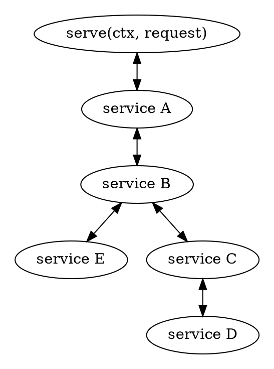

# Service Stack

Types implementing the `Service` trait may be the one actually providing the response directly or indirectly.
They might also contain as one of its properties another `Service` which in the happy path produces the
result directly or indirectly instead. The exact mode of operation is freely defined by the `Service` implementation.

An easy example of this is [a `Timeout` service](https://github.com/plabayo/rama/blob/main/src/service/layer/timeout/mod.rs)
which contains any other `Service` but will return a timeout 'error' in case that service took more
then the defined deadline to produce a result. A service such as `Timeout` is referred to as a `Layer` and
is usually created using an implementation of the `Layer` trait, as defined in
<https://github.com/plabayo/rama/blob/main/src/service/layer/mod.rs>.

You can nest `Service`s as deep as you want and some can even contain multiple ones that are either
all helping in producing a response for the given request or where it branches of and calls on of the wrapped services
depending on some defined conditions. All is possible. The contract is simple, the implementation is yours.

As such a topology such as the following is easily possible, where each node in the graph is a service:

What might not be clear on the graph, but what is important to understand,
is that a response can be produced at any layer of such a service stack. While in the happy
path it is produced by a leaf service, it is certainly not the case.
