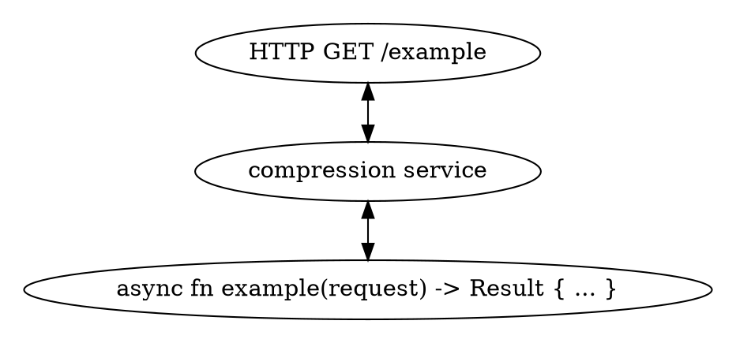

# 🍔 Middlewares and ☘️ Leaf Services

In a quick intermezzo, let's align on some terminology:

- What in `tower` and `rama` is called a `Layer` is in many other places often referred
  to as 'middleware'. The concept is the same and it is functionality operating somewhere
  between the callee (the one calling the 'function') and the actual thing (`Service`) responsible
  for producing the 'Response'.
- A Leaf Service is not really a term used in `tower`, but it can be a neat way to explicitly
  label a `Service` which sole responsibility is to produce a `Result` without relying on another wrapped `Service` to do so.

A typical web server example of seeing these two different types of `Service`s in action in a less abstract manner can be as follows:

<div class="book-article-image-center">



</div>

Alternatively you can represent this in a pseudo code style as follows:

```
struct Compression<Example>
    inner: Example

    serve(request):
        request = Compression::decompress(request)
        response = inner.serve(request)?
        return Ok(Compression::decompress(response))

struct Example
    serve(request):
        return "<p>Hello, World!</p>"

Compression::serve("HTTP GET /example")
```

Depending on a combination of how you learn/reason and how well I explained this,
this may or may not make sense. Please consult
[the examples found in the `/examples` dir](https://github.com/plabayo/rama/tree/main/examples)
to see this in action in actual Rust code. GitHub should allow you to even click through
the synbols, but this might be even easier if you clone the repo and go through them
in your preferred IDE.
