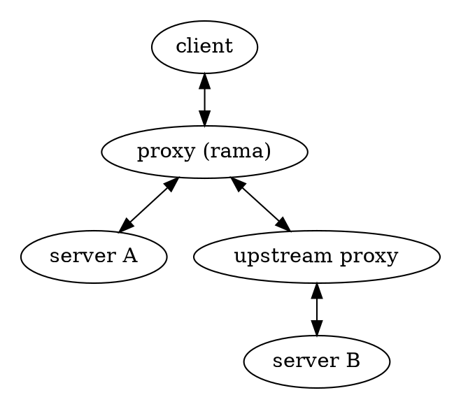

# 🕵️‍♀️ Distortion proxies

    
    

        Distorting proxy refers to a type of proxy server that masks the client’s IP address by modifying the HTTP headers and presents a fake IP address to the target server. It is often used to enhance privacy, add a layer of anonymity, and limit the ability to monitor the user’s browsing activity.
        
— <a href="https://nordvpn.com/cybersecurity/glossary/distorting-proxy">NordVPN</a>

    

There are currently
[no examples found in the `/examples` dir](https://github.com/plabayo/rama/tree/main/examples)
on how to create such a proxy using rama. If you are interested in contributing this
you can create an issue at <https://github.com/plabayo/rama/issues> and we'll
help you to get this shipped.

## Description

The Http/Tls content, version, config and flow can be adapted by the distortion proxy,
often in function of a specific web client it wishes to emulate. The IP Address can be changed
by the use of an upstream proxy.

The goal of all this us to ensure you're requests are not being fingerprinted
either as a collective or in order to connect you to a technology stack or origin
seen as malicious.
