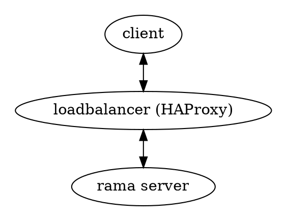

# 🧭 HAProxy (PROXY protocol)

<div class="book-article-intro">
    <div>
        The PROXY protocol is designed to safely transport connection information—such as a client’s original IP and port—across one or more layers of TCP proxies or load balancers, without requiring protocol-specific logic in the intermediary.
        <p>— <a href="https://www.haproxy.org/download/1.8/doc/proxy-protocol.txt">HAProxy PROXY Protocol Spec</a></p>
    </div>
</div>

[Examples](https://github.com/plabayo/rama/tree/main/examples):

- [/examples/haproxy_client_ip.rs](https://github.com/plabayo/rama/tree/main/examples/haproxy_client_ip.rs):
  shows how to support, optionally, HaProxy (v1/v2) in a rama web service,
  supporting load balancers that support the proagation of client IP address.

## Description

<div class="book-article-image-center">



</div>

The PROXY protocol is commonly used when a reverse proxy (like HAProxy, NGINX, or Envoy) terminates incoming TCP connections but needs to preserve the original connection metadata.

This is critical for:
- Preserving accurate IP logs,
- Applying access control policies,
- Implementing multi-layer proxy chains with full end-to-end source attribution.

Rama supports **both version 1 (text-based)** and **version 2 (binary-based)** of the PROXY protocol, enabling it to serve as either an upstream server behind HAProxy or as a proxy that receives and parses these headers.

### PROXY protocol v1

> 📖 rama docs: <https://ramaproxy.org/docs/rama/proxy/haproxy/protocol/v1/index.html>

The v1 format is human-readable and looks like this:

```
PROXY TCP4 192.0.2.1 198.51.100.1 56324 443\r\n
```

It is prepended to the beginning of a TCP stream before any application data. When Rama receives such a connection on a configured [`HaProxyService`](https://ramaproxy.org/docs/rama/proxy/haproxy/server/struct.HaProxyService.html), it will extract and provide access to the source/destination metadata via its connection context APIs.

```plaintext

PROXY v1 flow
-------------

┌────────┐       ┌────────────────┐       ┌────────────────────┐
│ Client │──────▶│ HAProxy        │──────▶│ Rama (Proxy Target)│
└────────┘       └────────────────┘       └────────────────────┘
     │                  │                        │
     │ 1. Connect to HA │                        │
     │─────────────────▶│                        │
     │                  │                        │
     │ 2. HA sends v1   │                        │
     │    PROXY header  │──────────────────────▶ │
     │                  │                        │
     │ 3. Rama extracts │                        │
     │    metadata      │                        │

```

### PROXY protocol v2

The v2 format is a binary header, allowing for more efficient parsing and extensibility (e.g., SSL info, unique ID, namespaces). Rama’s implementation fully supports parsing v2 headers including TLV extensions where needed.

> 📖 rama docs: <https://ramaproxy.org/docs/rama/proxy/haproxy/protocol/v2/index.html>

Example header structure:

- 12-byte signature
- 1-byte version/command
- 1-byte address family/protocol
- 2-byte payload length
- Variable-length address metadata
- Optional TLV vectors

```plaintext

PROXY v2 flow
-------------

┌────────┐       ┌────────────────┐       ┌────────────────────┐
│ Client │──────▶│ HAProxy        │──────▶│ Rama (Proxy Target)│
└────────┘       └────────────────┘       └────────────────────┘
     │                  │                        │
     │ 1. Connect to HA │                        │
     │─────────────────▶│                        │
     │                  │                        │
     │ 2. HA sends v2   │                        │
     │    binary header │──────────────────────▶ │
     │                  │                        │
     │ 3. Rama extracts │                        │
     │    full context  │                        │

```

> Note: Rama can also optionally support HAProxy by setting `peek=true` when creating the HaProxy layer/service.
