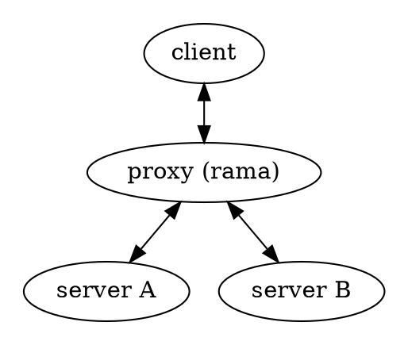

# 🌐 HTTP(S) proxies

    
    

        HTTP(S) proxies forward HTTP requests. The request from the client is the same as a regular HTTP request except the full URL is passed, instead of just the path. Some web proxies allow the HTTP CONNECT method to set up forwarding of arbitrary data through the connection; a common policy is to only forward port 443 to allow HTTPS traffic.
        
— <a href="https://en.wikipedia.org/wiki/Proxy_server#Web_proxy_servers">Wikipedia</a>

    

[Examples](https://github.com/plabayo/rama/tree/main/examples):

- [/examples/http_connect_proxy.rs](https://github.com/plabayo/rama/tree/main/examples/http_connect_proxy.rs):
  Spawns a minimal http proxy which accepts http/1.1 and h2 connections alike,
  and proxies them to the target host.
- [/examples/https_connect_proxy.rs](https://github.com/plabayo/rama/tree/main/examples/https_connect_proxy.rs):
  Spawns a minimal https connect proxy which accepts http/1.1 and h2 connections alike,
  and proxies them to the target host through a TLS tunnel.

## Description

You'll notice that the above graph is the exact same one used in
[the Reverse Proxies chapter](./reverse.md). In an abstract topology sense
this is expected, however there are typically differences:

- The client, proxy and server are typically in 3 different intranets,
  with communication going typically over the intranet;
- The use cases of a reverse proxy are very wide, while
  those of the http proxy are pretty specific.

The most common use case of an http(s) proxy is to
conceal the MAC (~L3) and IP address (~L4) of the client, and have the request
originate instead from the http(s) proxy.

In case the client request is encrypted (TLS) it will typically make a
plaintext (http/1.1) request with the "CONNECT" method to the proxy,
whom on the behalve of the client will establish an encrypted tunnel
to the target (server), from there it will:

- either just copy the data between the two connections as they are;
- or it might act as [a MITM proxy](./mitm.md) and actually read and
  possibly even modify the incoming (http) request prior to sending
  it to the target client. In this case it might even act
  as [a distortion proxy](./distort.md).

In case we are dealing with TLS-encrypted traffic it does mean that the client
most likely will have to accept/approve the authority of the proxy's TLS certification,
given it will not match the expected target (server) TLS certificate. Depending on the
client's network policies this might be handled automatically due to the use
of a non-public [root certificate](https://en.wikipedia.org/wiki/Root_certificate).

Plain text (http) requests are typically immediately made with the Host/Authorization
headers being equal to the desired target server. Which once again looks a lot more
like logic that a [reverse proxy](./reverse.md) would also do among one of its many tasks.

See the official RFCs for more information regarding HTTP semantics and
protocol specifications.
