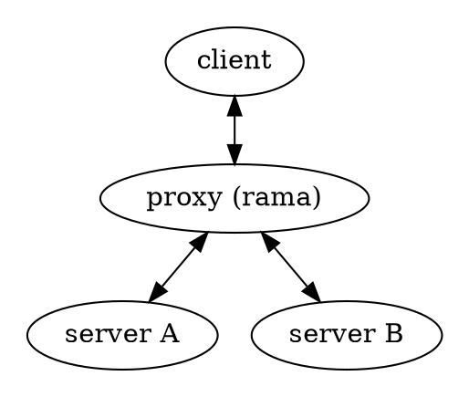

# 🌐 HTTP(S) proxies

<div class="book-article-intro">
    
    <div>
        HTTP(S) proxies forward HTTP requests. The request from the client is the same as a regular HTTP request except the full URL is passed, instead of just the path. Some web proxies allow the HTTP CONNECT method to set up forwarding of arbitrary data through the connection; a common policy is to only forward port 443 to allow HTTPS traffic.
        <p>— <a href="https://en.wikipedia.org/wiki/Proxy_server#Web_proxy_servers">Wikipedia</a></p>
    </div>
</div>

[Examples](https://github.com/plabayo/rama/tree/main/examples):

- [/examples/http_connect_proxy.rs](https://github.com/plabayo/rama/tree/main/examples/http_connect_proxy.rs):
  Spawns a minimal http proxy which accepts http/1.1 and h2 connections alike,
  and proxies them to the target host.
- [/examples/https_connect_proxy.rs](https://github.com/plabayo/rama/tree/main/examples/https_connect_proxy.rs):
  Spawns a minimal https connect proxy which accepts http/1.1 and h2 connections alike,
  and proxies them to the target host through a TLS tunnel.

## Description

<div class="book-article-image-center">



</div>

You'll notice that the above graph is the exact same one used in
[the Reverse Proxies chapter](./reverse.md). In an abstract topology sense
this is expected, however there are typically differences:

- The client, proxy and server are typically in 3 different intranets,
  with communication going typically over the intranet;
- The use cases of a reverse proxy are very wide, while
  those of the http proxy are pretty specific.

The most common use case of an http(s) proxy is to
conceal the MAC (~L3) and IP address (~L4) of the client, and have the request
originate instead from the http(s) proxy.

```

HTTP Proxy relaying HTTPS requests
------------------------------------

┌────────┐       ┌──────────────┐       ┌────────────────────┐
│ Client │──────▶│ HTTP Proxy   │──────▶│ Target Server (TLS)│
└────────┘       └──────────────┘       └────────────────────┘
     │                 │                        │
     │   1. TCP connect to proxy (e.g., :3128)  │
     │────────────────▶│                        │
     │                 │                        │
     │   2. Send HTTP CONNECT request           │
     │      e.g.,                               │
     │      CONNECT example.com:443 HTTP/1.1    │
     │      Host: example.com:443               │
     │────────────────▶│                        │
     │                 │                        │
     │   3. Proxy establishes TCP to server     │
     │                 │───────────────────────▶│
     │                 │                        │
     │   4. Proxy replies with 200 OK           │
     │◀────────────────│                        │
     │                 │                        │
     │ 5. TLS handshake begins (client ↔ server)│
     │◀────────────────────────────────────────▶│
     │                 │                        │
     │   6. Encrypted HTTP(S) traffic relayed   │
     │◀────────────────────────────────────────▶│

```

> Flow of a regular "HTTP CONNECT" proxy.

In case the client request is encrypted (TLS) it will typically make a
plaintext (http/1.1) request with the "CONNECT" method to the proxy,
whom on the behalve of the client will establish an encrypted tunnel
to the target (server), from there it will:

- either just copy the data between the two connections as they are;
- or it might act as [a MITM proxy](./mitm.md) and actually read and
  possibly even modify the incoming (http) request prior to sending
  it to the target client. In this case it might even act
  as [a distortion proxy](./distort.md).

In case we are dealing with TLS-encrypted traffic it does mean that the client
most likely will have to accept/approve the authority of the proxy's TLS certification,
given it will not match the expected target (server) TLS certificate. Depending on the
client's network policies this might be handled automatically due to the use
of a non-public [root certificate](https://en.wikipedia.org/wiki/Root_certificate).

```plaintext

HTTP Proxy relaying HTTP requests
-----------------------------------

┌────────┐       ┌────────────────┐       ┌────────────────────┐
│ Client │──────▶│ HTTP Proxy     │──────▶│ Target HTTP Server │
└────────┘       └────────────────┘       └────────────────────┘
     │                  │                        │
     │ 1. TCP connect to proxy (:3128)           │
     │─────────────────▶│                        │
     │                  │                        │
     │ 2. Send full HTTP request via proxy       │
     │    e.g.,                                  │
     │    GET http://example.com HTTP/1.1        │
     │    Host: example.com                      │
     │─────────────────▶│                        │
     │                  │                        │
     │ 3. Proxy parses and forwards request      │
     │                  │──────────────────────▶ │
     │                  │                        │
     │ 4. Target server replies with HTTP        │
     │                  │◀────────────────────── │
     │                  │                        │
     │ 5. Proxy may log, modify, or inject       │
     │                  │                        │
     │ 6. Proxy sends HTTP response to client    │
     │◀─────────────────│                        │
     │                  │                        │
     │ 7. Subsequent requests/responses relayed  │
     │◀─────────────────▶│◀─────────────────────▶│

```

Plain text (http) requests are typically immediately made with the Host/Authorization
headers being equal to the desired target server. Which once again looks a lot more
like logic that a [reverse proxy](./reverse.md) would also do among one of its many tasks.
As such HTTP traffic can always be logged, modified or injected by any intermediate party,
including your HTTP proxy.

See the official RFCs for more information regarding HTTP semantics and
protocol specifications.


```plaintext

HTTP Proxy MITM'ing HTTPS requests
------------------------------------

┌────────┐       ┌────────────────────┐       ┌────────────────────┐
│ Client │──────▶│ HTTP Proxy (MITM)  │──────▶│ Target Server (TLS)│
└────────┘       └────────────────────┘       └────────────────────┘
     │                    │                          │
     │ 1. TCP connect     │                          │
     │    to proxy (:3128)│                          │
     │───────────────────▶│                          │
     │                    │                          │
     │ 2. Send CONNECT    │                          │
     │    example.com:443 │                          │
     │───────────────────▶│                          │
     │                    │                          │
     │                    │    3. Proxy replies      │
     │ ◀───────────────── │       with 200 OK        │
     │                    │                          │
     │                    │       4. TLS handshake   │
     │◀─────────────────▶ │          with proxy      │
     │                    │          (fake cert)     │
     │                    │                          │
     │ 5. Proxy connects  │                          │
     │    to target:443   │─────────────────────────▶│
     │ 6. Proxy performs  │                          │
     │    TLS to server   │─────────────────────────▶│
     │                    │                          │
     │                                               │
     │              7. Encrypted HTTPS               │
     │                 relayed via MITM              │
     │                                               │
     │◀──────────────────▶│◀────────────────────────▶│

```

> Flow a MITM proxy handling HTTPS traffic
>
> step (4) to (6) can be done before step (3).
> However rrama by default does these `proxy ↔ server` steps
> lazilly only when the first actual http(s) request is received.

## SNI Proxies

A SNI proxy:
* Accepts TLS connections
* Peeks at the SNI field in the ClientHello (during TLS handshake)
* Uses that to route or filter traffic before finishing the handshake

This is a common kind of proxies serving multiple backends:

```plaintext
SNI Transport Proxy
---------------------

┌────────┐       ┌────────────────┐       ┌────────────────────┐
│ Client │──────▶│ SNI Proxy      │──────▶│ Target TLS Server  │
└────────┘       └────────────────┘       └────────────────────┘
     │                  │                        │
     │ 1. TCP connect to proxy (:443)            │
     |     (because firewall forwards this       │
     |       traffic or DNS record               │
    |      has been "hijacked")                  │
     │─────────────────▶│                        │
     │                  │                        │
     │ 2. Send TLS ClientHello                   │
     │    (includes SNI: example.com)            │
     │─────────────────▶│                        │
     │                  │                        │
     │ 3. Proxy inspects SNI                     │
     │    and selects backend                    │
     │                  │                        │
     │ 4. Proxy connects to example.com:443      │
     │                  │──────────────────────▶ │
     │                  │                        │
     │ 5. Proxy forwards full TLS handshake      │
     │◀─────────────────▶│◀─────────────────────▶│
     │                  │                        │
     │ 6. Encrypted traffic flows transparently  │
     │◀─────────────────▶│◀─────────────────────▶│
```

## SNI Proxy as TLS MITM

When an HTTP proxy performs **Man-In-The-Middle (MITM)** interception on **TLS-encrypted traffic** (e.g., HTTPS), it effectively operates as an **SNI proxy** — where **SNI** stands for *Server Name Indication*, a TLS extension that reveals the intended hostname during the initial handshake.

In this scenario, the proxy **terminates the incoming TLS connection** from the client and extracts the hostname from the Client Hello's SNI extension. It then uses this hostname to establish a new **outbound TLS connection** to the intended server. If the SNI is a domain name, the proxy also needs to **resolve it via DNS** into an IPv4 or IPv6 address.

With Rama, we often refer to these as **MITM proxies**, especially in the context of web traffic, but it's worth clarifying that **not all SNI proxies are MITM proxies**, and vice versa. An SNI proxy can operate passively (just routing), whereas a full MITM proxy **actively decrypts** and **re-encrypts** TLS traffic.

To improve performance, the SNI proxy can **cache DNS resolutions**, reducing repeated lookups for frequently accessed domains.

If you're looking to intercept **both HTTP and HTTPS** traffic, your proxy will need to:
- Handle raw HTTP directly (no encryption)
- Act as an SNI-based MITM for HTTPS by **terminating TLS after a CONNECT request**

This allows full visibility into both HTTP and HTTPS traffic through a unified proxy.

```plaintext
SNI Proxy MITM'ing HTTPS traffic (Rama-style)
-----------------------------------------------

┌────────┐       ┌────────────────────┐       ┌────────────────────┐
│ Client │──────▶│ SNI Proxy (MITM)   │──────▶│ Target Server (TLS)│
└────────┘       └────────────────────┘       └────────────────────┘
     │                    │                          │
     │ 1. TCP connect     │                          │
     │    to proxy (:443) │                          │
     │───────────────────▶│                          │
     │                    │                          │
     │ 2. TLS handshake   │                          │
     │    begins with SNI │                          │
     │───────────────────▶│                          │
     │                    │                          │
     │ 3. Proxy inspects  │                          │
     │    SNI, resolves   │                          │
     │    target hostname │                          │
     │                    │                          │
     │ 4. TLS handshake   │                          │
     │    complete (client↔proxy)                    │
     │ ◀───────────────── │                          │
     │                    │                          │
     │ 5. Proxy connects  │                          │
     │    to target:443   │─────────────────────────▶│
     │ 6. Proxy performs  │                          │
     │    TLS to server   │─────────────────────────▶│
     │                    │                          │
     │                                               │
     │              7. Encrypted HTTPS               │
     │                 relayed via MITM              │
     │                                               │
     │◀──────────────────▶│◀────────────────────────▶│

```

### SNI Proxies as invisible proxies

A SNI Proxy can be send tls-encrypted traffic without it first going
via a CONNECT request. This is great for environments that might not
support proxies.

This can work by allowing your firewall, ip table, router or some other "box" in the middle,
to override the DNS resolution for specific domain names
to the IP of the (SNI) proxy. The proxy on its turn will establish a connection
based on the Server Name as discussed previously and onwards it goes.

A proxy without a proxy protocol. That is also what a SNI proxy can be.
