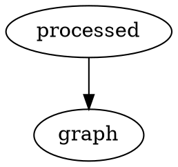

# 🌐 HTTP(S) proxies

    
    

        Lorem ipsum dolor sit amet, consectetur adipiscing elit. Vivamus diam purus, semper at magna ut, venenatis sodales quam. Phasellus in semper enim. Nulla facilisi. Vestibulum sed lectus sollicitudin, commodo nunc eget.
    

mollis mi. Ut at nisl aliquam, euismod arcu et, suscipit arcu. Suspendisse potenti. Nulla tellus sem, placerat ut turpis ac, venenatis aliquet ante. Etiam sed semper nunc.

Etiam sed semper nunc. In id condimentum turpis. Integer orci nisi, sagittis ut nisl vitae, mattis pretium ipsum. Nullam vitae odio eu libero euismod mollis. Aliquam sollicitudin enim ac urna tincidunt ullamcorper. Donec luctus risus velit, id imperdiet dui volutpat at. Cras tempor sed lorem tempus tempus.
