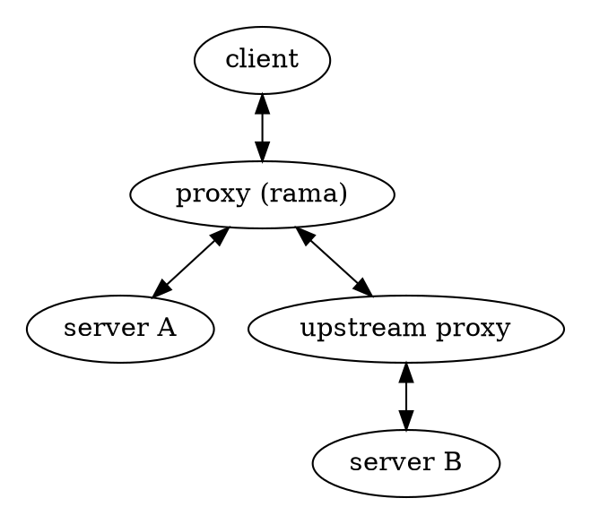

# 🔎 MITM proxies

    
    

        A Man-In-The-Middle proxy (MITM) is a proxy which sits in between the client and the server.
        That by itself is nothing special and is in fact what all proxies do. What defines this kind of
        proxy is that it actively interprets the application layer packets. It might also
        modify the packets as they pass, but more often then not inspecting and tracking
        is all it does.
    

There are currently
[no examples found in the `/examples` dir](https://github.com/plabayo/rama/tree/main/examples)
on how to create such a proxy using rama. If you are interested in contributing this
you can create an issue at <https://github.com/plabayo/rama/issues> and we'll
help you to get this shipped.

## Description

A MITM proxy is typically setup as [an HTTP Proxy](./http.md), but in case you
want it can be setup as [a SOCKS5 proxy](./socks5.md) instead.
