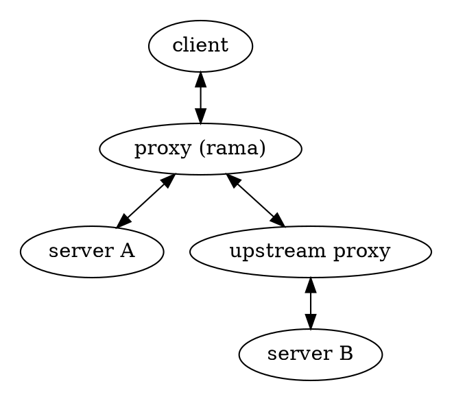

# 🔎 MITM Proxies

    
    

        A Man-In-The-Middle (MITM) proxy is a proxy that sits between the client and the server.
        While this positioning is common to all proxies, what distinguishes an MITM proxy is its
        active interpretation of application layer packets. Although it may modify packets as they pass through,
        its primary function is typically to inspect and track the traffic.
    

[Examples](https://github.com/plabayo/rama/tree/main/examples):

- [/examples/http_mitm_proxy_boring.rs](https://github.com/plabayo/rama/tree/main/examples/http_mitm_proxy_boring.rs):
  A minimal HTTP proxy that accepts both HTTP/1.1 and HTTP/2 connections,
  proxying them to the target host using Boring for TLS.
  - Similar to [/examples/http_connect_proxy.rs](https://github.com/plabayo/rama/tree/main/examples/http_connect_proxy.rs)
    but with MITM capabilities for both HTTP and HTTPS requests.

- [/examples/http_mitm_proxy_rustls.rs](https://github.com/plabayo/rama/tree/main/examples/http_mitm_proxy_rustls.rs):
  A minimal HTTP proxy that accepts both HTTP/1.1 and HTTP/2 connections,
  proxying them to the target host using Rustls for TLS.
  - Similar to [/examples/http_connect_proxy.rs](https://github.com/plabayo/rama/tree/main/examples/http_connect_proxy.rs)
    but with MITM capabilities for both HTTP and HTTPS requests.

## Description

An MITM proxy is typically set up as [an HTTP Proxy](./http.md), but it can alternatively be configured as [a SOCKS5 proxy](./socks5.md).

## Transparent Proxies

MITM proxies that only wish to inspect traffic without destructive modification can attempt to mirror the incoming client across various network layers (TCP, TLS, and HTTP). This approach is a form of User-Agent emulation, but it operates based on the original User-Agent rather than emulating a popular one with significant market share.

These proxies are often referred to as transparent proxies, and you may notice network inspection software offering options labeled as "transparent mode" or "hidden." If such software can still inspect your HTTPS traffic, it's likely operating as a "transparent proxy."
