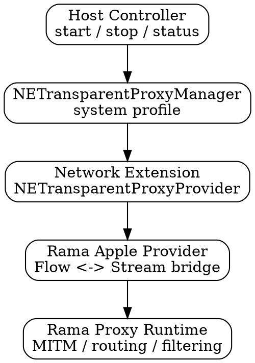

# 🍎 Operating Transparent Proxies on macOS

On macOS, transparent proxying is implemented using Apple’s **Network Extension** framework. Unlike Linux, where you directly manipulate packet flow using firewall rules, macOS provides a structured, system-managed environment for intercepting and handling traffic.

This makes the model safer and more controlled, but also more opinionated. You do not intercept packets manually. Instead, you register a system extension that macOS invokes whenever matching traffic flows occur.

## 1. The Network Extension Model

At the core of transparent proxying on macOS is the **`NETransparentProxyProvider`**.

Rather than working with raw packets, macOS gives you **flow-based abstractions**. Each intercepted connection is delivered as an `NEAppProxyFlow`, which you can read from and write to as a stream.

### How to Operate:

To run a transparent proxy on macOS, you need three components:

1. **A Host Application**
   Responsible for installing and managing the proxy configuration using `NETransparentProxyManager`.

2. **A Network Extension**
   A sandboxed system extension that implements `NETransparentProxyProvider` and receives intercepted traffic.

3. **A Proxy Runtime**
   In Rama’s case, this is typically a Rust static library that performs the actual proxying, MITM logic, and routing decisions.

Once installed and started, macOS owns the lifecycle of the extension. Your host application acts only as a controller.

## 2. Lifecycle and Control Plane

Unlike Linux or Windows setups, you do not keep a long running daemon to manage traffic interception.

Instead:

1. The host application installs a **transparent proxy profile**.
2. macOS activates the extension based on that profile.
3. The system automatically starts, stops, and restarts the extension as needed.

This has a few important consequences:

* Your proxy must be **stateless enough to restart cleanly**
* Configuration must be **persisted externally** and passed into the extension
* Failures are handled by the OS, not your process supervisor

A typical control surface exposes commands such as:

* `start` to install and activate the profile
* `stop` to disable it
* `status` to inspect current state

## 3. Traffic Interception

Traffic selection is not done via firewall rules, but through **`NENetworkRule`** objects.

These rules define what traffic should be intercepted. For example:

* All TCP traffic on port 443
* All outbound connections except local network ranges
* Traffic originating from specific applications

Once a rule matches, macOS delivers the connection to your extension as a flow.

From there:

1. The flow is bridged into your proxy runtime
2. Your runtime establishes an upstream connection
3. Data is proxied bidirectionally

Because this is flow based:

* You do not deal with packet fragmentation or reassembly
* You operate at a higher abstraction level than Linux TPROXY
* You still retain full control over routing, MITM, and filtering

## 4. Integrating Rama

In a Rama based setup, the architecture typically looks like this:

Key responsibilities are split as follows:

* **Swift / host layer** manages system integration and lifecycle
* **Network Extension** handles flow delivery
* **Rama** provides the proxy engine and abstraction layer
* **Rust runtime** implements the actual logic

This separation keeps platform specific concerns isolated from your proxy logic.

## 5. TLS and Certificate Authority Modes

Transparent MITM proxies require a Certificate Authority. On macOS, there are two common approaches.

### Self Managed CA

In this mode, the proxy generates and stores its own CA certificate.

* If no CA exists, one is created on first run
* The same CA is reused across restarts
* The certificate must be installed into the system or application trust stores

This mode is useful for:

* Local development
* Testing environments
* Non managed deployments

A common workflow is:

1. Start the proxy
2. Retrieve the generated CA certificate
3. Install it into the system or container environments

### Managed Identity via System Keychain

In managed environments, a centrally issued identity can be used.

In this setup:

1. The device receives a certificate and key via device management
2. The identity is stored in a system keychain access group
3. The proxy retrieves and uses this identity at runtime

This allows:

* Organization wide trust
* Central rotation of certificates
* No per device CA installation steps

One important constraint is that:

* The private key must be usable by the proxy runtime
* If direct export is not allowed, integration must use native APIs

## 6. Deployment and Packaging

On macOS, transparent proxies must be packaged as an **app bundle** containing:

* The host executable
* The embedded Network Extension

Installation typically involves:

1. Building the signed application bundle
2. Copying it into `/Applications`
3. Registering the extension with the system

Once installed:

* The extension appears under **System Settings → Network → Filters & Proxies**
* The user or system can enable or disable it
* The system persists its state across reboots

## 7. Observability and Debugging

macOS uses the unified logging system for both the host and the extension.

Typical workflows include:

* Streaming live logs for development
* Querying recent logs for debugging
* Exporting logs for analysis

Because the extension runs in a sandboxed environment:

* Traditional stdout logging is not sufficient
* You must rely on structured system logs

Be aware that:

* Debug level logging is not persisted by default
* Enabling persistent debug logs should only be done in development environments

## 8. Operational Considerations

Transparent proxying on macOS is powerful, but comes with constraints:

### Sandboxing

The Network Extension runs in a restricted environment:

* Limited filesystem access
* Controlled network capabilities
* Explicit entitlements required

### Lifecycle Ownership

macOS owns the lifecycle:

* Your extension may be restarted at any time
* You must handle reconnects and state recovery

### Application Awareness

Unlike system wide packet interception, macOS provides:

* Application level identity via audit tokens
* The ability to filter based on originating app

This enables fine grained policies such as:

* Proxy browser traffic but not system services
* Apply different rules per application

## 9. Fail Safe Behaviour

As with any transparent proxy, you must define a failure strategy.

On macOS this is especially important because:

* The system will continue routing traffic through your extension
* A broken proxy can disrupt all connectivity

Recommended approach:

* Implement a **fail open strategy** where possible
* Detect TLS handshake failures and bypass selectively
* Cache failing flows to avoid repeated disruption

This is particularly important for applications that:

* Do not trust the system certificate store
* Use certificate pinning
* Embed their own trust roots

---

**Final Note:** macOS provides a clean and structured way to build transparent proxies, but it trades low level control for safety and system integration.

Where Linux gives you raw power with TPROXY, macOS gives you a managed pipeline. Rama fits naturally into this model by bridging the flow based APIs into a familiar proxy runtime, allowing you to focus on policy and behavior rather than platform mechanics.
