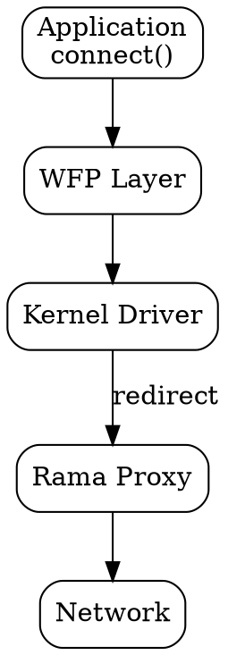

# 🪟 Operating Transparent Proxies on Windows

On Windows, transparent proxying is built on top of the **Windows Filtering Platform (WFP)**. This is a low level system that allows you to intercept and control network traffic inside the OS networking stack.

Unlike Linux or macOS, you do this using a **kernel mode driver**. That driver decides what happens to connections before they leave the machine.

This gives you a lot of power, but also means you need to think carefully about safety, failure modes, and debugging.

## 1. The WFP Model

At a high level, WFP lets you:

* inspect outgoing connections
* decide whether to allow, block, or redirect them
* apply rules based on process, destination, or protocol

To operate a transparent proxy you combine:

* **filters** that select traffic
* **callouts** that run your logic
* **redirect logic** that points traffic to your proxy

### How to Operate

A working setup consists of two parts:

1. **Kernel Driver**
   Intercepts traffic and decides what to do with it

2. **User Space Proxy (Rama)**
   Receives redirected traffic and handles MITM, routing, and policy

The driver does not implement proxy logic. It only forwards traffic to Rama when needed.

## 2. Where Interception Happens

WFP is split into stages called **layers**. The most important ones for transparent proxying are:

* `ALE_CONNECT_REDIRECT`
  where you can still change the destination of a connection

* `ALE_AUTH_CONNECT`
  an earlier decision point where you can allow or block traffic

### Redirection

At the redirect layers, the driver can:

* rewrite the destination of a connection
* point it to a local proxy
* attach a redirect handle so Windows tracks it correctly

This is the core of transparent proxying.

### Blocking and Filtering

At earlier layers, you can also:

* block traffic based on destination address or port
* block or allow based on the originating application
* enforce policy for specific protocols

This is commonly used for things like:

* blocking specific transports
* forcing fallback to other protocols
* excluding sensitive apps from proxying

## 3. Traffic Flow

A simplified flow looks like this:

Step by step:

1. An application opens a connection
2. WFP invokes the driver
3. The driver decides:

   * allow directly
   * redirect to proxy
   * block
4. If redirected, the proxy handles the connection

From the application’s perspective, this is completely transparent.

## 4. Runtime Configuration

The driver itself stays simple. It relies on runtime configuration provided by the proxy.

This typically includes:

* proxy endpoint for IPv4
* proxy endpoint for IPv6
* proxy process identifier

Important details:

* this state lives in memory only
* it is updated by the proxy at startup
* it is cleared automatically if the proxy process exits

This prevents stale or broken configurations from lingering.

## 5. Kernel Notifications and Process Tracking

Beyond WFP, Windows provides additional **kernel notification mechanisms** that are very useful when building a transparent proxy.

One important example is **process lifecycle notifications**.

The driver can register callbacks that are triggered when:

* a process starts
* a process exits

### Why This Matters

This is commonly used to track the **active proxy process**.

A typical pattern:

1. The user space proxy starts
2. It registers its PID and listening address with the driver
3. The driver stores this as runtime configuration
4. The driver also tracks that PID using a kernel process notification

If that proxy process exits:

* the kernel notifies the driver
* the driver clears the runtime configuration automatically

This avoids a dangerous situation where:

* traffic keeps being redirected
* but no proxy is actually running

In other words, kernel notifications are used as a safety mechanism to keep interception and proxy availability in sync.

## 6. Updating Without Breaking Traffic

One important design detail is that:

* **driver updates require a reboot**
* **proxy updates do not**

A typical proxy update flow looks like:

1. Start a new proxy instance
2. It registers itself with the driver
3. Confirm it is working
4. Shut down the old instance

Because the driver tracks the active proxy process:

* old instances cannot accidentally clear the config
* traffic keeps flowing during the transition

## 7. Fail Open Behavior

Transparent proxies should not break the system when something goes wrong.

A good default is **fail open**.

This means traffic is allowed to go directly when:

* no proxy is configured
* the destination is local or private
* the protocol should not be intercepted
* redirect logic fails

This keeps machines usable even during partial failures.

## 8. Process Aware Filtering

WFP gives you visibility into:

* the process that opened the connection
* the executable path

This allows you to:

* exclude specific applications
* apply different policies per app
* block or redirect selectively

For example:

* do not MITM system services
* apply stricter rules to browsers
* bypass internal tools

This is one of the biggest advantages over simpler proxy setups.

## 9. Verifying the Setup

After installing the driver, you typically want to verify:

* the driver is loaded
* the service exists
* WFP filters and callouts are registered
* Base Filtering Engine is running

Useful checks:

* `msinfo32` → System Drivers
* `services.msc` → Base Filtering Engine
* registry under
  `HKEY_LOCAL_MACHINE\SYSTEM\CurrentControlSet\Services`
* WFP objects such as provider, sublayer, filters

These confirm that interception is actually active.

## 10. Debugging and Tools

Debugging involves both kernel and user space.

Useful tools include:

* **DebugView**
  capture kernel debug output

* **WinDbg**
  deep debugging for both user space and kernel

* **Process Explorer**
  inspect running processes and loaded drivers

* **WinObj**
  inspect driver objects and symbolic links

### Kernel Logging

Driver logs are not persisted automatically.

To capture them:

1. Enable kernel debug output
2. Use DebugView with kernel capture enabled

This is essential when debugging redirect or filtering behavior.

### WinDbg

WinDbg can be used to:

* inspect threads and stacks
* set breakpoints
* debug both proxy and driver

Kernel debugging usually requires:

* running the driver in a VM
* connecting from a host debugger

## 11. Operational Notes

A few practical realities when running this in production:

* kernel drivers require careful testing
* updates are slower due to reboot requirements
* most logic should live in user space
* keep the driver as small and predictable as possible

---

**Final Note:**
Windows gives you very fine grained control over traffic through WFP. By combining WFP interception with kernel notifications and a Rama powered proxy runtime, you can build a transparent proxy that is both powerful and safe to operate.

The key is to keep responsibilities clearly split: the kernel decides *what* happens to traffic, and Rama decides *how* that traffic is handled.
