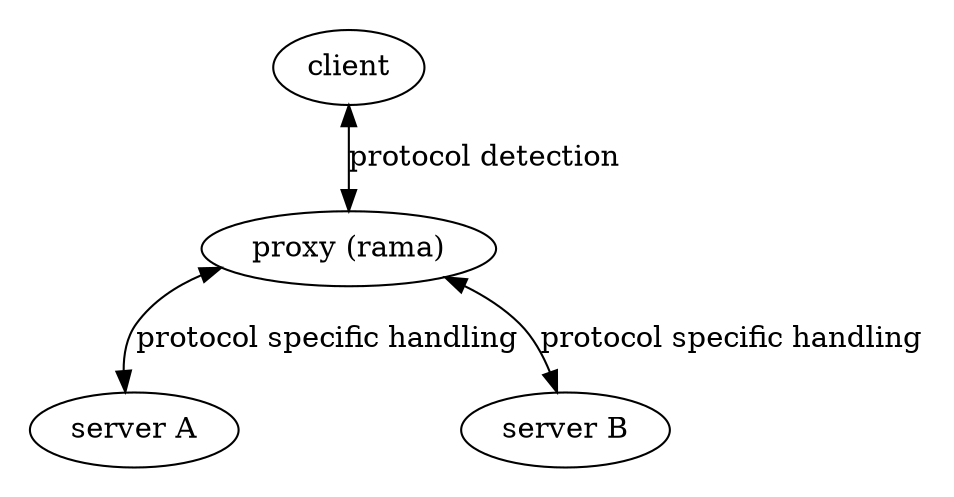

# 🔍 Protocol Inspection

<div class="book-article-intro">
    
    <div>
        Protocol inspection is the ability to examine and understand the underlying protocols being used in network traffic. This capability is crucial for proxies that need to handle multiple protocols or perform deep packet inspection for security and monitoring purposes.
    </div>
</div>

## Description

<div class="book-article-image-center">



</div>

Protocol inspection is a fundamental capability that enables proxies to:

1. **Multi-Protocol Support**: Accept and handle different proxy protocols (HTTP, SOCKS5, etc.) over the same network interface
2. **Deep Packet Inspection**: Examine the actual content of the traffic to determine the underlying protocol
3. **Protocol-Specific Handling**: Apply different processing rules based on the detected protocol
4. **Security Analysis**: Identify and potentially block malicious traffic patterns

## Protocol Detection Methods

### Transport Layer Detection

At the transport layer, proxies can detect protocols based on:

- **Port Numbers**: Common ports (80 for HTTP, 443 for HTTPS, etc.)
- **Connection Patterns**: Initial handshake sequences
- **Protocol Signatures**: Characteristic byte patterns

### Application Layer Detection

For application layer protocols, detection methods include:

- **Protocol Headers**: Examining initial bytes for protocol-specific markers
- **TLS SNI**: Server Name Indication in TLS handshakes
- **Protocol-Specific Patterns**: Characteristic sequences in the protocol

## Use Cases

### Multi-Protocol Proxies

A common use case is supporting both HTTP and SOCKS5 protocols on the same port:

```plaintext
Multi-Protocol Proxy Flow
-------------------------

┌────────┐       ┌────────────────┐       ┌────────────────────┐
│ Client ├──────▶│ Multi-Protocol ├──────▶│ Target Server      │
└────────┘       │    Proxy       │       └────────────────────┘
     │           └────────────────┘               │
     │                  │                         │
     │ 1. TCP Connect   │                         │
     ├─────────────────▶│                         │
     │                  │                         │
     │ 2. Protocol      │                         │
     │    Detection     │                         │
     ├─────────────────▶│                         │
     │                  │                         │
     │ 3. Protocol-     │                         │
     │    Specific      │                         │
     │    Handling      ├────────────────────────▶│
     │                  │                         │
     │ 4. Traffic       │                         │
     │    Relay         │◀───────────────────────▶│
```

### MITM Protocol Inspection

For MITM proxies, protocol inspection is crucial for:

1. **TLS Traffic**: Determining if traffic is TLS-encrypted
2. **Protocol Selection**: Choosing appropriate decryption and inspection methods
3. **Content Analysis**: Examining the actual protocol content

```plaintext
MITM Protocol Inspection
------------------------

┌────────┐       ┌────────────────┐       ┌────────────────────┐
│ Client ├──────▶│ MITM Proxy     ├──────▶│ Target Server      │
└────────┘       └────────────────┘       └────────────────────┘
     │                  │                         │
     │ 1. Initial       │                         │
     │    Connection    │                         │
     ├─────────────────▶│                         │
     │                  │                         │
     │ 2. Protocol      │                         │
     │    Detection     │                         │
     ├─────────────────▶│                         │
     │                  │                         │
     │ 3. TLS           │                         │
     │    Termination   │                         │
     │◀─────────────────┤                         │
     │                  │                         │
     │ 4. Protocol      │                         │
     │    Inspection    ├────────────────────────▶│
     │                  │                         │
     │ 5. Re-encryption │                         │
     │    & Relay       │◀───────────────────────▶│
```

## Implementation in Rama

Rama provides protocol inspection capabilities through its modular architecture. A key example is the SOCKS5 MITM proxy implementation [`socks5_connect_proxy_mitm_proxy.rs`](https://github.com/plabayo/rama/tree/main/examples/socks5_connect_proxy_mitm_proxy.rs), which demonstrates how to:

1. Use `PeekTlsRouter` to detect TLS traffic
2. Route TLS traffic to a TLS-capable service
3. Handle non-TLS traffic with a fallback service

This pattern allows for flexible protocol handling while maintaining clean separation of concerns. The implementation shows how to:

- Detect protocols at the transport layer
- Handle protocol-specific processing
- Integrate with MITM capabilities when needed

Some rama examples that built on top of protocol inspection:
- [`socks5_and_http_proxy.rs`](https://github.com/plabayo/rama/tree/main/examples/socks5_and_http_proxy.rs)
  is an example of such protocol inspection.This code is used to be able to support
  a socks5 proxy that can also be something else next to it (e.g. an http proxy).
- [`http_https_socks5_and_socks5h_connect_proxy.rs`](https://github.com/plabayo/rama/tree/main/examples/http_https_socks5_and_socks5h_connect_proxy.rs)
  is another advanced demonstration of Rama's protocol inspection and routing capabilities.
  This example showcases how to build a **single, unified proxy server** that intelligently handles
  HTTP, HTTPS (HTTP within TLS) and SOCKS5 traffic all within the same listener,
  leveraging various `PeekRouter` and service composition patterns for robust multi-protocol support.
- [`proxy_connectivity_check.rs`](https://github.com/plabayo/rama/tree/main/examples/proxy_connectivity_check.rs)
  is not about protocool inspection but does leverage socks5 and http protocol inspections for various purposes,
  including to hijack very specific http data without forcing all socks5 proxy traffic to be http.

When writing technical docs, it’s easy to fall into that "instruction manual" trap where everything is a sterile list. If you want to sound more like a peer sharing advice over coffee, the trick is to weave those best practices into a narrative flow using a conversational tone.

Here is a more human-led version of those best practices:

## Getting it Right: Performance and Security

When you're building out your proxy logic, the real goal is to keep things moving as fast as possible without leaving the door open for trouble. You’ll want to be efficient with how you detect protocols; try to identify what you're looking at using the absolute minimum number of bytes. It's often best to set up a "fast-path" for the protocols you expect to see most often, so the bulk of your traffic isn't stuck in a heavy detection loop.

Of course, speed doesn't matter if the system isn't secure. You should always validate protocol signatures and make sure your code can gracefully handle malformed traffic—because "garbage in" shouldn't mean "crash out." From a performance standpoint, keep an eye on your buffering strategies. Excessive buffering can lead to latency spikes, so it’s worth tailoring your memory usage to the specific protocol you're handling. Ultimately, a bit of intentionality in how you structure these early handshakes goes a long way in making the whole system feel snappier and more resilient.
