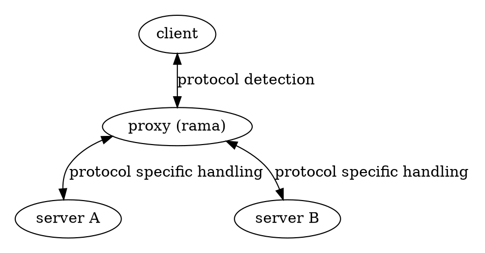

# 🔍 Protocol Inspection

<div class="book-article-intro">
    
    <div>
        Protocol inspection is the ability to examine and understand the underlying protocols being used in network traffic. This capability is crucial for proxies that need to handle multiple protocols or perform deep packet inspection for security and monitoring purposes.
    </div>
</div>

## Description

<div class="book-article-image-center">



</div>

Protocol inspection is a fundamental capability that enables proxies to:

1. **Multi-Protocol Support**: Accept and handle different proxy protocols (HTTP, SOCKS5, etc.) over the same network interface
2. **Deep Packet Inspection**: Examine the actual content of the traffic to determine the underlying protocol
3. **Protocol-Specific Handling**: Apply different processing rules based on the detected protocol
4. **Security Analysis**: Identify and potentially block malicious traffic patterns

## Protocol Detection Methods

### Transport Layer Detection

At the transport layer, proxies can detect protocols based on:

- **Port Numbers**: Common ports (80 for HTTP, 443 for HTTPS, etc.)
- **Connection Patterns**: Initial handshake sequences
- **Protocol Signatures**: Characteristic byte patterns

### Application Layer Detection

For application layer protocols, detection methods include:

- **Protocol Headers**: Examining initial bytes for protocol-specific markers
- **TLS SNI**: Server Name Indication in TLS handshakes
- **Protocol-Specific Patterns**: Characteristic sequences in the protocol

## Use Cases

### Multi-Protocol Proxies

A common use case is supporting both HTTP and SOCKS5 protocols on the same port:

```plaintext
Multi-Protocol Proxy Flow
-------------------------

┌────────┐       ┌────────────────┐       ┌────────────────────┐
│ Client │──────▶│ Multi-Protocol │──────▶│ Target Server      │
└────────┘       │    Proxy       │       └────────────────────┘
     │           └────────────────┘               │
     │                  │                         │
     │ 1. TCP Connect   │                         │
     │─────────────────▶│                         │
     │                  │                         │
     │ 2. Protocol      │                         │
     │    Detection     │                         │
     │─────────────────▶│                         │
     │                  │                         │
     │ 3. Protocol-     │                         │
     │    Specific      │                         │
     │    Handling      │────────────────────────▶│
     │                  │                         │
     │ 4. Traffic       │                         │
     │    Relay         │◀────────────────────────▶│
```

### MITM Protocol Inspection

For MITM proxies, protocol inspection is crucial for:

1. **TLS Traffic**: Determining if traffic is TLS-encrypted
2. **Protocol Selection**: Choosing appropriate decryption and inspection methods
3. **Content Analysis**: Examining the actual protocol content

```plaintext
MITM Protocol Inspection
------------------------

┌────────┐       ┌────────────────┐       ┌────────────────────┐
│ Client │──────▶│ MITM Proxy     │──────▶│ Target Server      │
└────────┘       └────────────────┘       └────────────────────┘
     │                  │                         │
     │ 1. Initial       │                         │
     │    Connection    │                         │
     │─────────────────▶│                         │
     │                  │                         │
     │ 2. Protocol      │                         │
     │    Detection     │                         │
     │─────────────────▶│                         │
     │                  │                         │
     │ 3. TLS           │                         │
     │    Termination   │                         │
     │◀─────────────────│                         │
     │                  │                         │
     │ 4. Protocol      │                         │
     │    Inspection    │────────────────────────▶│
     │                  │                         │
     │ 5. Re-encryption │                         │
     │    & Relay       │◀────────────────────────▶│
```

## Implementation in Rama

Rama provides protocol inspection capabilities through its modular architecture. A key example is the SOCKS5 MITM proxy implementation [`socks5_connect_proxy_mitm_proxy.rs`](https://github.com/plabayo/rama/tree/main/examples/socks5_connect_proxy_mitm_proxy.rs), which demonstrates how to:

1. Use `PeekTlsRouter` to detect TLS traffic
2. Route TLS traffic to a TLS-capable service
3. Handle non-TLS traffic with a fallback service

This pattern allows for flexible protocol handling while maintaining clean separation of concerns. The implementation shows how to:

- Detect protocols at the transport layer
- Handle protocol-specific processing
- Integrate with MITM capabilities when needed

[`socks5_and_http_proxy.rs`](https://github.com/plabayo/rama/tree/main/examples/socks5_and_http_proxy.rs) is another example of such protocol inspection. This code is used to be able to support a socks5 proxy that can also be something else next to it(e.g. an http proxy).

## Best Practices

1. **Efficient Detection**:
   - Use minimal bytes for initial protocol detection
   - Implement fast-path for common protocols

2. **Security Considerations**:
   - Validate protocol signatures
   - Handle malformed traffic gracefully

3. **Performance Optimization**:
   - Minimize protocol detection overhead
   - Use appropriate buffering strategies
   - Implement protocol-specific optimizations
