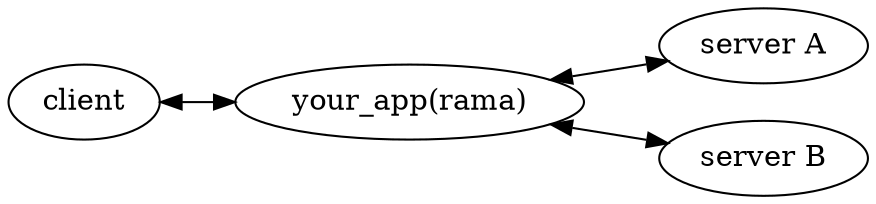

# 🚦 Reverse proxies

    
    

        In computer networks, a reverse proxy is an application that sits in front of back-end applications and forwards client (e.g. browser) requests to those applications. The resources returned to the client appear as if they originated from the web server itself.
        
— <a href="https://en.wikipedia.org/wiki/Reverse_proxy">Wikipedia</a>

    

There are currently
[no examples found in the `./examples` dir](https://github.com/plabayo/rama/tree/main/examples)
on how to create such a proxy using rama. If you are interested in contributing this
you can create an issue at <https://github.com/plabayo/rama/issues> and we'll
help you to get this shipped.

Reverse proxies are very common and chances are big that you've set it up yourself
already, beknowingly or not. For standard proxy cases like this, the default
proxy solutions available are usually good enough. It is however just as simple
to make with rama, which gives you a degree of freedom that might come in handy.

The reasons on why one wants a reverse proxies are usually among the following:

- it improves security by:
  - having only one service exposed to the public intranet;
  - your "backend" applications can stay very simple, e.g. a plain old http server;
  - all your policies, authentication, firewall rules and more can be handled in this one place;
- tls connections are typically terminated here,
  forwarding the requests as plain text over the internal network to the "backend services;
  - see [the TLS Termination proxies chapter](./tls.md) for more info on that.

A trivial example is that it allows your old PHP http/1 web service to be
exposed to the web as a secured h3 server with caching and more provided,
without changing your code from the 90s / early 2000s. If that is what you want.
