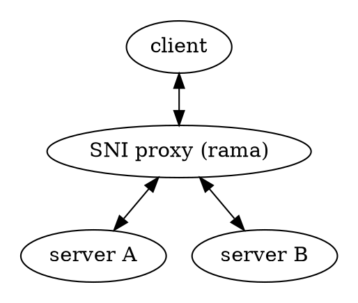

# 🔓 SNI Proxies

<div class="book-article-intro">
    
    <div>
        A SNI proxy is a specialized type of proxy that operates at the TLS layer, using the Server Name Indication (SNI) field from the TLS handshake to make routing decisions. This allows for intelligent routing of encrypted traffic without needing to decrypt it first.
        <p>— <a href="https://en.wikipedia.org/wiki/Server_Name_Indication">Wikipedia</a></p>
    </div>
</div>

[Examples](https://github.com/plabayo/rama/tree/main/examples):

- [/examples/tls_sni_router.rs](https://github.com/plabayo/rama/tree/main/examples/tls_sni_router.rs):
  (TLS) SNI Router, a proxy which fowards traffic to encrypted web servers based on the public SNI found
  in the client hello handshake data sent by the UA as part of the connection establishment.

## Description

<div class="book-article-image-center">



</div>

A SNI proxy:
* Accepts TLS connections
* Peeks at the SNI field in the ClientHello (during TLS handshake)
* Uses that to route or filter traffic before finishing the handshake

This is a common kind of proxies serving multiple backends:

```plaintext
SNI Transport Proxy
---------------------

┌────────┐       ┌────────────────┐       ┌────────────────────┐
│ Client ├──────▶│ SNI Proxy      ├──────▶│ Target TLS Server  │
└────────┘       └────────────────┘       └────────────────────┘
     │                  │                        │
     │ 1. TCP connect to proxy (:443)            │
     |     (because firewall forwards this       │
     |       traffic or DNS record               │
     |      has been "hijacked")                 │
     ├─────────────────▶│                        │
     │                  │                        │
     │ 2. Send TLS ClientHello                   │
     │    (includes SNI: example.com)            │
     ├─────────────────▶│                        │
     │                  │                        │
     │ 3. Proxy inspects SNI                     │
     │    and selects backend                    │
     │                  │                        │
     │ 4. Proxy connects to example.com:443      │
     │                  ├──────────────────────▶ │
     │                  │                        │
     │ 5. Proxy forwards full TLS handshake      │
     │◀────────────────▶│◀──────────────────────▶│
     │                  │                        │
     │ 6. Encrypted traffic flows transparently  │
     │◀────────────────▶│◀──────────────────────▶│
```

## SNI Proxy as TLS MITM

When an HTTP proxy performs **Man-In-The-Middle (MITM)** interception on **TLS-encrypted traffic** (e.g., HTTPS), it effectively operates as an **SNI proxy** — where **SNI** stands for *Server Name Indication*, a TLS extension that reveals the intended hostname during the initial handshake.

In this scenario, the proxy **terminates the incoming TLS connection** from the client and extracts the hostname from the Client Hello's SNI extension. It then uses this hostname to establish a new **outbound TLS connection** to the intended server. If the SNI is a domain name, the proxy also needs to **resolve it via DNS** into an IPv4 or IPv6 address.

With Rama, we often refer to these as **MITM proxies**, especially in the context of web traffic, but it's worth clarifying that **not all SNI proxies are MITM proxies**, and vice versa. An SNI proxy can operate passively (just routing), whereas a full MITM proxy **actively decrypts** and **re-encrypts** TLS traffic.

To improve performance, the SNI proxy can **cache DNS resolutions**, reducing repeated lookups for frequently accessed domains.

If you're looking to intercept **both HTTP and HTTPS** traffic, your proxy will need to:
- Handle raw HTTP directly (no encryption)
- Act as an SNI-based MITM for HTTPS by **terminating TLS after a CONNECT request**

This allows full visibility into both HTTP and HTTPS traffic through a unified proxy.

```plaintext
SNI Proxy MITM'ing HTTPS traffic (Rama-style)
-----------------------------------------------

┌────────┐       ┌────────────────────┐       ┌────────────────────┐
│ Client ├──────▶│ SNI Proxy (MITM)   ├──────▶│ Target Server (TLS)│
└────────┘       └────────────────────┘       └────────────────────┘
     │                    │                          │
     │ 1. TCP connect     │                          │
     │    to proxy (:443) │                          │
     ├───────────────────▶│                          │
     │                    │                          │
     │ 2. TLS handshake   │                          │
     │    begins with SNI │                          │
     ├───────────────────▶│                          │
     │                    │                          │
     │ 3. Proxy inspects  │                          │
     │    SNI, resolves   │                          │
     │    target hostname │                          │
     │                    │                          │
     │ 4. TLS handshake   │                          │
     │    complete (client↔proxy)                    │
     │ ◀──────────────────┤                          │
     │                    │                          │
     │ 5. Proxy connects  │                          │
     │    to target:443   ├─────────────────────────▶│
     │ 6. Proxy performs  │                          │
     │    TLS to server   ├─────────────────────────▶│
     │                    │                          │
     │                                               │
     │              7. Encrypted HTTPS               │
     │                 relayed via MITM              │
     │                                               │
     │◀──────────────────▶│◀────────────────────────▶│
```

[Examples](https://github.com/plabayo/rama/tree/main/examples):

- [/examples/tls_sni_proxy_mitm.rs](https://github.com/plabayo/rama/tree/main/examples/tls_sni_proxy_mitm.rs):
  (TLS) SNI MITM Proxy, a basic example showing you how you can hijhack/re-route traffic that you
  wish to handle but ignore any other traffic.

### SNI Proxies as invisible proxies

A SNI Proxy can be send tls-encrypted traffic without it first going
via a CONNECT request. This is great for environments that might not
support proxies.

This can work by allowing your firewall, ip table, router or some other "box" in the middle,
to override the DNS resolution for specific domain names
to the IP of the (SNI) proxy. The proxy on its turn will establish a connection
based on the Server Name as discussed previously and onwards it goes.

A proxy without a proxy protocol. That is also what a SNI proxy can be.
