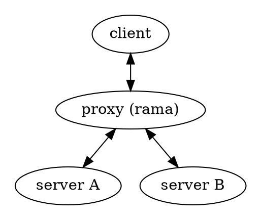

# 🧦 SOCKS5 proxies

    
    

        SOCKS is an Internet protocol that exchanges network packets between a client and server through a proxy server. SOCKS5 optionally provides authentication so only authorized users may access a server. Practically, a SOCKS server proxies TCP connections to an arbitrary IP address, and provides a means for UDP packets to be forwarded.
        
— <a href="https://en.wikipedia.org/wiki/SOCKS">Wikipedia</a>

    

There are currently
[no examples found in the `/examples` dir](https://github.com/plabayo/rama/tree/main/examples)
on how to create such a proxy using rama. If you are interested in contributing this
you can create an issue at <https://github.com/plabayo/rama/issues> and we'll
help you to get this shipped.

## Description

You'll notice that the above graph is the exact same one used in
[the http(s) Proxies chapter](./http.md). This is no coincidence,
as topology wise they are the same.

The key differences are:

- SOCKS5 proxies do not operate on the application layer, and sit directly on the application layer;
  - This means they have no need to touch for example the http packets at all, unless they want to;
  - It is also one of the reasons that they are typically said to be faster, given the SOCKS protocol,
    is fairly trivial and cheaply to interpret;
- These proxies also support UDP traffic, which is not commonly associated with [HTTP proxies](./http.md);

The SOCKS5 protocol is however in plaintext, just
like is the case with [HTTP Proxy authentication](./http.md).
Depending on your client support you can tunnel it through a TLS connection,
which from the Rama proxy perspective you can easily achieve.

Similar to [HTTP proxies](./http.md), a SOCKS5 proxy can only do routing of connections,
but can just as easily sniff the application packets and as such be [a MITM proxy](./mitm.md).
It can even go further and actively mold the packets and therefore be more of
[a Distortion proxy](./distort.md).
