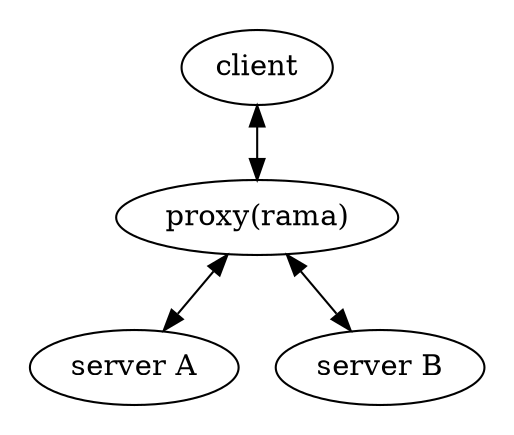

# 🧦 SOCKS5 proxies

    
    

        Lorem ipsum dolor sit amet, consectetur adipiscing elit. Vivamus diam purus, semper at magna ut, venenatis sodales quam. Phasellus in semper enim. Nulla facilities. Vestibulum sed lectus sollicitudin, commodo nunc eget.
    

There are currently
[no examples found in the `./examples` dir](https://github.com/plabayo/rama/tree/main/examples)
on how to create such a proxy using rama. If you are interested in contributing this
you can create an issue at <https://github.com/plabayo/rama/issues> and we'll
help you to get this shipped.

You'll notice that the above graph is the exact same one used in
[the http(s) Proxies chapter](./http.md). This is no coincidance,
as topology wise they are the same.

The key differences are:

- TODO
