# 🧦 SOCKS5 proxies

<div class="book-article-intro">
    
    <div>
        SOCKS is an Internet protocol that exchanges network packets between a client and server through a proxy server. SOCKS5 optionally provides authentication so only authorized users may access a server. Practically, a SOCKS server proxies TCP connections to an arbitrary IP address, and provides a means for UDP packets to be forwarded.
        <p>— <a href="https://en.wikipedia.org/wiki/SOCKS">Wikipedia</a></p>
    </div>
</div>

## Description

<div class="book-article-image-center">


</div>

You'll notice that the above graph is the exact same one used in
[the http(s) Proxies chapter](./http.md). This is no coincidence,
as topology wise they are the same.

The key differences are:

- SOCKS5 proxies do not operate on the application layer (layer 7), and sit directly on the session layer (layer 5);
  - This means they have no need to touch for example the http packets at all, unless they want to;
  - It is also one of the reasons that they are typically said to be faster, given the SOCKS protocol,
    is fairly trivial and cheaply to interpret;
- These proxies also support UDP traffic, which is not commonly associated with [HTTP proxies](./http.md);

The SOCKS5 protocol is however in plaintext, just
like is the case with [HTTP Proxy authentication](./http.md).
Depending on your client support you can tunnel it through a TLS connection,
which from the Rama proxy perspective you can easily achieve.

Similar to [HTTP proxies](./http.md), a SOCKS5 proxy can only do routing of connections,
but can just as easily sniff the application packets and as such be [a MITM proxy](./mitm.md).
It can even go further and actively mold the packets and therefore be more of
[a Distortion proxy](./distort.md).

## Socks5 Protocol

Rama's implementation of the SOCKS5 Protocols [RFC 1928] and [RFC 1929]
can be found here: <https://ramaproxy.org/docs/rama/proxy/socks5/proto/index.html>

[RFC 1928]: https://datatracker.ietf.org/doc/html/rfc1928
[RFC 1929]: https://datatracker.ietf.org/doc/html/1929

## Transport Proxies

Proxies that operate on the TCP/UDP layers are also referred to as "transport proxies".
Socks5 proxies are an example of this. An [http proxy](./http.md) can also be a transport proxy,
and in fact most commercial proxies out in the wild are just that. The key difference
with socks5 proxies is however that for plain text requests it is still
the (http) proxy that will see the http request to be proxied, while even for plain text
requests (read: not encrypted with TLS) socks5 proxies do not _have_ to see the requests.

That said, regardless if you expose yourself as an [http proxy](./http.md) or socks5 proxy,
you can if you want to still run your proxy as a [Man In The Middle Proxy](./mitm.md),
and at that point you are no longer a transport proxy, but do see the http requests coming by,
regardless if they were initially secured via tls.

## Socks5 command: CONNECT

### Overview

The `CONNECT` command is the most commonly used mode of SOCKS5. It establishes a **TCP tunnel** through the proxy to a specified destination address and port. Once established, the proxy transparently relays all subsequent data between the client and the target server.

This command is typically used for protocols that operate over TCP such as HTTPS, HTTP, SSH, and others.

[Examples](https://github.com/plabayo/rama/tree/main/examples):

- [/examples/socks5_connect_proxy.rs](https://github.com/plabayo/rama/tree/main/examples/socks5_connect_proxy.rs):
  Spawns a minimal socks5 CONNECT proxy with authentication, snappy and easy;
- [/examples/socks5_connect_proxy_mitm_proxy.rs](https://github.com/plabayo/rama/tree/main/examples/socks5_connect_proxy_mitm_proxy.rs):
  Spawns a socks5 CONNECT proxy with authentication and HTTP MITM capabilities;
- [/examples/socks5_connect_proxy_over_tls.rs](https://github.com/plabayo/rama/tree/main/examples/socks5_connect_proxy_over_tls.rs):
  Spawns a socks5 CONNECT proxy implementation which runs within a TLS tunnel

### Step-by-Step Flow

```dot process
digraph {
    pad=0.2;
    rankdir=LR;

    client [label="Client"];
    proxy [label="Proxy (Rama)"];
    server [label="Target Server"];

    client -> proxy [label="① TCP connection + SOCKS5 handshake"];
    client -> proxy [label="② SOCKS5 CONNECT request (addr:port)"];
    proxy -> server [label="③ Establish TCP connection to target"];
    proxy -> client [label="④ Reply: connection established"];

    client -> proxy [dir=both, label="⑤ Relay data"];
    proxy -> server [dir=both, label="⑥ Relay data"];
}
```

<div class="book-article-image-center">



</div>

1. **TCP Handshake & Greeting**
   - The client initiates a TCP connection to the proxy server.
   - It sends a SOCKS5 greeting with supported authentication methods.
   - The proxy responds with the selected authentication method (often "no authentication").

2. **CONNECT Request**
   - The client sends a SOCKS5 request with:
     - Command: `CONNECT`
     - Destination address (IPv4, IPv6, or domain name)
     - Destination port

3. **Proxy Establishes TCP Connection**
   - The proxy attempts to connect to the requested destination address and port.
   - If successful, it returns a success response to the client (4).

5. **Relay Phase**
   - After the CONNECT reply, the proxy begins relaying TCP data between the client and the destination.
   - This data is raw TCP — no additional SOCKS5 framing is used.

```plaintext
Client                Proxy (Rama)           Target Server
  |                        |                      |
  | -- TCP Connect ------> |                      |
  | -- SOCKS5 Greeting --> |                      |
  | <-- Method Select ---- |                      |
  |                        |                      |
  |  [ If Username/Pass is selected ]             |
  | -- Auth Request -----> |                      |
  | <-- Auth Response ---- |                      |
  |                        |                      |
  | -- CONNECT Request --> |                      |
  |                        | -- TCP Connect ----> |
  |                        | <-- TCP ACK -------- |
  | <-- CONNECT OK ------- |                      |
  | <==== TCP Relay ============================> |
```

## Socks5 command: BIND

In addition to the common `CONNECT`, the SOCKS5 protocol also supports a less frequently used command: `BIND`.

```dot process
digraph {
    pad=0.2;
    rankdir=LR;

    client [label="Client"];
    proxy [label="Proxy (Rama)"];
    peer [label="Peer (Remote)"];

    client -> proxy [label="① TCP: BIND request"];
    proxy -> client [label="② Reply: bind address/port"];

    peer -> proxy [label="③ Peer connects to bind port"];
    proxy -> client [label="④ Notify client: peer connected"];

    client -> proxy [dir=both, label="⑤ Relay data"];
    proxy -> peer [dir=both, label="⑥ Relay data"];
}
```

<div class="book-article-image-center">



</div>

Where `CONNECT` is used for outgoing connections to a remote server, `BIND` enables the proxy to **accept incoming connections** from a third party on behalf of the client. This is useful in protocols where the client needs to listen for a peer (e.g., FTP active mode, SIP, or custom peer-to-peer scenarios).

When a client sends a `BIND` request to a SOCKS5 proxy, it asks the proxy to open a listening socket. The proxy responds with the bound address and port. The client then waits for the proxy to accept an incoming connection from the peer. Once a connection is accepted, the proxy notifies the client and begins relaying data between the peer and the client.

You can try this flow using the following example:

- [/examples/socks5_bind_proxy.rs](https://github.com/plabayo/rama/tree/main/examples/socks5_bind_proxy.rs):
  Spawns a SOCKS5 proxy that supports the `BIND` command and allows you to experiment with incoming peer connections via the proxy.

This makes `BIND` a useful tool for reverse connection setups and client-initiated listeners in NAT'd environments or restricted network conditions.

```plaintext
Client                Proxy (Rama)            Peer (Remote)
  |                        |                       |
  | -- TCP Connect ------> |                       |
  | -- SOCKS5 Greeting --> |                       |
  | <-- Method Select ---- |                       |
  |                        |                       |
  |  [ If Username/Pass is selected ]              |
  | -- Auth Request -----> |                       |
  | <-- Auth Response ---- |                       |
  |                        |                       |
  | -- BIND Request -----> |                       |
  |                        | -- Bind TCP Port ---- |
  |                        | <-- Bound Addr/Port --|
  | <-- BIND Reply ------- |                       |
  |                        | <== Peer Connect ==== |
  | <-- Second Reply ----- |                       |
  | <==== TCP Relay =============================> |
```

## Socks5 command: UDP ASSOCIATE

The `UDP ASSOCIATE` command in SOCKS5 allows a client to proxy **UDP datagrams** through the SOCKS5 server. This is essential for supporting protocols that are UDP-based, such as DNS, QUIC, VoIP, gaming traffic, or any custom UDP-based application.

```dot process
digraph {
    pad=0.2;
    rankdir=LR;

    client [label="Client"];
    proxy [label="Proxy (Rama)"];
    target [label="UDP Target"];

    client -> proxy [label="① TCP: UDP ASSOCIATE request"];
    proxy -> client [label="② Reply: allocated UDP relay address"];

    client -> proxy [label="③ New UDP socket → \nsends datagram to relay address \n(SOCKS5-wrapped)"];
    proxy -> target [label="④ Forward UDP datagram to target"];

    target -> proxy [label="⑤ UDP datagram from target"];
    proxy -> client [label="⑥ Forward to client via relay \n(SOCKS5-wrapped)"];
}
```

<div class="book-article-image-center">



</div>

When the client sends a `UDP ASSOCIATE` request, it provides a local IP/port hint (or just `0.0.0.0:0`) and receives from the proxy a `BND.ADDR:BND.PORT` in return. This is the address the client should send UDP packets to. The client then sends UDP datagrams, each wrapped in a lightweight SOCKS5 UDP header, to that address. The proxy receives these datagrams, unpacks them, forwards them to the intended destination, and can relay responses back to the client in the same wrapped format.

The TCP connection used to initiate the UDP ASSOCIATE must remain open for the duration of the UDP session, as it controls the lifetime of the association.

You can test this functionality using the following example:

- [/examples/socks5_udp_associate.rs](https://github.com/plabayo/rama/tree/main/examples/socks5_udp_associate.rs):
  Spawns a SOCKS5 proxy that supports the `UDP ASSOCIATE` command, enabling proxying of UDP traffic over a TCP-controlled SOCKS5 session.
- [/examples/socks5_udp_associate_framed.rs](https://github.com/plabayo/rama/tree/main/examples/socks5_udp_associate_framed.rs):
  Same as `socks5_udp_associate_framed.rs` but demonstrating how to combine it with frames.

This command enables powerful use cases like full DNS proxying or tunneling UDP through restrictive firewalls via a single TCP-controlled proxy session.

```plaintext
Client                Proxy (Rama)             UDP Target
  |                        |                       |
  | -- TCP Connect ------> |                       |
  | -- SOCKS5 Greeting --> |                       |
  | <-- Method Select ---- |                       |
  |                        |                       |
  |  [ If Username/Pass is selected ]              |
  | -- Auth Request -----> |                       |
  | <-- Auth Response ---- |                       |
  |                        |                       |
  | -- UDP ASSOCIATE ----> |                       |
  |                        | -- Allocate UDP Port -|
  | <-- ASSOCIATE Reply -- |                       |
  |== Open UDP Socket ==>  |                       |
  |== Send UDP Packet ==>  | -- Forward Packet --> |
  |                        | <-- UDP Packet -------|
  |<== Forward Packet ==== |                       |
```
