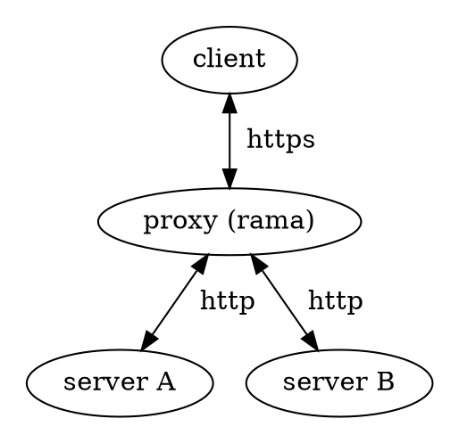

# 🔓 TLS Termination proxies

    
    

        A TLS termination proxy is a proxy server that acts as an intermediary point between client and server applications, and is used to terminate and/or establish TLS (or DTLS) tunnels by decrypting and/or encrypting communications. This is different to TLS pass-through proxies that forward encrypted (D)TLS traffic between clients and servers without terminating the tunnel.
        
 — <a href="https://en.wikipedia.org/wiki/TLS_termination_proxy">Wikipedia</a>

    

[Examples](https://github.com/plabayo/rama/tree/main/examples):

- [/examples/tls_rustls_termination.rs](https://github.com/plabayo/rama/tree/main/examples/tls_rustls_termination.rs):
  Spawns a mini handmade http server, as well as a TLS termination proxy, forwarding the
  plain text stream to the first.
- [/examples/mtls_tunnel_and_service.rs](https://github.com/plabayo/rama/blob/main/examples/mtls_tunnel_and_service.rs):
  Example of how to do mTLS (mutual TLS, where the client also needs a certificate) using rama,
  as well as how one might use this concept to provide a tunnel service build with these concepts;

## Description

[Reverse proxies](./reverse.md) are a superset of proxies that also
include TLS Termination Proxies. It's very common for a reverse proxy
to also terminate the TLS tunnel.
