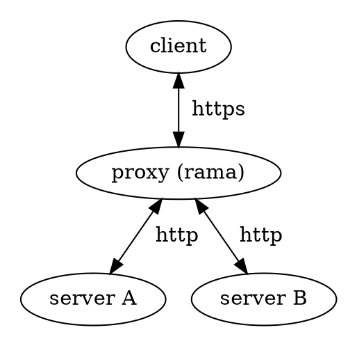

# 🔓 TLS Termination proxies

    
    

        A TLS termination proxy is a proxy server that acts as an intermediary point between client and server applications, and is used to terminate and/or establish TLS (or DTLS) tunnels by decrypting and/or encrypting communications. This is different to TLS pass-through proxies that forward encrypted (D)TLS traffic between clients and servers without terminating the tunnel.
        
 — <a href="https://en.wikipedia.org/wiki/TLS_termination_proxy">Wikipedia</a>

    

There are currently
[no examples found in the `./examples` dir](https://github.com/plabayo/rama/tree/main/examples)
on how to create such a proxy using rama. If you are interested in contributing this
you can create an issue at <https://github.com/plabayo/rama/issues> and we'll
help you to get this shipped.

[Reverse proxies](./reverse.md) are a superset of proxies that also
include TLS Termination Proxies. It's very common for a reverse proxy
to also terminate the TLS tunnel.
