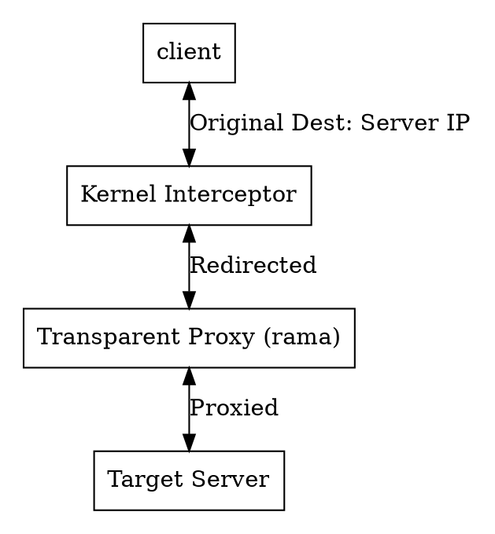

# ⛶ Transparent proxies

<div class="book-article-intro">
<div>
A transparent proxy, also known as an intercepting proxy, inline proxy, or forced proxy, is a server that intercepts communication between a client and the internet without requiring any special client-side configuration. This allows for centralized traffic management, security enforcement, and caching without the user's knowledge or intervention.
<p>— <a href="https://en.wikipedia.org/wiki/Transparent_proxy">Wikipedia</a></p>
</div>
</div>

> TODO: add Rama examples once we have them (it's on roadmap... todo)

## Description

<div class="book-article-image-center">



</div>

A transparent proxy sits in the network path and:

* Intercepts packets at the OS or Network layer.
* Does **not** require the client to be configured with proxy settings (unlike explicit proxies).
* Re-routes the traffic to a local proxy service (like Rama) while preserving or spoofing the original destination information.

### Transparent vs. SNI Proxies

As discussed in the [previous chapter on SNI Proxies](./sni.md), an **SNI Proxy** is often a form of transparent proxy. While a traditional transparent proxy might work by intercepting all traffic on a specific port (like `:80` or `:443`), an SNI proxy specifically uses the TLS handshake to decide where to route that intercepted traffic.

Essentially, a transparent proxy provides the **interception mechanism**, while SNI provides the **routing intelligence** for encrypted streams.

## Interception Mechanisms by Platform

To make a proxy "transparent," the operating system must be told to "steal" packets destined for the internet and hand them to your application. This is done differently on every platform:

* **Linux (TPROXY):** Uses the `iptables` or `nftables` [**TPROXY**](https://docs.kernel.org/networking/tproxy.html) target. This is the gold standard for transparent proxying as it allows the proxy to receive traffic without modifying the packet headers (no NAT required), meaning the proxy can still see the original destination IP and port.
* **Windows (Kernel Drivers):** Since Windows lacks a native TPROXY-like feature for user-space, high-performance transparent proxies typically use a [**WFP (Windows Filtering Platform)**](https://learn.microsoft.com/en-us/windows/win32/fwp/windows-filtering-platform-start-page) callout driver. This driver intercepts the "Connect" requests at the kernel level and redirects them to the local Rama instance.
* **macOS (Network Extensions):** macOS provides [the **`NETransparentProxyProvider`**](https://developer.apple.com/documentation/NetworkExtension/NETransparentProxyProvider) (part of the Network Extension framework). This allows apps to claim flows at the socket layer system-wide, making it the most stable and "Apple-approved" way to build transparent proxies on Mac.

## Proxies vs. Observers

It is important to distinguish a **Transparent Proxy** from a **Network Observer** or **Inspector** (like Wireshark or certain security monitors).

* **Observers/Inspectors:** Use mechanisms like NICs in "promiscuous mode," packet mirroring, or network extensions that only *duplicate* the data stream. They are "passive." They can see the traffic, but the original packets still reach their destination regardless of what the observer does.
* **Transparent Proxies:** Are "active" and sit **inline**. They terminate the connection. If the proxy doesn't forward the data, the data doesn't move. Because they sit in the middle of the flow, they have the power to:
  * **Re-route:** Send the traffic to a different backend.
  * **Modify:** Change headers, inject scripts, or swap certificates (MITM).
  * **Block:** Drop the connection entirely based on policy.

```plaintext
Transparent Proxy (Inline)
---------------------------

App ────▶ [ Interceptor ] ────▶ [ Proxy Logic ] ────▶ Server
               │                     │
               └─(Connection is terminated and re-established)─┘

Observer (Passive)
-------------------

App ────────────────────────────────────────────────▶ Server
               │
               ▼
        [ Packet Mirror ] ────▶ [ Observer/Wireshark ]

```

By operating transparently, Rama can provide advanced security and
routing features to legacy applications or devices that have no native support for proxy configurations.

## Coexistence with VPNs

In modern corporate and security-conscious environments, it is common for a transparent proxy to run on a machine that is simultaneously connected to a **Virtual Private Network (VPN)**. Without careful design, these two technologies can conflict, leading to "routing wars" or infinite loops where the proxy captures its own traffic.

### The Challenge: Routing Wars vs. Socket Interception

Most VPNs (like WireGuard or OpenVPN) operate at the **Network Layer (L3)** by creating a virtual network interface (TUN/TAP) and hijacking the system’s default gateway. If your transparent proxy also attempts to hijack the default gateway at L3, the two will fight for dominance, and one will inevitably break the other.

To coexist gracefully, Rama-based transparent proxies often prefer **Socket-Level Interception (L4)** over L3 hijacking. By sitting "above" the routing table, the proxy captures the application's traffic before the VPN tunnel even sees it.

### Platform-Specific Coexistence Strategies

| Platform | Coexistence Strategy | Key Benefit |
| --- | --- | --- |
| **macOS** / **iOS** | **Network Extensions** | `NETransparentProxyProvider` is "stackable." It intercepts traffic at the flow layer, allowing the underlying VPN to remain the primary L3 interface for egress. |
| **Windows** | **WFP Sub-layers** | The **Windows Filtering Platform** supports sub-layers and weights. You can place your proxy's redirection filters "above" the VPN filters to ensure you see the data first. |
| **Linux** / **Android** | **Policy Routing** | Using `ip rule` and packet marks (`fwmark`), you can steer traffic into the proxy while ensuring the proxy's own egress traffic is routed into the VPN's specific routing table. |

### Preventing the Infinite Loop (Egress Bypass)

A critical requirement for coexistence is ensuring that the proxy’s own outbound traffic (the **Egress**) is not intercepted by the proxy itself. This is achieved via **Loop Avoidance** rules:

1. **Process Exclusion:** The interceptor (WFP, nftables, or Network Extension) is configured to ignore any traffic generated by the proxy’s own process ID (PID).
2. **Socket Marking:** The proxy marks its outbound sockets with a specific tag (e.g., `SO_MARK` on Linux). The interceptor then ignores any packets carrying this mark.
3. **Interface Scoping:** On macOS and Windows, the proxy can bind its egress sockets specifically to the VPN's virtual interface or the physical NIC, bypassing the "transparent" redirection logic.

### VPN "Hand-off"

When properly configured, the flow looks like this:

1. **Application** attempts a connection to a website.
2. **Transparent Proxy** intercepts the connection (L4) and performs MITM/Routing logic.
3. **Proxy Egress** creates a new connection to the real destination.
4. **VPN Tunnel** (L3) sees this new connection and wraps it in encryption for safe passage through the public internet.

By following this layered approach, Rama can provide deep traffic inspection and modification even in highly restricted VPN-enabled environments.
