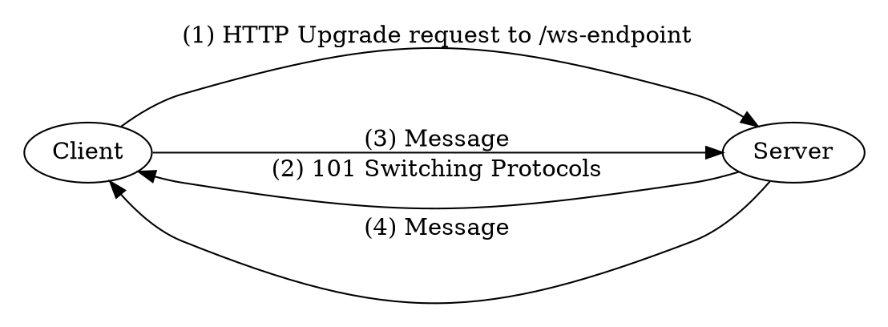

# WebSockets (WS)

<div class="book-article-intro">
    
    <div>
        WebSockets provide full-duplex communication between client and server over a single,
        long-lived connection. Unlike Server-Sent Events (SSE), which are strictly one-way,
        WebSockets allow <strong>both client and server to send messages at any time</strong>,
        making them ideal for chat systems, collaborative tools, and low-latency control loops.
        <p>— <a href="https://developer.mozilla.org/en-US/docs/Web/API/WebSockets_API">MDN Web Docs</a></p>
    </div>
</div>

## Description

> RFC:  The WebSocket Protocol: <https://datatracker.ietf.org/doc/html/rfc6455>

The WebSocket protocol (`ws://` or `wss://` for TLS) upgrades a standard HTTP connection into a persistent, bidirectional channel. Once established, either side can send arbitrary binary or text messages at any time—without the overhead of HTTP headers or reconnection logic.

Compared to HTTP-based polling or [SSE](./sse.md), WebSockets offer:

- **Low latency**: no need to establish a new connection for every message
- **Bidirectional flow**: both client and server can initiate messages

Rama supports WebSocket connections natively, allowing you to both expose WebSocket endpoints **and** interact with them as a client—all with async-first ergonomics.

<div class="book-article-image-center">



</div>

> This is the happy flow for a http/1.1 upgrade. Note that rama also supports
> websockets over `h2`. The flow for this is the same, but the details differ.
> Most relevant for this flowchart it changes the request method to `CONNECT`
> and the response status to `200 OK`.

### HTTP/1.1 Request Example

- Request:

```
GET / HTTP/1.1
Host: example.com
Connection: upgrade
Upgrade: websocket
Sec-WebSocket-Version: 13
Sec-WebSocket-Key: dGhlIHNhbXBsZSBub25jZQ==


```

- Response:

```
HTTP/1.1 101 Switching Protocols
Connection: upgrade
Upgrade: websocket
Sec-WebSocket-Accept: s3pPLMBiTxaQ9kYGzzhZRbK+xOo=


```


The interaction begins with a client making a standard HTTP `GET` request to a WebSocket endpoint, but including an `Upgrade: websocket` header. If accepted, the server replies with a `101 Switching Protocols` response. From this point forward, both sides can send frames over a persistent TCP connection.

Messages can be either text or binary.

### h2 WebSocket support

> RFC: Bootstrapping WebSockets with HTTP/2: <https://datatracker.ietf.org/doc/rfc8441/>

While traditional WebSockets rely on HTTP/1.1's `Upgrade` and `Connection: upgrade` headers to switch protocols,
HTTP/2 doesn’t support these connection-wide semantics due to its stream-multiplexing architecture.
Instead, RFC 8441 introduces a new mechanism: an **extended CONNECT method** combined with a new pseudo-header
`:protocol: websocket`. When the `SETTINGS_ENABLE_CONNECT_PROTOCOL` flag is set, clients may initiate a
WebSocket stream by issuing a `CONNECT` request with additional pseudo-headers like `:scheme`, `:path`, and
`:authority`, alongside WebSocket-specific headers such as `sec-websocket-protocol`.

Despite the different handshake, once established,
**the resulting stream behaves just like a WebSocket TCP connection** from the perspective of the application:
bidirectional, message-based communication with binary or text frames. HTTP/2’s stream-layer features like
prioritization and flow control also apply, enabling better resource sharing.

The core WebSocket protocol (RFC 6455) remains unchanged beyond the handshake;
only the transport bootstrap differs.

## Rama Support

> 📚 Rust Docs: <https://ramaproxy.org/docs/rama/http/ws/index.html>

With Rama’s `ws` or `http-full` feature enabled, full WebSocket support is built-in for both
[**servers**](./web_servers.md) and [**clients**](./http_clients.md). You can:

- Accept WebSocket upgrades and handle messages asynchronously
- Connect to remote WebSocket endpoints and send/receive data
- Handle disconnects (in the form of IO errors)

You are notified about meta messages such as ping/pong, close and so on. These are however
also already handled for you automatically when you use the runtime API, so this is only informative.
As such, you'll see that high level functionality such as a ws client/server or the built-in ws echo server
only handle the text/binary messages.

There’s no hardcoded opinion about message format. Text, binary, newline-delimited, JSON, MessagePack—it’s your protocol, Rama just streams it. How you decode them is up to you. See the examples for inspiration.

### Flexible transport support

From both the client and server perspective, Rama gives you full control over the transport layer used for
(async) WebSocket communication.

Since WebSocket handshakes are initiated over HTTP(S), you inherit the same transport
flexibility that Rama offers for all HTTP layers:

- Need secure WebSocket (WSS)? TLS is fully supported out of the box—no special handling required.
- Want to route through a proxy protocol like HAProxy, or use remote proxies such as HTTP or SOCKS5?
  That works the same way as any other HTTP request in Rama.
- Prefer using UNIX domain sockets instead of TCP? That’s supported too—just plug it in.

### WebSocket support in rama binary

The [rama CLI tool](./deploy/rama-cli.md) has WebSocket support:

- server-side in the echo and fingerprint commands.
  - E.g. for the echo command you can enable it using `--ws`
  - the public `https://echo.ramaproxy.org` website accepts also WebSocket connections on any endpoint
- client side with a Terminal User Interface (TUI) via the `rama ws` command
  - this can be a useful client to quickly test out a WebSocket service or a MITM WS Proxy;

<div class="book-article-image-center">

</div>

### Examples

You can find working WebSocket examples in the Rama repository:
ws_echo_server.rs
- [`ws_echo_server.rs`](https://github.com/plabayo/rama/blob/main/examples/ws_echo_server.rs)
  Simple WebSocket echo server.
- [`ws_chat_server.rs`](https://github.com/plabayo/rama/blob/main/examples/ws_chat_server.rs)
  Simple WebSocket server for a basic chat room.
- [`ws_tls_server.rs`](https://github.com/plabayo/rama/blob/main/examples/ws_tls_server.rs)
   Secure WebSocket server example (WSS).
- [`ws_over_h2.rs`](https://github.com/plabayo/rama/blob/main/examples/ws_over_h2.rs)
   Secure WebSocket server using h2.
- [`autobahn_client.rs`](https://github.com/plabayo/rama/blob/main/examples/autobahn_client.rs)
   Run autobahn WebSocket test suite.

In the existing [`http_mitm_proxy_boring.rs`](https://github.com/plabayo/rama/blob/main/examples/http_mitm_proxy_boring.rs) example
you can find inspiration on how to MITM proxy WebSocket traffic. As often it is not the only
way to achieve it, but in case you didn't know yet how to begin doing so,
it might be sufficient to get you started at least.

Rama’s WebSocket types integrate with its typed headers and upgrade machinery, giving you seamless access to the WebSocket handshake and stream lifecycle.
