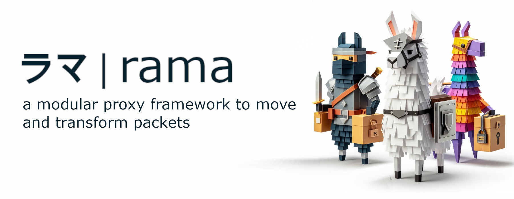

[![Crates.io][crates-badge]][crates-url]
[![Docs.rs][docs-badge]][docs-url]
[![MIT License][license-mit-badge]][license-mit-url]
[![Apache 2.0 License][license-apache-badge]][license-apache-url]
[![rust version][rust-version-badge]][rust-version-url]
[![Build Status][actions-badge]][actions-url]

[![Discord][discord-badge]][discord-url]
[![Buy Me A Coffee][bmac-badge]][bmac-url]
[![GitHub Sponsors][ghs-badge]][ghs-url]
[![Paypal Donation][paypal-badge]][paypal-url]

[crates-badge]: https://img.shields.io/crates/v/rama.svg
[crates-url]: https://crates.io/crates/rama
[docs-badge]: https://img.shields.io/docsrs/rama/latest
[docs-url]: https://docs.rs/rama/latest/rama/index.html
[license-mit-badge]: https://img.shields.io/badge/license-MIT-blue.svg
[license-mit-url]: https://github.com/plabayo/rama/blob/main/LICENSE-MIT
[license-apache-badge]: https://img.shields.io/badge/license-APACHE-blue.svg
[license-apache-url]: https://github.com/plabayo/rama/blob/main/LICENSE-APACHE
[rust-version-badge]: https://img.shields.io/badge/rustc-1.96+-blue?style=flat-square&logo=rust
[rust-version-url]: https://www.rust-lang.org
[actions-badge]: https://github.com/plabayo/rama/actions/workflows/CI.yml/badge.svg?branch=main
[actions-url]: https://github.com/plabayo/rama/actions/workflows/CI.yml

[discord-badge]: https://img.shields.io/badge/Discord-%235865F2.svg?style=for-the-badge&logo=discord&logoColor=white
[discord-url]: https://discord.gg/29EetaSYCD
[bmac-badge]: https://img.shields.io/badge/Buy%20Me%20a%20Coffee-ffdd00?style=for-the-badge&logo=buy-me-a-coffee&logoColor=black
[bmac-url]: https://www.buymeacoffee.com/plabayo
[ghs-badge]: https://img.shields.io/badge/sponsor-30363D?style=for-the-badge&logo=GitHub-Sponsors&logoColor=#EA4AAA
[ghs-url]: https://github.com/sponsors/plabayo
[paypal-badge]: https://img.shields.io/badge/paypal-contribution?style=for-the-badge&color=blue
[paypal-url]: https://www.paypal.com/donate/?hosted_button_id=P3KCGT2ACBVFE

🦙 rama® (ラマ) is a modular service framework for the 🦀 Rust language to move and transform your network packets.
The reasons behind the creation of rama can be read in [the "Why Rama" chapter](https://ramaproxy.org/book/why_rama).

## rama-cli

`rama-cli` is the official rama binary, which can be used to proxy requests, make requests and inspect your traffic. It serves mostly as an example to showcase some of what you can do with rama, but of course if you wish you can also use it for your actual production use cases, just know we give no guarantees of any kind.

### Proxy interception

Start the inspector with `rama serve proxy --mitm`. Forwarding is automatic by
default; add `--intercept` or enable **Intercept · require approval** in the
inspector to hold HTTP request and response headers and WebSocket application
messages in both directions. The pending queue is shared across browser tabs,
ordered by arrival, and independent of capture limits. Inspection requires the
inspector to be running. Queued items appear inline in the request list; use
**Awaiting approval** to show only queued traffic, oldest first.

Open a pending item to edit headers or a WebSocket text/binary message, **Forward**
it, or **Block** it. Repeated headers are preserved. HTTP bodies stay streaming;
framing, routing and upgrade headers cannot be changed in the header editor.
**Respond locally** replaces the entire HTTP response. Templates cover a 403,
redirects, 304, 204, 404, 429, 503, and JSON; they can be edited, saved as presets,
or replaced with a response built from scratch. Redirects require a destination;
a 304 requires a conditional GET/HEAD and simulates an unchanged representation.
WebSocket messages can be dropped individually or the WebSocket can be closed.
Ping replies and close handshakes continue while application messages are held.

**Forward automatically for this connection** also releases its other pending
items and applies to subsequent messages, including other HTTP/2 streams on the
same connection. The connection can be returned to interception from the request list. Automatic response/drop/close rules still apply. Turning interception off
only affects new items; **Forward all and turn off** also releases the queue.
Pending approvals expire after five minutes by default: HTTP receives 504 and
WebSockets close. Queue overflow returns 503 or closes the WebSocket, never an
implicit approval. Limits and the default blocked response are configurable.

Use **Rules** or **Create rule** on captured/pending traffic to match host, path,
protocol, direction, method, port, message kind, status, and header values.
Conditions in one rule are combined. A plain host matches exactly; `.example.com`
also matches subdomains; host/path/header globs support `*`. Empty fields match
all values, including future protocol names. Response/drop/close rules run first
in list order, followed by the first matching approval/automatic-forwarding rule.
With interception on, unmatched traffic requires approval. Applying a new rule to
already pending traffic is an explicit option.

For discovery, start with `rama serve proxy --mitm --mitm-scope none`, or select
**None** under MITM domain scope. The **Hosts** pane records observed destinations,
connection counts, uninspected counts, and last-seen times without decrypting
traffic. Sort by recency or count, then add relevant hosts to **Selected** scope.
An empty Selected scope inspects nothing. Scope changes apply to new TLS
connections; existing tunnels cannot be upgraded. CLI allow/deny restrictions
remain a ceiling and deny rules win. Scope domain patterns preserve their existing
subdomain behavior; `=example.com` selects exactly one host.

**Pause inspector** stops MITM, capture, host observations and traffic rules.
New connections pass through unchanged. Existing inspected connections are closed
because established TLS/WebSocket sessions cannot become opaque tunnels; clients
can reconnect through the paused proxy. Remaining HTTP approvals are forwarded
unchanged and interception is turned off. Scope and rules are retained for resume.
An active HAR is finalized and kept for download; start a new HAR after resuming.
Settings belong to the running proxy. Opening a browser restores display filters
only; saved browser preferences never overwrite live traffic policy. Use the
explicit settings export/import controls to transfer policy between runs.

The queue holds at most 128 messages by default (256 configurable), 256 KiB per
editable item, and 8 MiB of queued message data. WebSocket read-ahead during a
hold is separately bounded to 16 messages / 256 KiB per direction; exceeding it
closes the connection. The host inventory retains up to 4,096 recent hosts.
