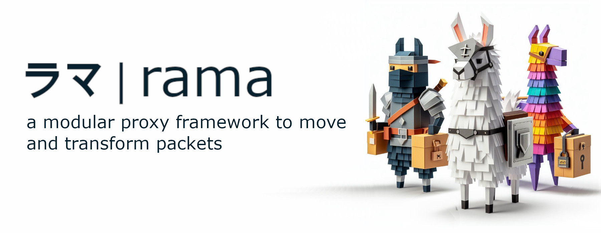

[](https://ramaproxy.org/)

[![Crates.io][crates-badge]][crates-url]
[![Docs.rs][docs-badge]][docs-url]
[![MIT License][license-mit-badge]][license-mit-url]
[![Apache 2.0 License][license-apache-badge]][license-apache-url]
[![rust version][rust-version-badge]][rust-version-url]
[![Build Status][actions-badge]][actions-url]

[![Discord][discord-badge]][discord-url]
[![Buy Me A Coffee][bmac-badge]][bmac-url]
[![GitHub Sponsors][ghs-badge]][ghs-url]
[![Paypal Donation][paypal-badge]][paypal-url]

[crates-badge]: https://img.shields.io/crates/v/rama-net-apple-networkextension.svg
[crates-url]: https://crates.io/crates/rama-net-apple-networkextension
[docs-badge]: https://img.shields.io/docsrs/rama-net-apple-networkextension/latest
[docs-url]: https://docs.rs/rama-net-apple-networkextension/latest/rama_net_apple_networkextension/index.html
[license-mit-badge]: https://img.shields.io/badge/license-MIT-blue.svg
[license-mit-url]: https://github.com/plabayo/rama/blob/main/LICENSE-MIT
[license-apache-badge]: https://img.shields.io/badge/license-APACHE-blue.svg
[license-apache-url]: https://github.com/plabayo/rama/blob/main/LICENSE-APACHE
[rust-version-badge]: https://img.shields.io/badge/rustc-1.93+-blue?style=flat-square&logo=rust
[rust-version-url]: https://www.rust-lang.org
[actions-badge]: https://github.com/plabayo/rama/actions/workflows/CI.yml/badge.svg?branch=main
[actions-url]: https://github.com/plabayo/rama/actions/workflows/CI.yml

[discord-badge]: https://img.shields.io/badge/Discord-%235865F2.svg?style=for-the-badge&logo=discord&logoColor=white
[discord-url]: https://discord.gg/29EetaSYCD
[bmac-badge]: https://img.shields.io/badge/Buy%20Me%20a%20Coffee-ffdd00?style=for-the-badge&logo=buy-me-a-coffee&logoColor=black
[bmac-url]: https://www.buymeacoffee.com/plabayo
[ghs-badge]: https://img.shields.io/badge/sponsor-30363D?style=for-the-badge&logo=GitHub-Sponsors&logoColor=#EA4AAA
[ghs-url]: https://github.com/sponsors/plabayo
[paypal-badge]: https://img.shields.io/badge/paypal-contribution?style=for-the-badge&color=blue
[paypal-url]: https://www.paypal.com/donate/?hosted_button_id=P3KCGT2ACBVFE

🦙 rama® (ラマ) is a modular service framework for the 🦀 Rust language to move and transform your network packets.
The reasons behind the creation of rama can be read in [the "Why Rama" chapter](https://ramaproxy.org/book/why_rama).

## rama-net-apple-networkextension

Rama network types and utilities.

Apple Network Extension support for rama.

Crate used by the end-user `rama` crate and `rama` crate authors alike.

Learn more about `rama`:

- Github: <https://github.com/plabayo/rama>
- Book: <https://ramaproxy.org/book/>

## Showcase

See the macOS transparent proxy example in:

- [`ffi/apple/examples/transparent_proxy`](../ffi/apple/examples/transparent_proxy)

It shows:

- a host app and `NETransparentProxyProvider`
- a Rust `staticlib` implementing the Apple C ABI contract
- a macro-driven FFI entrypoint
- end-to-end Apple FFI tests covering HTTP, HTTPS, HTTP/2, WebSocket, raw TCP/TLS, and basic UDP

Run the main checks with:

```sh
just qa-crate rama-net-apple-networkextension
just qa-ffi-apple
just test-e2e-ffi-apple
```

## Swift Package

The Apple Network Extension bridge is available as the Swift package:

- `https://github.com/plabayo/rama.git`

Use the `RamaAppleNetworkExtension` product from:

- [`Package.swift`](../Package.swift)

This package ships the Swift and C bridge only. Your app or extension provides the Rust
implementation as a static library and links that library into the final Apple target.

### Consumer Integration

Add the package by URL and version in Xcode or `Package.swift`:

```swift
.package(url: "https://github.com/plabayo/rama.git", from: "0.3.0")
```

Then depend on the `RamaAppleNetworkExtension` product in your target:

```swift
.product(name: "RamaAppleNetworkExtension", package: "rama")
```

You still need to link your own Rust static library into the Network Extension target. In the
transparent proxy example that is done in:

- [`ffi/apple/examples/transparent_proxy/tproxy_app/Project.yml`](../ffi/apple/examples/transparent_proxy/tproxy_app/Project.yml#L44)

The relevant part is:

```yaml
dependencies:
  - package: RamaAppleNetworkExtension
    product: RamaAppleNetworkExtension

settings:
  base:
    OTHER_LDFLAGS:
      - "$(SRCROOT)/../tproxy_rs/target/universal/librama_tproxy_example.a"
      - "-framework"
      - "NetworkExtension"
      - "-lz"
```

Consumer checklist:

- depend on the `RamaAppleNetworkExtension` Swift package
- build your own Rust crate as a `staticlib` using normal Cargo flow
- link that `.a` into the Network Extension target
- export the expected FFI symbols defined by the bridge header

The public C ABI contract used by the Swift bridge is defined in:

- [`ffi/apple/RamaAppleNetworkExtension/Sources/RamaAppleNEFFI/include/rama_apple_ne_ffi.h`](../ffi/apple/RamaAppleNetworkExtension/Sources/RamaAppleNEFFI/include/rama_apple_ne_ffi.h)

### Why This Shape

The Swift package is intentionally implementation-agnostic:

- Rama ships the Apple bridge
- the application author ships the Rust implementation
- the final app target links both together

This keeps the package reusable across different Rama-based Apple Network Extension implementations.

## Maintainer Notes

### Versioning

The Swift package version is the repository tag that consumers select in SwiftPM. There is no
separate Swift-only version stream in this repository layout.

When changing the public Swift or C bridge surface, treat it as a package API change. In
particular:

- changes to `Package.swift`
- changes to public Swift APIs under `ffi/apple/RamaAppleNetworkExtension/Sources/RamaAppleNetworkExtension`
- changes to the public C header
  [`rama_apple_ne_ffi.h`](../ffi/apple/RamaAppleNetworkExtension/Sources/RamaAppleNEFFI/include/rama_apple_ne_ffi.h)

should be released in the next repository tag that Swift package consumers will use.

### Publishing

The package is published through the normal repository tag/release flow. Maintainers should:

1. update the bridge code and docs in `ffi/apple/RamaAppleNetworkExtension`
2. update the root Swift package manifest in [`Package.swift`](../Package.swift) if needed
3. verify the Swift package still typechecks in consumer scenarios
4. ensure the example still integrates correctly with a Rust static library
5. create and publish the next repository tag/version

After that, consumers can depend on the new package version directly from the repository URL.

### Compatibility Discipline

Because consumers provide their own Rust static library, Swift package changes must stay compatible
with the expected FFI contract unless you intentionally ship a breaking version.

When changing the FFI:

- update the public header first
- update the Swift bridge accordingly
- update the example Rust implementation accordingly
- document the required Rust-side changes for downstream users
