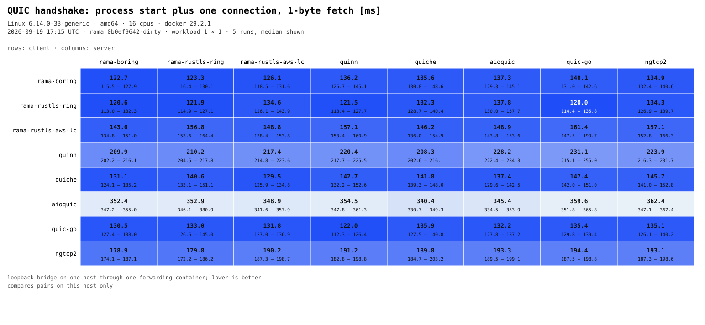
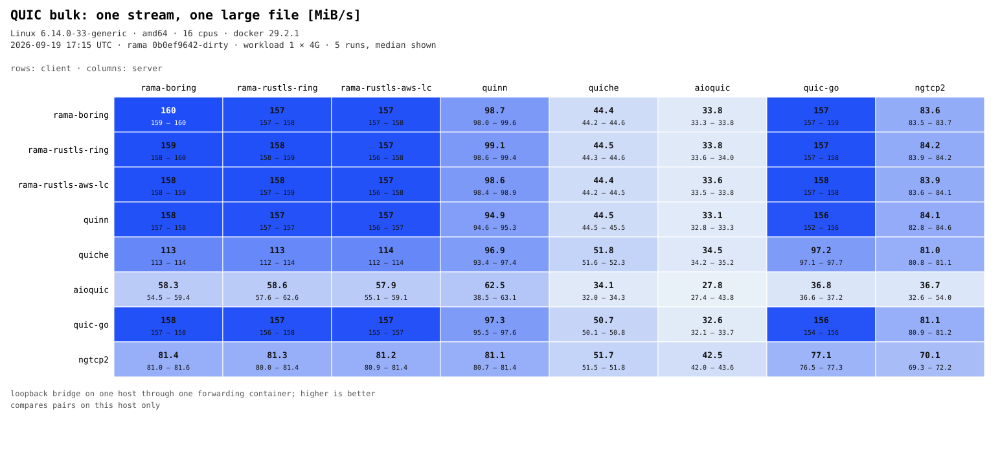
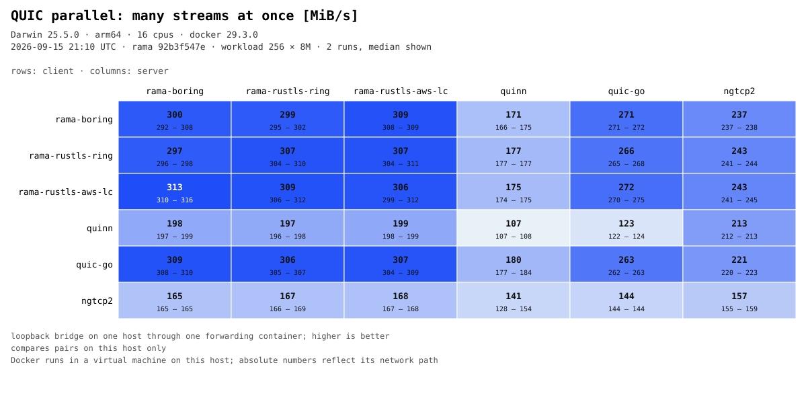
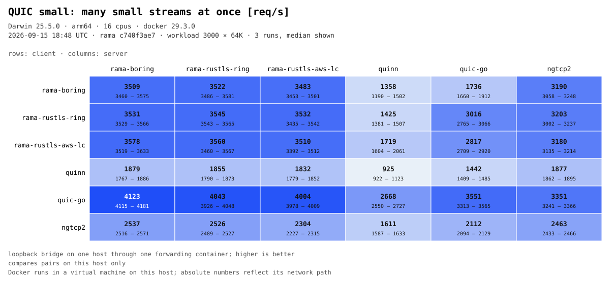

# QUIC client x server benchmark matrix

Every implementation in the public [QUIC interop runner] ships an endpoint image with one
contract: `ROLE`, `TESTCASE`, `REQUESTS`, files under `/www`, downloads under `/downloads`,
certificates under `/certs`, HTTP/0.9 over ALPN `hq-interop`. Rama's image (built from
[the runner project](../interop-runner/)) follows it too. So every pairing of implementations
can be measured without writing any peer code: one image serves, another fetches, the fetch
is timed from the client container's own start and finish timestamps.

The simulator stays out. The runner’s IPv4 and IPv6 subnets are kept, with a plain forwarding container
where the simulator would be, because the endpoint base image routes through that gateway.
The endpoint setup scripts require both address families even for IPv4 requests.
The two temporary benchmark bridges use Docker’s `nat-unprotected` gateway mode so
Docker does not drop packets destined for the other subnet before they reach the forwarder.
This permits direct access to unpublished ports on those benchmark networks by hosts with
routes to them; it does not change daemon-wide settings or other Docker networks.
Every pair crosses the same forwarder, so cells compare fairly with one another; absolute
numbers describe this host's path, not the implementations in isolation.

## Run

Docker Engine 28 or newer with IPv6 bridge support is the only prerequisite. From the repository root:

```sh
just rama-quic/bench-matrix
```

That builds the Rama images for the three TLS backends when they are missing, pulls the peer
images pinned in [`bench.lock.json`](bench.lock.json), generates the certificates and served
files inside containers, runs every client x server pair for every case, prints one table per
case and writes the SVGs under `graph/`, plus a JSON report under `target/quic-bench/`.
Container logs are saved by default under `target/quic-bench/logs/<timestamp>/`.
A partial report is saved after each cell to `target/quic-bench/in-progress.json`, so an
interrupted matrix can still be inspected or rendered with `bench-matrix-report`.

Useful knobs (`--help` has them all):

```sh
# a quick look at two implementations with a smaller transfer
just rama-quic/bench-matrix --implementations rama-boring,quinn --set bulk.size=256M --repeat 1
# only the throughput cases, more repetitions
just rama-quic/bench-matrix --cases bulk,parallel --repeat 5
# re-render tables and SVGs from a saved report
just rama-quic/bench-matrix-report target/quic-bench/<stamp>.json
# keep every container's log; the Rama endpoints print their loss and queue counters there
just rama-quic/bench-matrix --implementations rama-boring --cases parallel --logs target/quic-bench/logs
```

## Cases

| case | the client fetches | reported |
| --- | --- | --- |
| `handshake` | one 1-byte file, many runs | ms per run: process start plus one connection plus the fetch |
| `bulk` | one 4 GiB file on one stream | MiB/s |
| `parallel` | 256 files of 8 MiB at once | MiB/s aggregate |
| `small` | 3,000 files of 64 KiB at once | requests/s (streams completed per second) |

Transfer cases subtract the pair's median `handshake` time, so they report the transfer and not
the container's start-up. A run shorter than four such baselines is marked `*`: raise the
workload with `--set <case>.size=...` or `--set <case>.files=...` before trusting it. The
request list travels in one environment variable, which Linux caps at 128 KiB, so a case can
name about 3,500 files; `small` therefore hammers per-stream cost with 64 KiB bodies rather
than with a request count no endpoint could be handed. Downloads
are counted and size-checked; a pair that fails, or a client that reports the case unsupported,
is `n/a`, never a number. Each cell runs once as warm-up and then `--repeat` times; the median
is shown with min and max.

## Peer notes

[`bench.lock.json`](bench.lock.json) pins the images and records the two adjustments the
matrix makes so that every column measures the implementation and not its script:

- **quinn**: its endpoint script sleeps three seconds before starting the client; the client is
  started directly after the same route setup.
- **ngtcp2**: its scripts pass `--qlog-dir $QLOGDIR` unquoted and refuse to run without a
  writable directory; `QLOGDIR` is set and qlog is then disabled through the image's
  `CLIENT_PARAMS`/`SERVER_PARAMS` hooks, so it pays no qlog cost the others skip.

Everything else runs exactly as the image ships it: quic-go with its GSO client, aioquic's
Python client, and so on. That is the comparison people actually get.

## Charts






[QUIC interop runner]: https://github.com/quic-interop/quic-interop-runner
